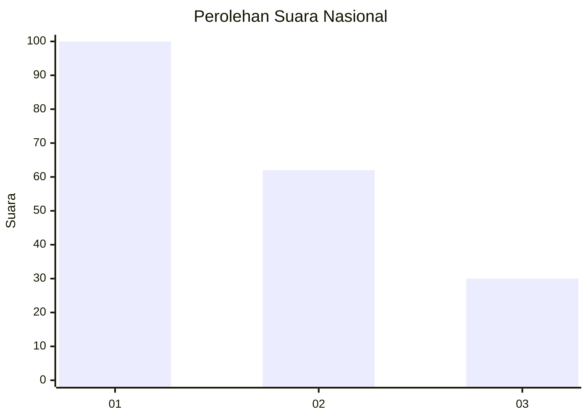
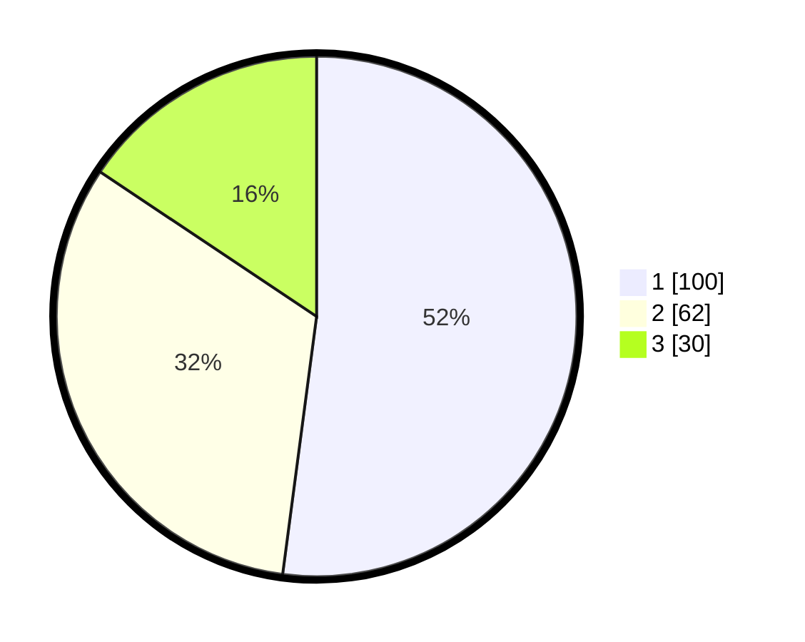

# Hasil

## Grafik

## Tabel

| No.    | Nama Paslon    | Suara | Suara (raw) | Persentase |
|:------ |:-------------- | -----:| -----------:| ----------:|
| 100025 | ANIES MUHAIMIN | 100   | [100][p-1]  | 52,08      |
| 100026 | PRABOWO GIBRAN | 62    | [62][p-2]   | 32,29      |
| 100027 | GANJAR MAHFUD  | 30    | [30][p-3]   | 15,63      |

[p-1]: https://github.com/gigit-pemilu/pemilu-2024/blob/main/pilpres/hitung-suara/sub/31-dki-jakarta/sub/74-jakarta-selatan/sub/03-mampang-prapatan/sub/1001-mampang-prapatan/sub/043-tps/sub/paslon-1.txt
[p-2]: https://github.com/gigit-pemilu/pemilu-2024/blob/main/pilpres/hitung-suara/sub/31-dki-jakarta/sub/74-jakarta-selatan/sub/03-mampang-prapatan/sub/1001-mampang-prapatan/sub/043-tps/sub/paslon-2.txt
[p-3]: https://github.com/gigit-pemilu/pemilu-2024/blob/main/pilpres/hitung-suara/sub/31-dki-jakarta/sub/74-jakarta-selatan/sub/03-mampang-prapatan/sub/1001-mampang-prapatan/sub/043-tps/sub/paslon-3.txt

## Foto C Plano

https://sirekap-obj-formc.kpu.go.id/e49d/pemilu/ppwp/31/74/03/10/01/3174031001043-20240214-195515--964a6ae5-497a-4b7d-b202-3aa5e437f762.jpg

https://sirekap-obj-formc.kpu.go.id/e49d/pemilu/ppwp/31/74/03/10/01/3174031001043-20240214-195206--99a7bc01-8379-41e6-8b98-d11d642b4c2f.jpg

https://sirekap-obj-formc.kpu.go.id/e49d/pemilu/ppwp/31/74/03/10/01/3174031001043-20240214-195825--9aadca10-ef64-411f-8842-3a5a04039601.jpg

## Metadata

| Key        | Value               |
| ---------- | ------------------- |
| Time Stamp | 2024-02-24 22:31:28 |

