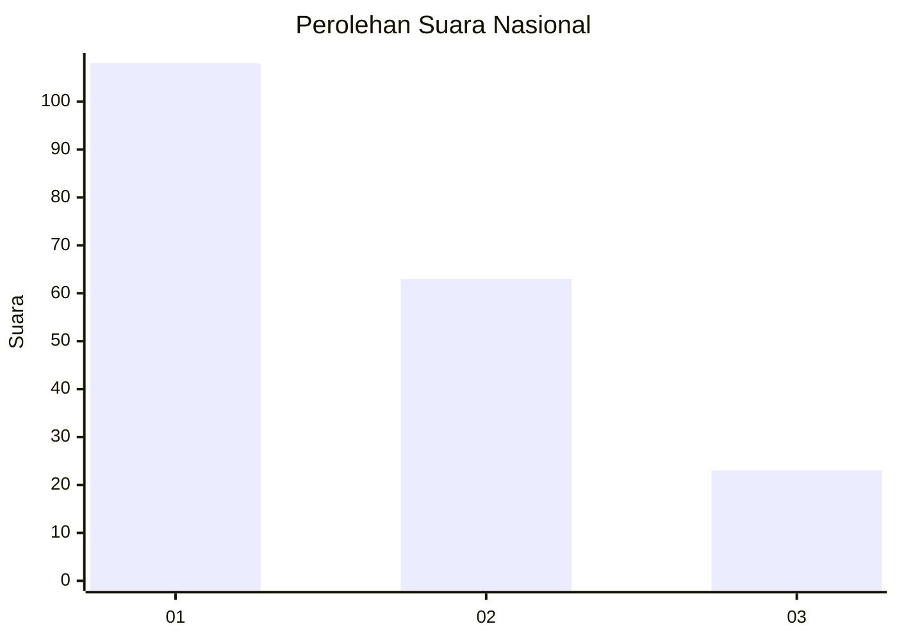
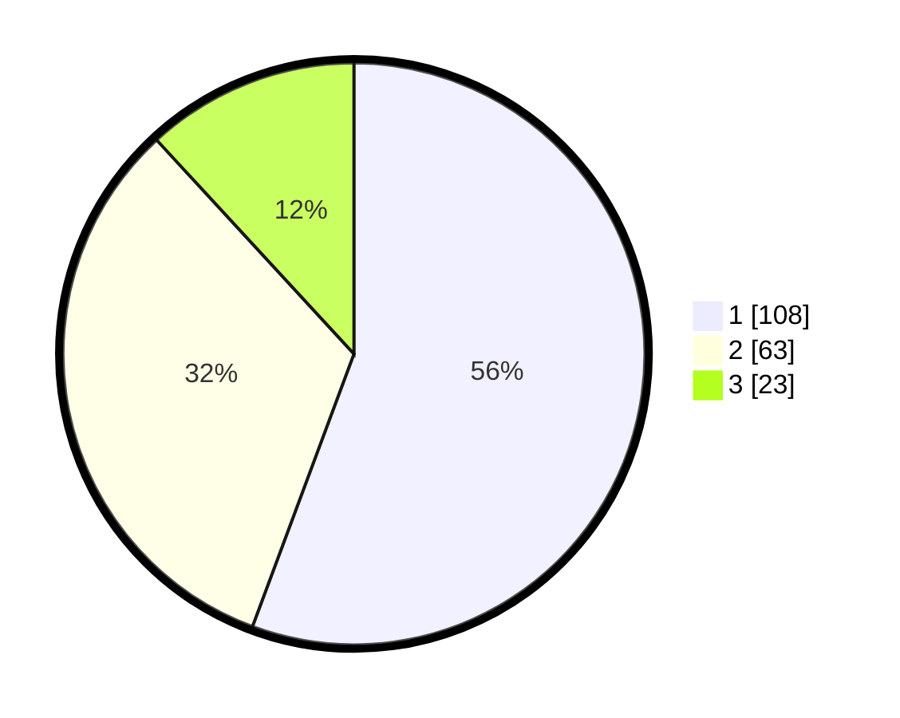

# Hasil

## Grafik

## Tabel

| No.    | Nama Paslon    | Suara | Suara (raw) | Persentase |
|:------ |:-------------- | -----:| -----------:| ----------:|
| 100025 | ANIES MUHAIMIN | 108   | [108][p-1]  | 55,67      |
| 100026 | PRABOWO GIBRAN | 63    | [63][p-2]   | 32,47      |
| 100027 | GANJAR MAHFUD  | 23    | [23][p-3]   | 11,86      |

[p-1]: https://github.com/gigit-pemilu/pemilu-2024/blob/main/pilpres/hitung-suara/sub/31-dki-jakarta/sub/74-jakarta-selatan/sub/03-mampang-prapatan/sub/1001-mampang-prapatan/sub/044-tps/sub/paslon-1.txt
[p-2]: https://github.com/gigit-pemilu/pemilu-2024/blob/main/pilpres/hitung-suara/sub/31-dki-jakarta/sub/74-jakarta-selatan/sub/03-mampang-prapatan/sub/1001-mampang-prapatan/sub/044-tps/sub/paslon-2.txt
[p-3]: https://github.com/gigit-pemilu/pemilu-2024/blob/main/pilpres/hitung-suara/sub/31-dki-jakarta/sub/74-jakarta-selatan/sub/03-mampang-prapatan/sub/1001-mampang-prapatan/sub/044-tps/sub/paslon-3.txt

## Foto C Plano

https://sirekap-obj-formc.kpu.go.id/a6b3/pemilu/ppwp/31/74/03/10/01/3174031001044-20240215-002353--a8e6849b-cf3c-432c-aca4-277d8512dc4a.jpg

https://sirekap-obj-formc.kpu.go.id/a6b3/pemilu/ppwp/31/74/03/10/01/3174031001044-20240215-002531--f7cf5092-ac2a-4ec2-8341-11a8b0fd6355.jpg

https://sirekap-obj-formc.kpu.go.id/a6b3/pemilu/ppwp/31/74/03/10/01/3174031001044-20240215-002601--96ba006c-192c-41de-a174-8b10e6f56bf3.jpg

## Metadata

| Key        | Value               |
| ---------- | ------------------- |
| Time Stamp | 2024-02-24 22:31:28 |

