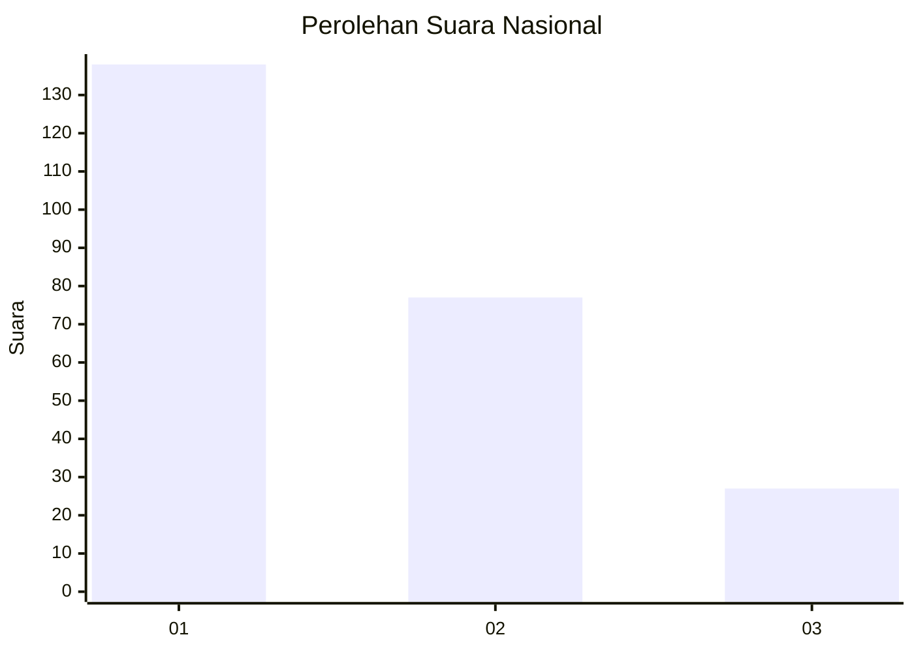
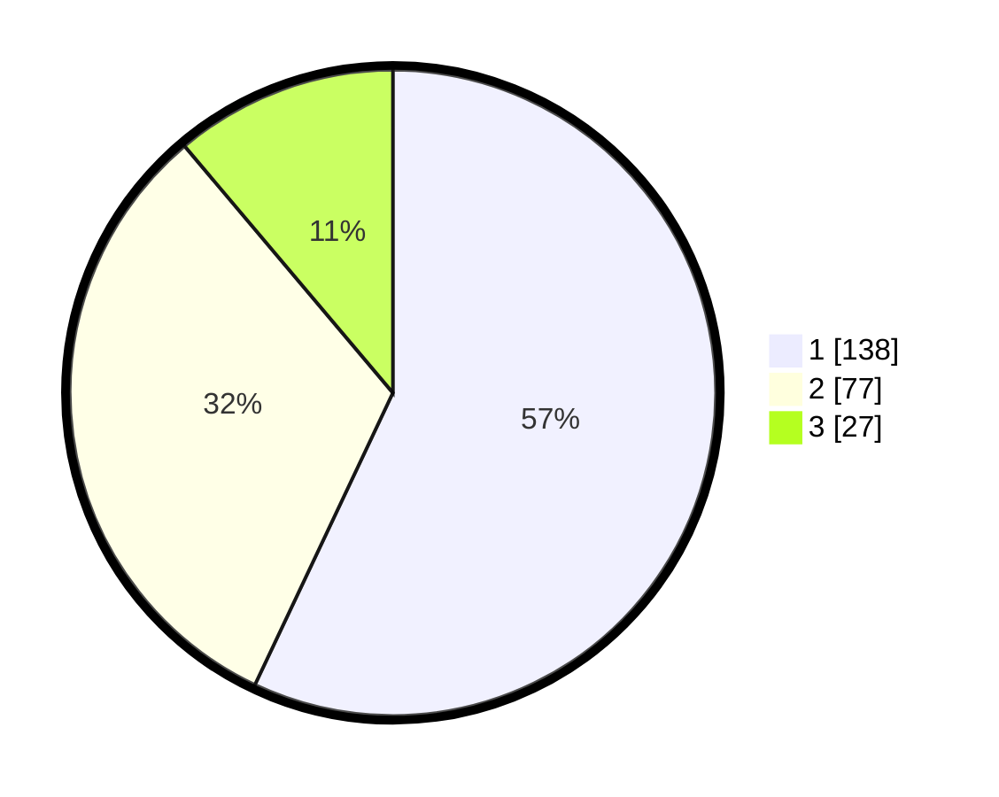

# Hasil

## Grafik

## Tabel

| No.    | Nama Paslon    | Suara | Suara (raw) | Persentase |
|:------ |:-------------- | -----:| -----------:| ----------:|
| 100025 | ANIES MUHAIMIN | 138   | [138][p-1]  | 57,02      |
| 100026 | PRABOWO GIBRAN | 77    | [77][p-2]   | 31,82      |
| 100027 | GANJAR MAHFUD  | 27    | [27][p-3]   | 11,16      |

[p-1]: https://github.com/gigit-pemilu/pemilu-2024/blob/main/pilpres/hitung-suara/sub/31-dki-jakarta/sub/74-jakarta-selatan/sub/03-mampang-prapatan/sub/1001-mampang-prapatan/sub/055-tps/sub/paslon-1.txt
[p-2]: https://github.com/gigit-pemilu/pemilu-2024/blob/main/pilpres/hitung-suara/sub/31-dki-jakarta/sub/74-jakarta-selatan/sub/03-mampang-prapatan/sub/1001-mampang-prapatan/sub/055-tps/sub/paslon-2.txt
[p-3]: https://github.com/gigit-pemilu/pemilu-2024/blob/main/pilpres/hitung-suara/sub/31-dki-jakarta/sub/74-jakarta-selatan/sub/03-mampang-prapatan/sub/1001-mampang-prapatan/sub/055-tps/sub/paslon-3.txt

## Foto C Plano

https://sirekap-obj-formc.kpu.go.id/0d19/pemilu/ppwp/31/74/03/10/01/3174031001055-20240214-192222--6cf75355-3ee9-4f57-b8e7-8a2ea152e8d3.jpg

https://sirekap-obj-formc.kpu.go.id/0d19/pemilu/ppwp/31/74/03/10/01/3174031001055-20240214-192232--82500c1f-94f1-45ad-b860-e5cf5479a2eb.jpg

https://sirekap-obj-formc.kpu.go.id/0d19/pemilu/ppwp/31/74/03/10/01/3174031001055-20240214-160059--8dc5c3ce-2452-483c-8234-e0461e855294.jpg

## Metadata

| Key        | Value               |
| ---------- | ------------------- |
| Time Stamp | 2024-02-24 22:31:28 |

