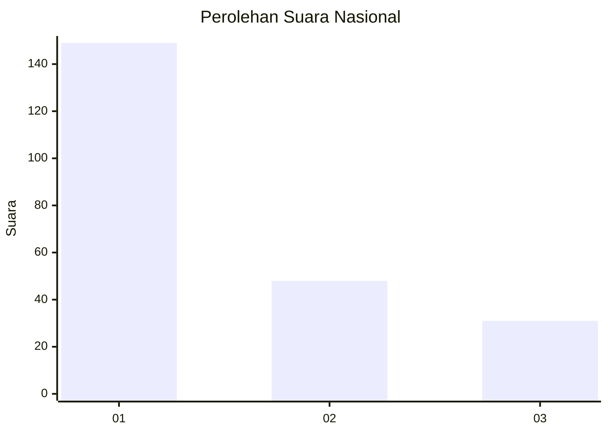
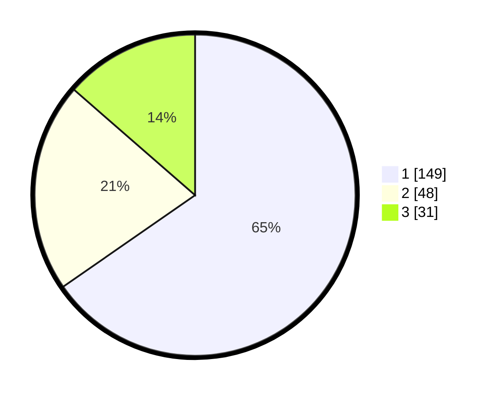

# Hasil

## Grafik

## Tabel

| No.    | Nama Paslon    | Suara | Suara (raw) | Persentase |
|:------ |:-------------- | -----:| -----------:| ----------:|
| 100025 | ANIES MUHAIMIN | 149   | [149][p-1]  | 65,35      |
| 100026 | PRABOWO GIBRAN | 48    | [48][p-2]   | 21,05      |
| 100027 | GANJAR MAHFUD  | 31    | [31][p-3]   | 13,60      |

[p-1]: https://github.com/gigit-pemilu/pemilu-2024/blob/main/pilpres/hitung-suara/sub/31-dki-jakarta/sub/74-jakarta-selatan/sub/03-mampang-prapatan/sub/1001-mampang-prapatan/sub/056-tps/sub/paslon-1.txt
[p-2]: https://github.com/gigit-pemilu/pemilu-2024/blob/main/pilpres/hitung-suara/sub/31-dki-jakarta/sub/74-jakarta-selatan/sub/03-mampang-prapatan/sub/1001-mampang-prapatan/sub/056-tps/sub/paslon-2.txt
[p-3]: https://github.com/gigit-pemilu/pemilu-2024/blob/main/pilpres/hitung-suara/sub/31-dki-jakarta/sub/74-jakarta-selatan/sub/03-mampang-prapatan/sub/1001-mampang-prapatan/sub/056-tps/sub/paslon-3.txt

## Foto C Plano

https://sirekap-obj-formc.kpu.go.id/3cad/pemilu/ppwp/31/74/03/10/01/3174031001056-20240214-232807--7589918e-a1c5-468a-b409-4222683ac464.jpg

https://sirekap-obj-formc.kpu.go.id/3cad/pemilu/ppwp/31/74/03/10/01/3174031001056-20240214-233109--8f33b5c7-227f-429c-b805-d30b5b3678b0.jpg

https://sirekap-obj-formc.kpu.go.id/3cad/pemilu/ppwp/31/74/03/10/01/3174031001056-20240214-233229--8af9f968-9504-49c5-8189-b7cc8c8f339f.jpg

## Metadata

| Key        | Value               |
| ---------- | ------------------- |
| Time Stamp | 2024-02-24 22:31:28 |

