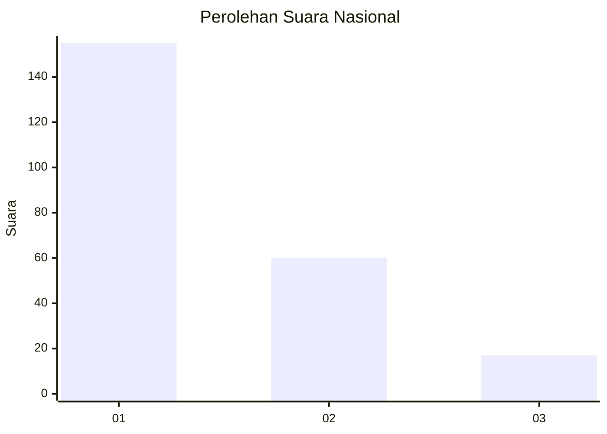
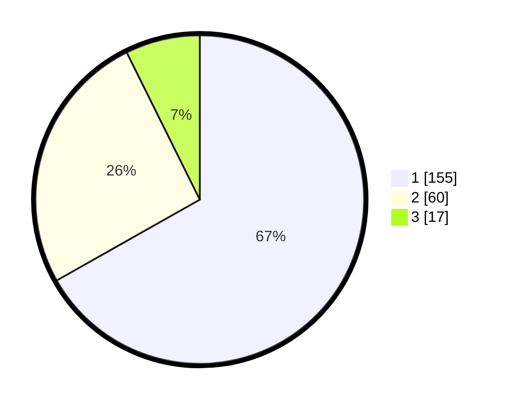

# Hasil

## Grafik

## Tabel

| No.    | Nama Paslon    | Suara | Suara (raw) | Persentase |
|:------ |:-------------- | -----:| -----------:| ----------:|
| 100025 | ANIES MUHAIMIN | 155   | [155][p-1]  | 66,81      |
| 100026 | PRABOWO GIBRAN | 60    | [60][p-2]   | 25,86      |
| 100027 | GANJAR MAHFUD  | 17    | [17][p-3]   | 7,33       |

[p-1]: https://github.com/gigit-pemilu/pemilu-2024/blob/main/pilpres/hitung-suara/sub/31-dki-jakarta/sub/74-jakarta-selatan/sub/03-mampang-prapatan/sub/1001-mampang-prapatan/sub/066-tps/sub/paslon-1.txt
[p-2]: https://github.com/gigit-pemilu/pemilu-2024/blob/main/pilpres/hitung-suara/sub/31-dki-jakarta/sub/74-jakarta-selatan/sub/03-mampang-prapatan/sub/1001-mampang-prapatan/sub/066-tps/sub/paslon-2.txt
[p-3]: https://github.com/gigit-pemilu/pemilu-2024/blob/main/pilpres/hitung-suara/sub/31-dki-jakarta/sub/74-jakarta-selatan/sub/03-mampang-prapatan/sub/1001-mampang-prapatan/sub/066-tps/sub/paslon-3.txt

## Foto C Plano

https://sirekap-obj-formc.kpu.go.id/8a8a/pemilu/ppwp/31/74/03/10/01/3174031001066-20240215-010133--b48bfc11-3e2b-46e9-a712-0a6693029665.jpg

https://sirekap-obj-formc.kpu.go.id/8a8a/pemilu/ppwp/31/74/03/10/01/3174031001066-20240215-010223--ad6b2285-7024-4d86-aed0-72bc05c1b509.jpg

https://sirekap-obj-formc.kpu.go.id/8a8a/pemilu/ppwp/31/74/03/10/01/3174031001066-20240215-010314--c7ba5a5a-b3d2-4e6b-944a-a21d1a481885.jpg

## Metadata

| Key        | Value               |
| ---------- | ------------------- |
| Time Stamp | 2024-02-24 22:31:28 |

