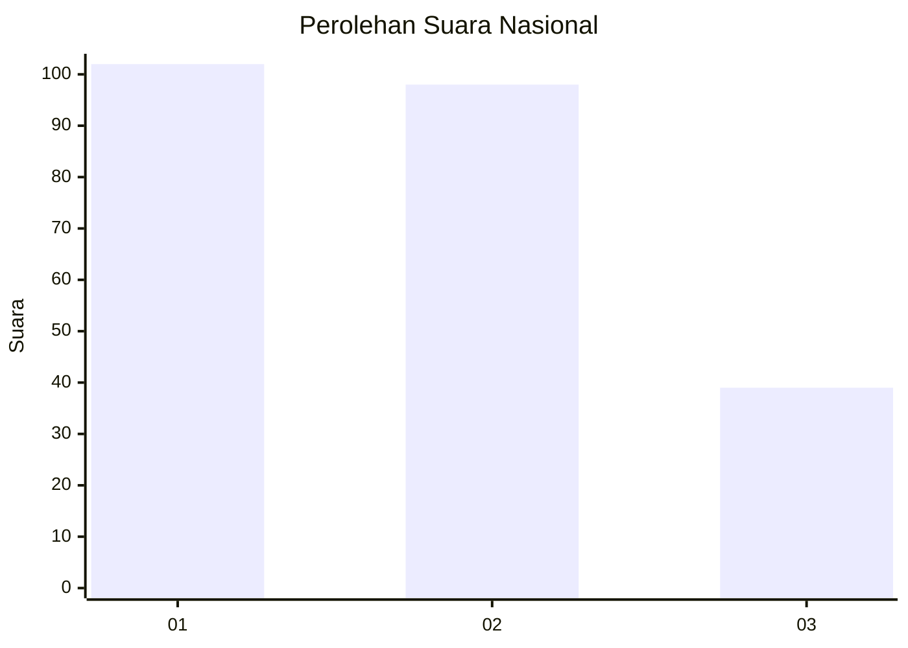
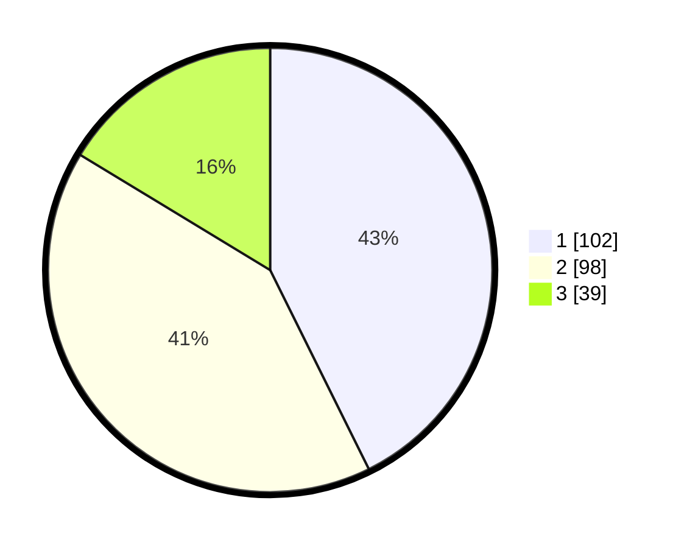

# Hasil

## Grafik

## Tabel

| No.    | Nama Paslon    | Suara | Suara (raw) | Persentase |
|:------ |:-------------- | -----:| -----------:| ----------:|
| 100025 | ANIES MUHAIMIN | 102   | [102][p-1]  | 42,68      |
| 100026 | PRABOWO GIBRAN | 98    | [98][p-2]   | 41,00      |
| 100027 | GANJAR MAHFUD  | 39    | [39][p-3]   | 16,32      |

[p-1]: https://github.com/gigit-pemilu/pemilu-2024/blob/main/pilpres/hitung-suara/sub/31-dki-jakarta/sub/74-jakarta-selatan/sub/03-mampang-prapatan/sub/1003-pela-mampang/sub/017-tps/sub/paslon-1.txt
[p-2]: https://github.com/gigit-pemilu/pemilu-2024/blob/main/pilpres/hitung-suara/sub/31-dki-jakarta/sub/74-jakarta-selatan/sub/03-mampang-prapatan/sub/1003-pela-mampang/sub/017-tps/sub/paslon-2.txt
[p-3]: https://github.com/gigit-pemilu/pemilu-2024/blob/main/pilpres/hitung-suara/sub/31-dki-jakarta/sub/74-jakarta-selatan/sub/03-mampang-prapatan/sub/1003-pela-mampang/sub/017-tps/sub/paslon-3.txt

## Foto C Plano

https://sirekap-obj-formc.kpu.go.id/d935/pemilu/ppwp/31/74/03/10/03/3174031003017-20240215-005654--6a4eb89c-6bdd-4045-a870-83d15ced75c0.jpg

https://sirekap-obj-formc.kpu.go.id/d935/pemilu/ppwp/31/74/03/10/03/3174031003017-20240215-064201--52a6f50d-118f-4cb5-9da2-2268ef2c4830.jpg

https://sirekap-obj-formc.kpu.go.id/d935/pemilu/ppwp/31/74/03/10/03/3174031003017-20240215-005916--0e23f255-f7f6-405a-a92b-ff249c64ce35.jpg

## Metadata

| Key        | Value               |
| ---------- | ------------------- |
| Time Stamp | 2024-02-25 17:00:00 |

