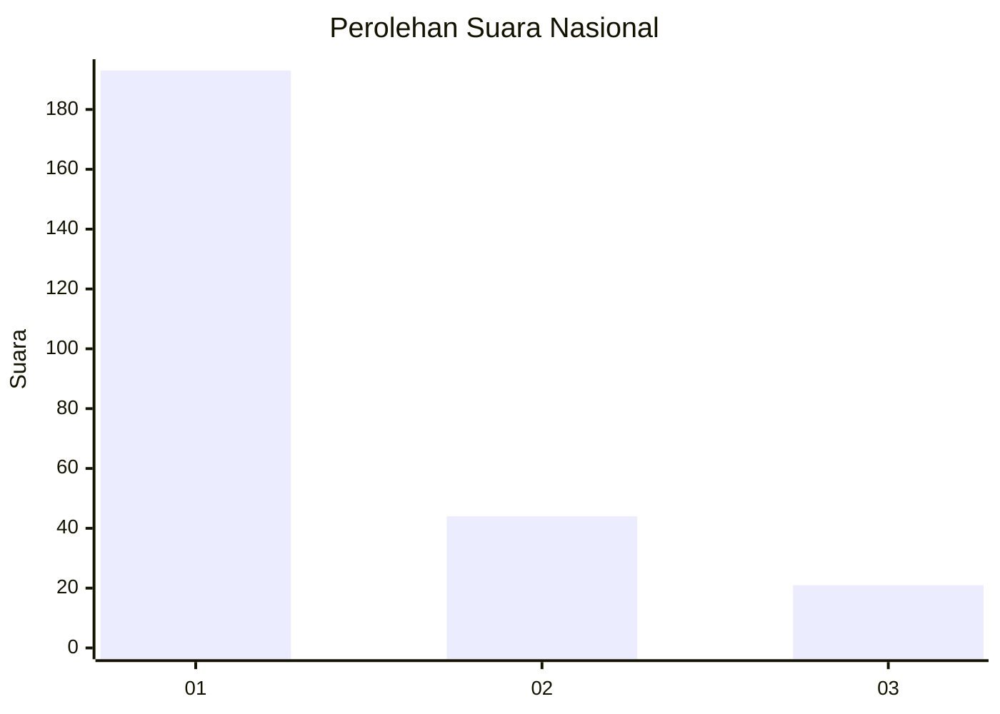
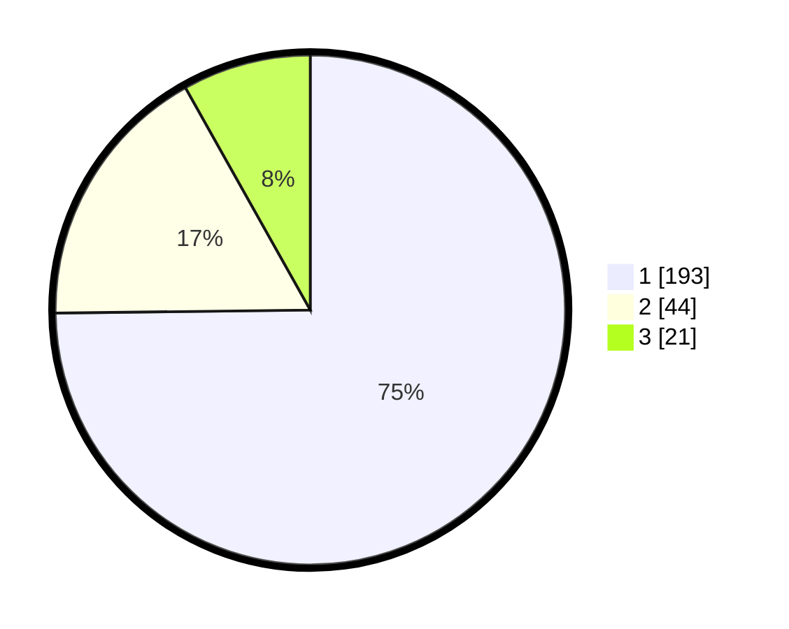

# Hasil

## Grafik

## Tabel

| No. | Nama Paslon    | Suara | Suara (raw) | Persentase |
|:--- |:-------------- | -----:| -----------:| ----------:|
| 1   | ANIES MUHAIMIN | 193   | [193][p-1]  | 74,81      |
| 2   | PRABOWO GIBRAN | 44    | [44][p-2]   | 17,05      |
| 3   | GANJAR MAHFUD  | 21    | [21][p-3]   | 8,14       |

[p-1]: https://github.com/gigit-pemilu/pemilu-2024/blob/main/pilpres/hitung-suara/sub/31-dki-jakarta/sub/74-jakarta-selatan/sub/03-mampang-prapatan/sub/1003-pela-mampang/sub/027-tps/sub/paslon-1.txt
[p-2]: https://github.com/gigit-pemilu/pemilu-2024/blob/main/pilpres/hitung-suara/sub/31-dki-jakarta/sub/74-jakarta-selatan/sub/03-mampang-prapatan/sub/1003-pela-mampang/sub/027-tps/sub/paslon-2.txt
[p-3]: https://github.com/gigit-pemilu/pemilu-2024/blob/main/pilpres/hitung-suara/sub/31-dki-jakarta/sub/74-jakarta-selatan/sub/03-mampang-prapatan/sub/1003-pela-mampang/sub/027-tps/sub/paslon-3.txt

## Foto C Plano

https://sirekap-obj-formc.kpu.go.id/25b6/pemilu/ppwp/31/74/03/10/03/3174031003027-20240214-213032--9726f04b-cda4-4f8f-a095-6dd654a76dda.jpg

https://sirekap-obj-formc.kpu.go.id/25b6/pemilu/ppwp/31/74/03/10/03/3174031003027-20240215-003806--e42ca578-45cc-4c9a-8f1e-e7a4c6d0c716.jpg

https://sirekap-obj-formc.kpu.go.id/25b6/pemilu/ppwp/31/74/03/10/03/3174031003027-20240215-001301--7b0139af-c0dc-4437-9031-4d2649920b4d.jpg

## Metadata

| Key        | Value               |
| ---------- | ------------------- |
| Time Stamp | 2024-02-24 22:31:28 |

