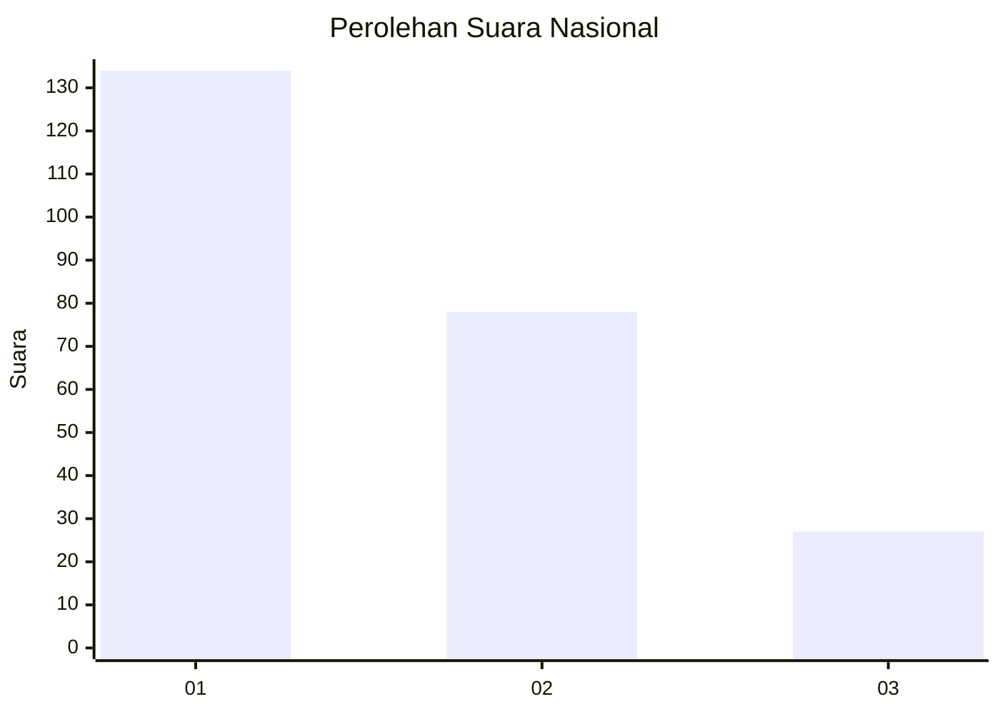
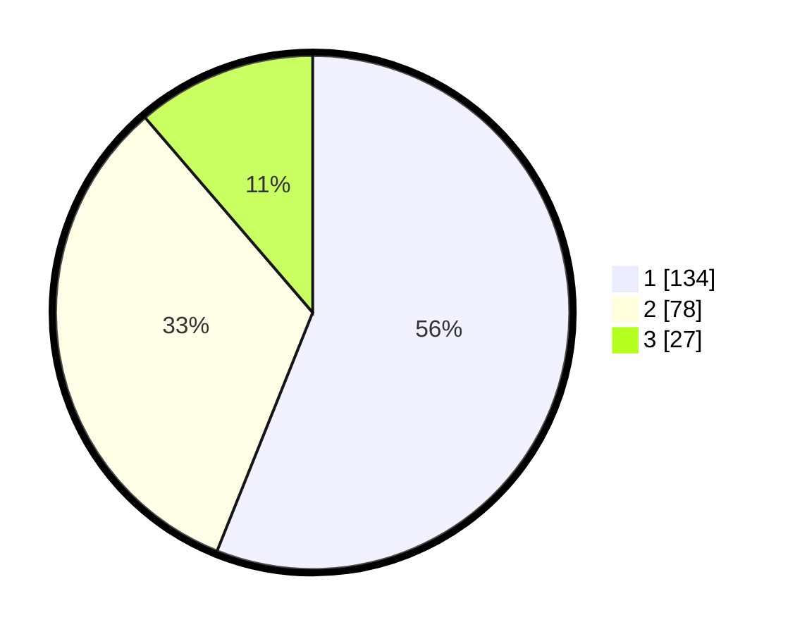

# Hasil

## Grafik

## Tabel

| No.    | Nama Paslon    | Suara | Suara (raw) | Persentase |
|:------ |:-------------- | -----:| -----------:| ----------:|
| 100025 | ANIES MUHAIMIN | 134   | [134][p-1]  | 56,07      |
| 100026 | PRABOWO GIBRAN | 78    | [78][p-2]   | 32,64      |
| 100027 | GANJAR MAHFUD  | 27    | [27][p-3]   | 11,30      |

[p-1]: https://github.com/gigit-pemilu/pemilu-2024/blob/main/pilpres/hitung-suara/sub/31-dki-jakarta/sub/74-jakarta-selatan/sub/03-mampang-prapatan/sub/1003-pela-mampang/sub/029-tps/sub/paslon-1.txt
[p-2]: https://github.com/gigit-pemilu/pemilu-2024/blob/main/pilpres/hitung-suara/sub/31-dki-jakarta/sub/74-jakarta-selatan/sub/03-mampang-prapatan/sub/1003-pela-mampang/sub/029-tps/sub/paslon-2.txt
[p-3]: https://github.com/gigit-pemilu/pemilu-2024/blob/main/pilpres/hitung-suara/sub/31-dki-jakarta/sub/74-jakarta-selatan/sub/03-mampang-prapatan/sub/1003-pela-mampang/sub/029-tps/sub/paslon-3.txt

## Foto C Plano

https://sirekap-obj-formc.kpu.go.id/cd25/pemilu/ppwp/31/74/03/10/03/3174031003029-20240214-222409--d3f6c00e-69c6-496f-93c4-48e42194ccfe.jpg

https://sirekap-obj-formc.kpu.go.id/cd25/pemilu/ppwp/31/74/03/10/03/3174031003029-20240214-233722--c484df26-6bb4-4f61-88e7-f466a7185c27.jpg

https://sirekap-obj-formc.kpu.go.id/cd25/pemilu/ppwp/31/74/03/10/03/3174031003029-20240216-133259--07b097d8-6953-4968-adbc-0a8a6033c950.jpg

## Metadata

| Key        | Value               |
| ---------- | ------------------- |
| Time Stamp | 2024-02-17 18:00:00 |

