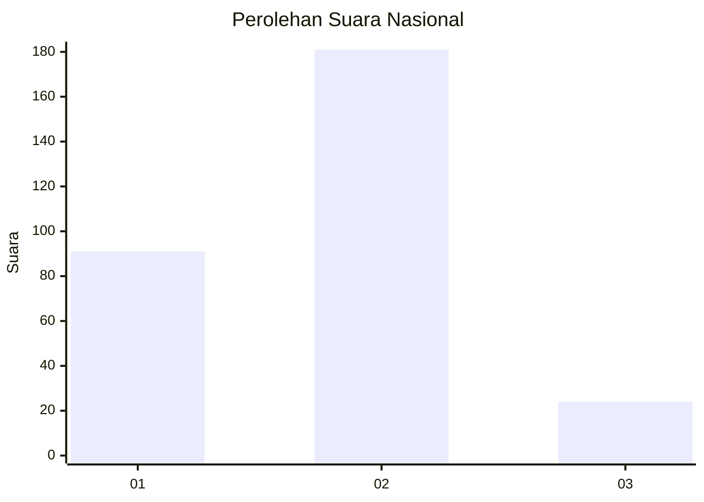
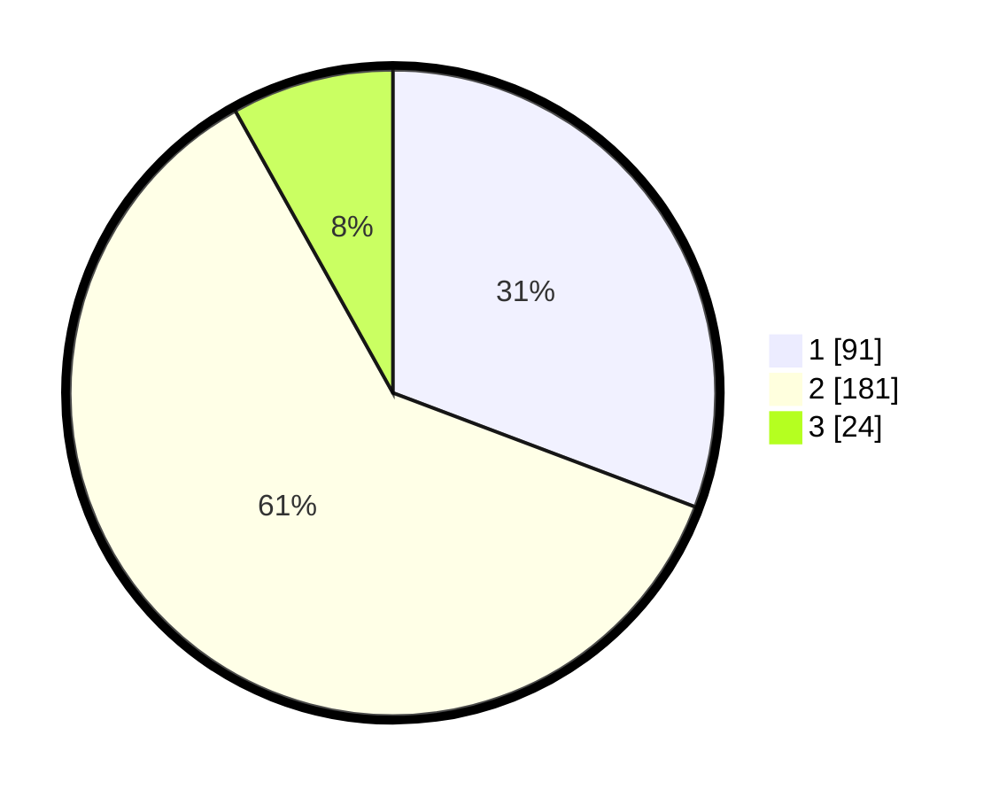

# Hasil

## Grafik

## Tabel

| No.    | Nama Paslon    | Suara | Suara (raw) | Persentase |
|:------ |:-------------- | -----:| -----------:| ----------:|
| 100025 | ANIES MUHAIMIN | 91    | [91][p-1]   | 30,74      |
| 100026 | PRABOWO GIBRAN | 181   | [181][p-2]  | 61,15      |
| 100027 | GANJAR MAHFUD  | 24    | [24][p-3]   | 8,11       |

[p-1]: https://github.com/gigit-pemilu/pemilu-2024/blob/main/pilpres/hitung-suara/sub/31-dki-jakarta/sub/74-jakarta-selatan/sub/03-mampang-prapatan/sub/1003-pela-mampang/sub/031-tps/sub/paslon-1.txt
[p-2]: https://github.com/gigit-pemilu/pemilu-2024/blob/main/pilpres/hitung-suara/sub/31-dki-jakarta/sub/74-jakarta-selatan/sub/03-mampang-prapatan/sub/1003-pela-mampang/sub/031-tps/sub/paslon-2.txt
[p-3]: https://github.com/gigit-pemilu/pemilu-2024/blob/main/pilpres/hitung-suara/sub/31-dki-jakarta/sub/74-jakarta-selatan/sub/03-mampang-prapatan/sub/1003-pela-mampang/sub/031-tps/sub/paslon-3.txt

## Foto C Plano

https://sirekap-obj-formc.kpu.go.id/9603/pemilu/ppwp/31/74/03/10/03/3174031003031-20240219-214906--84398fb4-36e8-4b09-9cb4-e21e774e713a.jpg

https://sirekap-obj-formc.kpu.go.id/9603/pemilu/ppwp/31/74/03/10/03/3174031003031-20240219-215541--6f66d323-e61b-4325-bd39-95991757dfa9.jpg

https://sirekap-obj-formc.kpu.go.id/9603/pemilu/ppwp/31/74/03/10/03/3174031003031-20240215-121213--c756b437-bc2f-405f-8f9b-5d2cade3d7aa.jpg

## Metadata

| Key        | Value               |
| ---------- | ------------------- |
| Time Stamp | 2024-02-25 11:00:00 |

