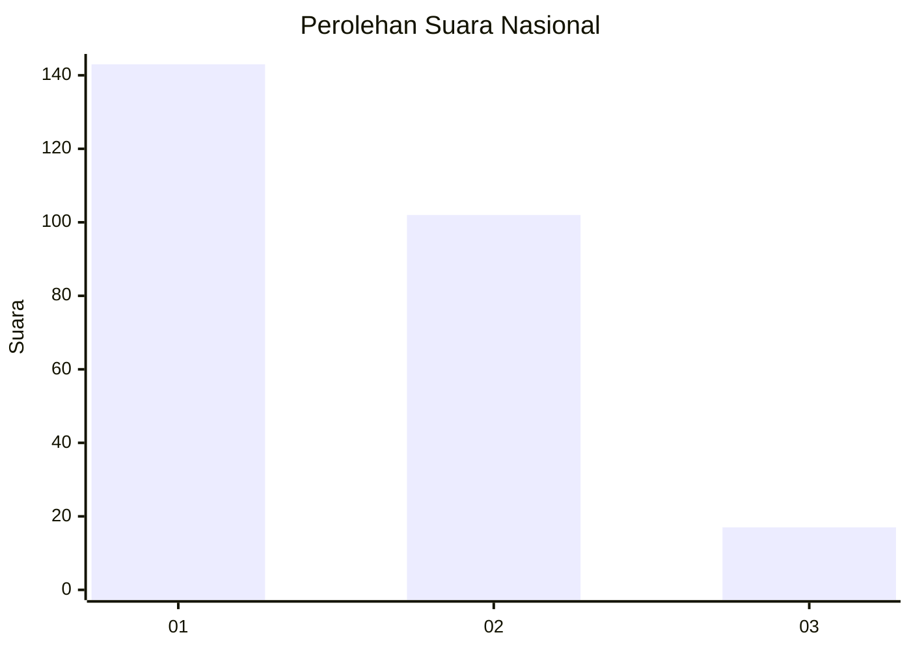
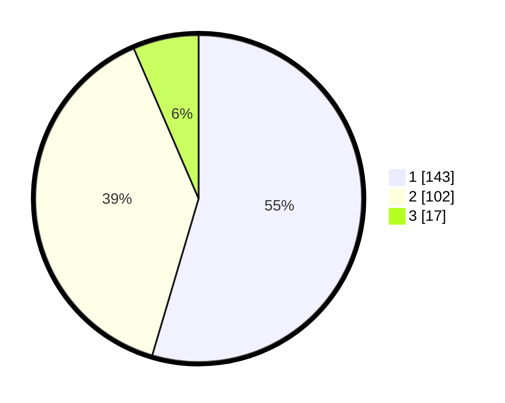

# Hasil

## Grafik

## Tabel

| No.    | Nama Paslon    | Suara | Suara (raw) | Persentase |
|:------ |:-------------- | -----:| -----------:| ----------:|
| 100025 | ANIES MUHAIMIN | 143   | [143][p-1]  | 54,58      |
| 100026 | PRABOWO GIBRAN | 102   | [102][p-2]  | 38,93      |
| 100027 | GANJAR MAHFUD  | 17    | [17][p-3]   | 6,49       |

[p-1]: https://github.com/gigit-pemilu/pemilu-2024/blob/main/pilpres/hitung-suara/sub/31-dki-jakarta/sub/74-jakarta-selatan/sub/03-mampang-prapatan/sub/1003-pela-mampang/sub/075-tps/sub/paslon-1.txt
[p-2]: https://github.com/gigit-pemilu/pemilu-2024/blob/main/pilpres/hitung-suara/sub/31-dki-jakarta/sub/74-jakarta-selatan/sub/03-mampang-prapatan/sub/1003-pela-mampang/sub/075-tps/sub/paslon-2.txt
[p-3]: https://github.com/gigit-pemilu/pemilu-2024/blob/main/pilpres/hitung-suara/sub/31-dki-jakarta/sub/74-jakarta-selatan/sub/03-mampang-prapatan/sub/1003-pela-mampang/sub/075-tps/sub/paslon-3.txt

## Foto C Plano

https://sirekap-obj-formc.kpu.go.id/fd98/pemilu/ppwp/31/74/03/10/03/3174031003075-20240215-044453--87c824a7-ace7-4f46-ac01-0342f833f56e.jpg

https://sirekap-obj-formc.kpu.go.id/fd98/pemilu/ppwp/31/74/03/10/03/3174031003075-20240216-133943--0c747aa4-83ad-41bd-8bde-f809b18b972e.jpg

https://sirekap-obj-formc.kpu.go.id/fd98/pemilu/ppwp/31/74/03/10/03/3174031003075-20240215-162439--d0950ca3-d097-460d-bc37-48d74bc7b8bf.jpg

## Metadata

| Key        | Value               |
| ---------- | ------------------- |
| Time Stamp | 2024-02-16 14:00:34 |

