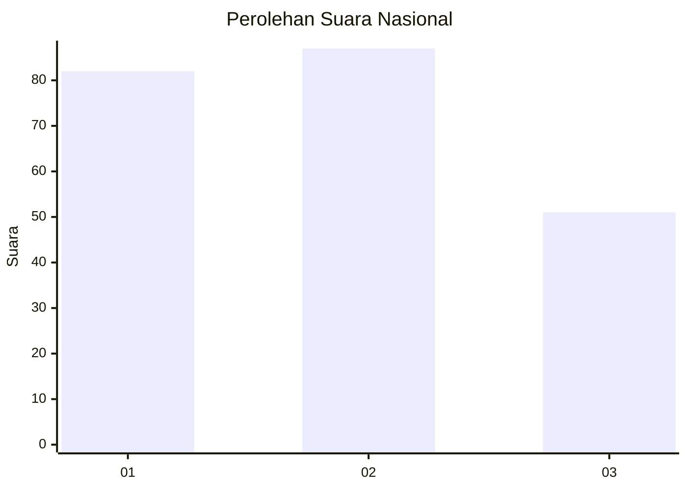
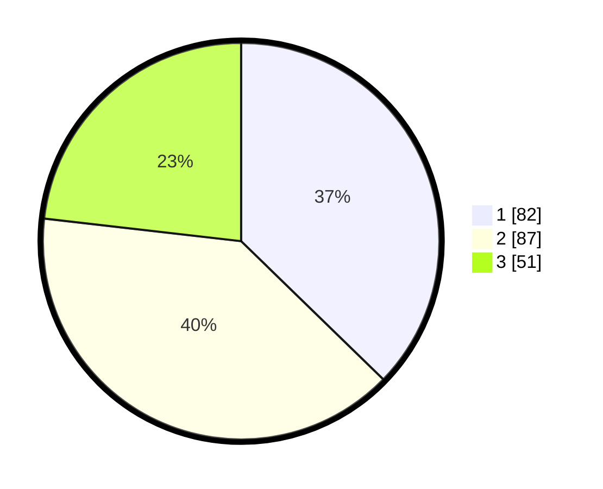

# Hasil

## Grafik

## Tabel

| No.    | Nama Paslon    | Suara | Suara (raw) | Persentase |
|:------ |:-------------- | -----:| -----------:| ----------:|
| 100025 | ANIES MUHAIMIN | 82    | [82][p-1]   | 37,27      |
| 100026 | PRABOWO GIBRAN | 87    | [87][p-2]   | 39,55      |
| 100027 | GANJAR MAHFUD  | 51    | [51][p-3]   | 23,18      |

[p-1]: https://github.com/gigit-pemilu/pemilu-2024/blob/main/pilpres/hitung-suara/sub/31-dki-jakarta/sub/74-jakarta-selatan/sub/03-mampang-prapatan/sub/1003-pela-mampang/sub/083-tps/sub/paslon-1.txt
[p-2]: https://github.com/gigit-pemilu/pemilu-2024/blob/main/pilpres/hitung-suara/sub/31-dki-jakarta/sub/74-jakarta-selatan/sub/03-mampang-prapatan/sub/1003-pela-mampang/sub/083-tps/sub/paslon-2.txt
[p-3]: https://github.com/gigit-pemilu/pemilu-2024/blob/main/pilpres/hitung-suara/sub/31-dki-jakarta/sub/74-jakarta-selatan/sub/03-mampang-prapatan/sub/1003-pela-mampang/sub/083-tps/sub/paslon-3.txt

## Foto C Plano

https://sirekap-obj-formc.kpu.go.id/1f49/pemilu/ppwp/31/74/03/10/03/3174031003083-20240215-204156--52fbd96d-c4f5-4d51-81aa-39f1e431c66d.jpg

https://sirekap-obj-formc.kpu.go.id/1f49/pemilu/ppwp/31/74/03/10/03/3174031003083-20240215-004714--7791b86c-b5c6-4fbf-a641-40a77542490d.jpg

https://sirekap-obj-formc.kpu.go.id/1f49/pemilu/ppwp/31/74/03/10/03/3174031003083-20240215-004730--da471097-0c19-44df-b421-557b1b930d63.jpg

## Metadata

| Key        | Value               |
| ---------- | ------------------- |
| Time Stamp | 2024-02-15 21:01:18 |

