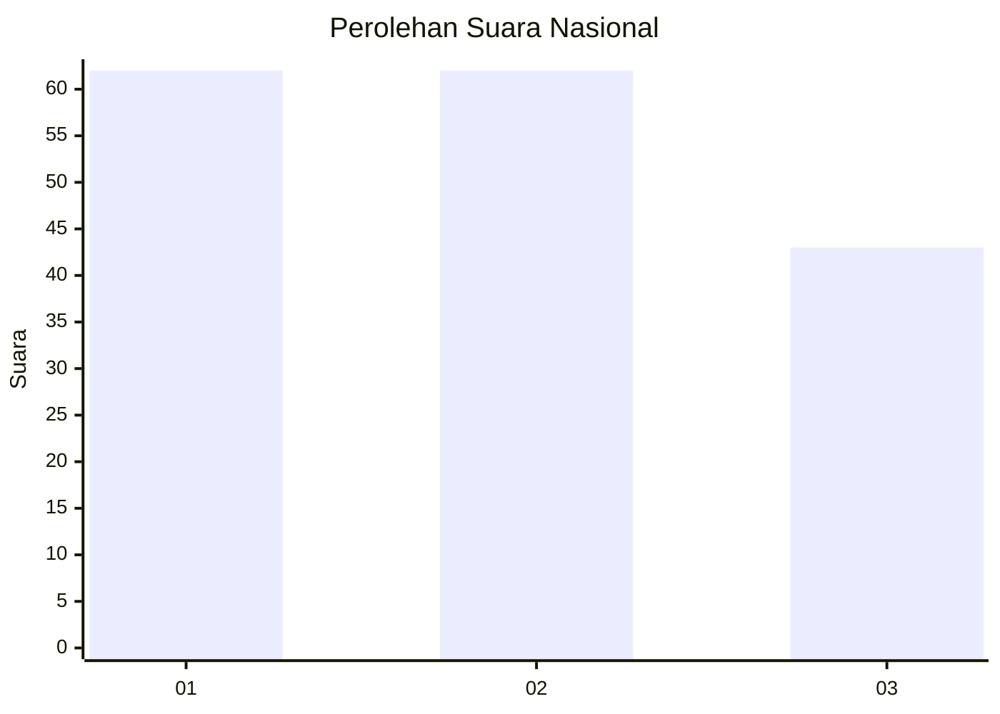
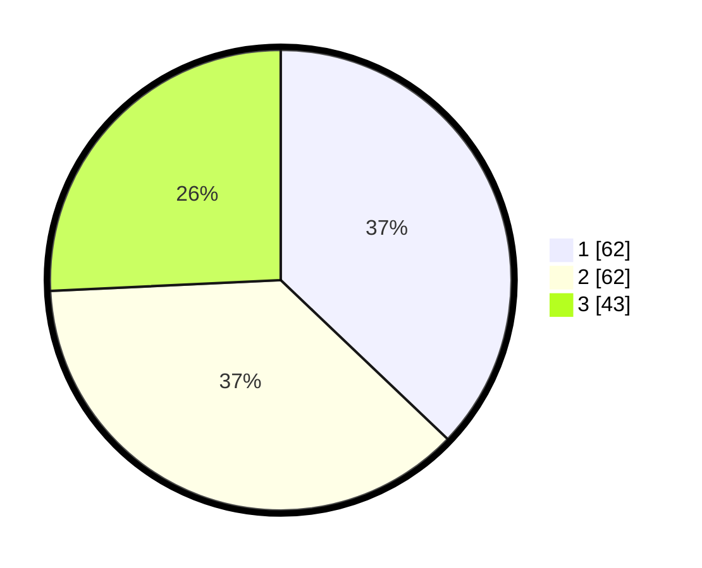

# Hasil

## Grafik

## Tabel

| No.    | Nama Paslon    | Suara | Suara (raw) | Persentase |
|:------ |:-------------- | -----:| -----------:| ----------:|
| 100025 | ANIES MUHAIMIN | 62    | [62][p-1]   | 37,13      |
| 100026 | PRABOWO GIBRAN | 62    | [62][p-2]   | 37,13      |
| 100027 | GANJAR MAHFUD  | 43    | [43][p-3]   | 25,75      |

[p-1]: https://github.com/gigit-pemilu/pemilu-2024/blob/main/pilpres/hitung-suara/sub/31-dki-jakarta/sub/74-jakarta-selatan/sub/03-mampang-prapatan/sub/1003-pela-mampang/sub/090-tps/sub/paslon-1.txt
[p-2]: https://github.com/gigit-pemilu/pemilu-2024/blob/main/pilpres/hitung-suara/sub/31-dki-jakarta/sub/74-jakarta-selatan/sub/03-mampang-prapatan/sub/1003-pela-mampang/sub/090-tps/sub/paslon-2.txt
[p-3]: https://github.com/gigit-pemilu/pemilu-2024/blob/main/pilpres/hitung-suara/sub/31-dki-jakarta/sub/74-jakarta-selatan/sub/03-mampang-prapatan/sub/1003-pela-mampang/sub/090-tps/sub/paslon-3.txt

## Foto C Plano

https://sirekap-obj-formc.kpu.go.id/bbb1/pemilu/ppwp/31/74/03/10/03/3174031003090-20240215-001543--7a673add-09c6-42be-9d08-b8fd377ab08c.jpg

https://sirekap-obj-formc.kpu.go.id/bbb1/pemilu/ppwp/31/74/03/10/03/3174031003090-20240215-001544--bd1394a9-6eaf-4f2d-bd4a-89c360bae2bd.jpg

https://sirekap-obj-formc.kpu.go.id/bbb1/pemilu/ppwp/31/74/03/10/03/3174031003090-20240215-001620--36b3398a-18f1-49b9-b70e-04b896bb80d3.jpg

## Metadata

| Key        | Value               |
| ---------- | ------------------- |
| Time Stamp | 2024-02-24 22:31:28 |

