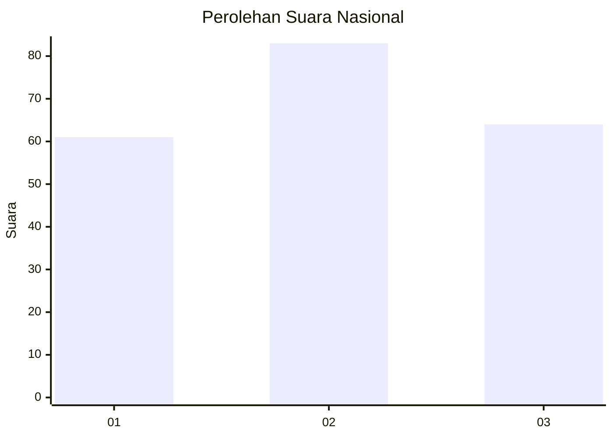
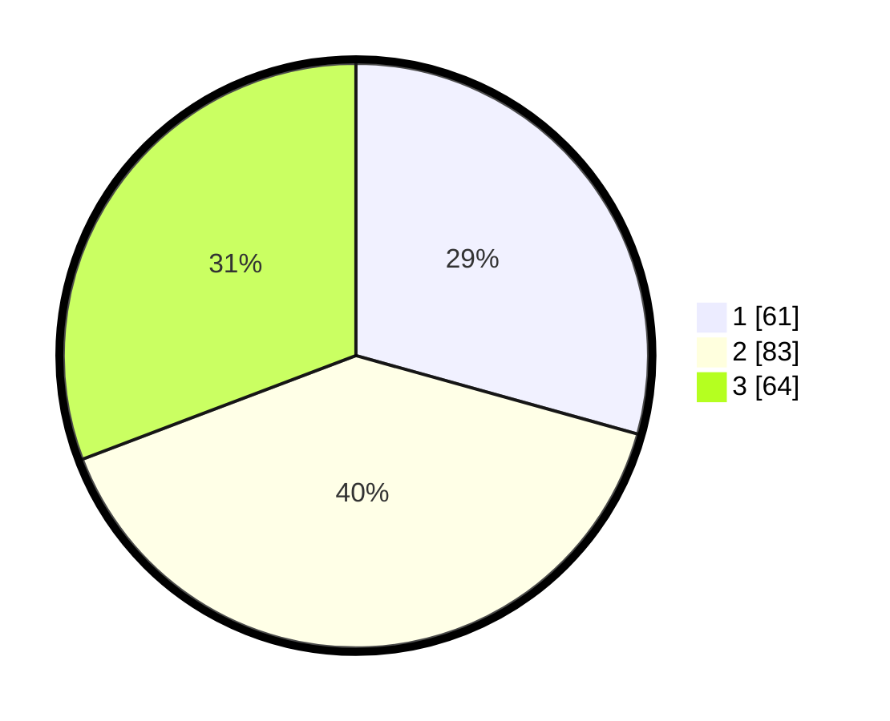

# Hasil

## Grafik

## Tabel

| No.    | Nama Paslon    | Suara | Suara (raw) | Persentase |
|:------ |:-------------- | -----:| -----------:| ----------:|
| 100025 | ANIES MUHAIMIN | 61    | [61][p-1]   | 29,33      |
| 100026 | PRABOWO GIBRAN | 83    | [83][p-2]   | 39,90      |
| 100027 | GANJAR MAHFUD  | 64    | [64][p-3]   | 30,77      |

[p-1]: https://github.com/gigit-pemilu/pemilu-2024/blob/main/pilpres/hitung-suara/sub/31-dki-jakarta/sub/74-jakarta-selatan/sub/03-mampang-prapatan/sub/1003-pela-mampang/sub/092-tps/sub/paslon-1.txt
[p-2]: https://github.com/gigit-pemilu/pemilu-2024/blob/main/pilpres/hitung-suara/sub/31-dki-jakarta/sub/74-jakarta-selatan/sub/03-mampang-prapatan/sub/1003-pela-mampang/sub/092-tps/sub/paslon-2.txt
[p-3]: https://github.com/gigit-pemilu/pemilu-2024/blob/main/pilpres/hitung-suara/sub/31-dki-jakarta/sub/74-jakarta-selatan/sub/03-mampang-prapatan/sub/1003-pela-mampang/sub/092-tps/sub/paslon-3.txt

## Foto C Plano

https://sirekap-obj-formc.kpu.go.id/af9f/pemilu/ppwp/31/74/03/10/03/3174031003092-20240215-004234--fb4c9ddc-972b-46d2-9e6d-90677d1ca53e.jpg

https://sirekap-obj-formc.kpu.go.id/af9f/pemilu/ppwp/31/74/03/10/03/3174031003092-20240215-004248--488f60b4-75be-4bad-9fe8-07509e0867ab.jpg

https://sirekap-obj-formc.kpu.go.id/af9f/pemilu/ppwp/31/74/03/10/03/3174031003092-20240215-004256--0338e9e0-2c1e-4567-a7b4-00162170edd4.jpg

## Metadata

| Key        | Value               |
| ---------- | ------------------- |
| Time Stamp | 2024-02-24 22:31:28 |

