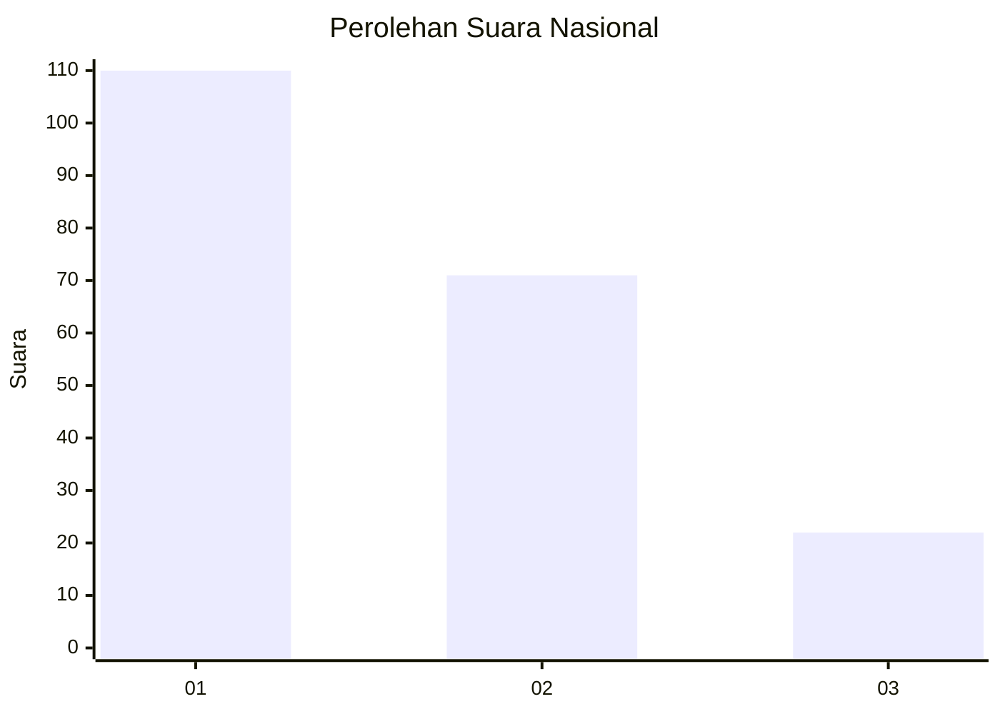
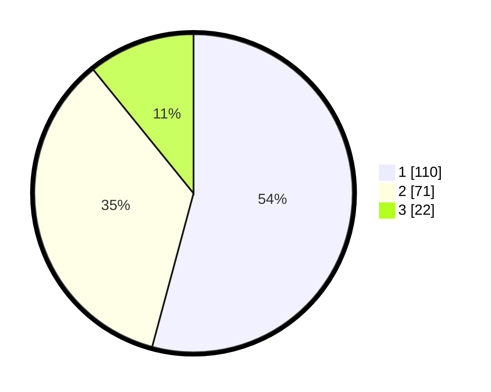

# Hasil

## Grafik

## Tabel

| No.    | Nama Paslon    | Suara | Suara (raw) | Persentase |
|:------ |:-------------- | -----:| -----------:| ----------:|
| 100025 | ANIES MUHAIMIN | 110   | [110][p-1]  | 54,19      |
| 100026 | PRABOWO GIBRAN | 71    | [71][p-2]   | 34,98      |
| 100027 | GANJAR MAHFUD  | 22    | [22][p-3]   | 10,84      |

[p-1]: https://github.com/gigit-pemilu/pemilu-2024/blob/main/pilpres/hitung-suara/sub/31-dki-jakarta/sub/74-jakarta-selatan/sub/03-mampang-prapatan/sub/1003-pela-mampang/sub/107-tps/sub/paslon-1.txt
[p-2]: https://github.com/gigit-pemilu/pemilu-2024/blob/main/pilpres/hitung-suara/sub/31-dki-jakarta/sub/74-jakarta-selatan/sub/03-mampang-prapatan/sub/1003-pela-mampang/sub/107-tps/sub/paslon-2.txt
[p-3]: https://github.com/gigit-pemilu/pemilu-2024/blob/main/pilpres/hitung-suara/sub/31-dki-jakarta/sub/74-jakarta-selatan/sub/03-mampang-prapatan/sub/1003-pela-mampang/sub/107-tps/sub/paslon-3.txt

## Foto C Plano

https://sirekap-obj-formc.kpu.go.id/893b/pemilu/ppwp/31/74/03/10/03/3174031003107-20240214-205034--8b569553-c9f1-4f7f-a92c-0e38e0248092.jpg

https://sirekap-obj-formc.kpu.go.id/893b/pemilu/ppwp/31/74/03/10/03/3174031003107-20240214-205028--f8bf8b86-c12a-4ecc-a5c3-d366451d730f.jpg

https://sirekap-obj-formc.kpu.go.id/893b/pemilu/ppwp/31/74/03/10/03/3174031003107-20240214-205019--d7d7b5b1-2bd6-4c19-b1b6-78aa72ce073d.jpg

## Metadata

| Key        | Value               |
| ---------- | ------------------- |
| Time Stamp | 2024-02-25 12:00:00 |

