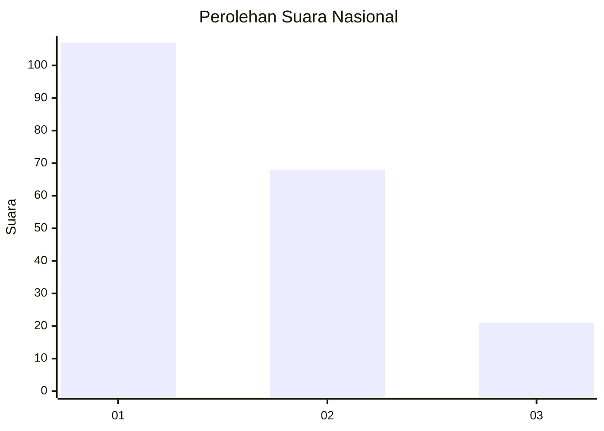
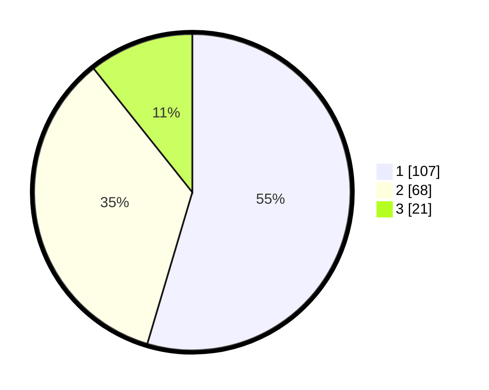

# Hasil

## Grafik

## Tabel

| No.    | Nama Paslon    | Suara | Suara (raw) | Persentase |
|:------ |:-------------- | -----:| -----------:| ----------:|
| 100025 | ANIES MUHAIMIN | 107   | [107][p-1]  | 54,59      |
| 100026 | PRABOWO GIBRAN | 68    | [68][p-2]   | 34,69      |
| 100027 | GANJAR MAHFUD  | 21    | [21][p-3]   | 10,71      |

[p-1]: https://github.com/gigit-pemilu/pemilu-2024/blob/main/pilpres/hitung-suara/sub/31-dki-jakarta/sub/74-jakarta-selatan/sub/03-mampang-prapatan/sub/1003-pela-mampang/sub/123-tps/sub/paslon-1.txt
[p-2]: https://github.com/gigit-pemilu/pemilu-2024/blob/main/pilpres/hitung-suara/sub/31-dki-jakarta/sub/74-jakarta-selatan/sub/03-mampang-prapatan/sub/1003-pela-mampang/sub/123-tps/sub/paslon-2.txt
[p-3]: https://github.com/gigit-pemilu/pemilu-2024/blob/main/pilpres/hitung-suara/sub/31-dki-jakarta/sub/74-jakarta-selatan/sub/03-mampang-prapatan/sub/1003-pela-mampang/sub/123-tps/sub/paslon-3.txt

## Foto C Plano

https://sirekap-obj-formc.kpu.go.id/d2f3/pemilu/ppwp/31/74/03/10/03/3174031003123-20240214-195322--d29e804c-28a9-4da1-97c3-c054f843f29a.jpg

https://sirekap-obj-formc.kpu.go.id/d2f3/pemilu/ppwp/31/74/03/10/03/3174031003123-20240214-195331--aa62bb9b-e3b4-4179-bfc2-e79843425f3f.jpg

https://sirekap-obj-formc.kpu.go.id/d2f3/pemilu/ppwp/31/74/03/10/03/3174031003123-20240215-002314--475ecff8-11f4-4589-8a2b-201445919a8b.jpg

## Metadata

| Key        | Value               |
| ---------- | ------------------- |
| Time Stamp | 2024-02-15 21:01:18 |

