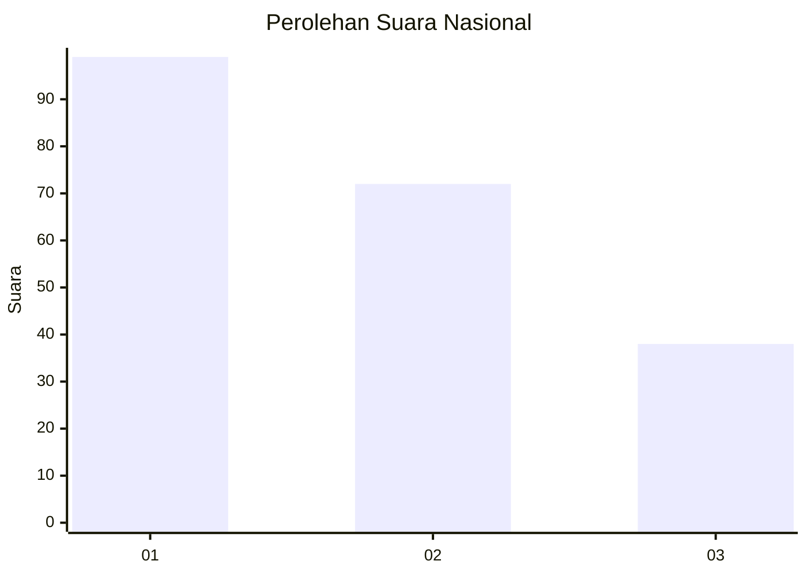
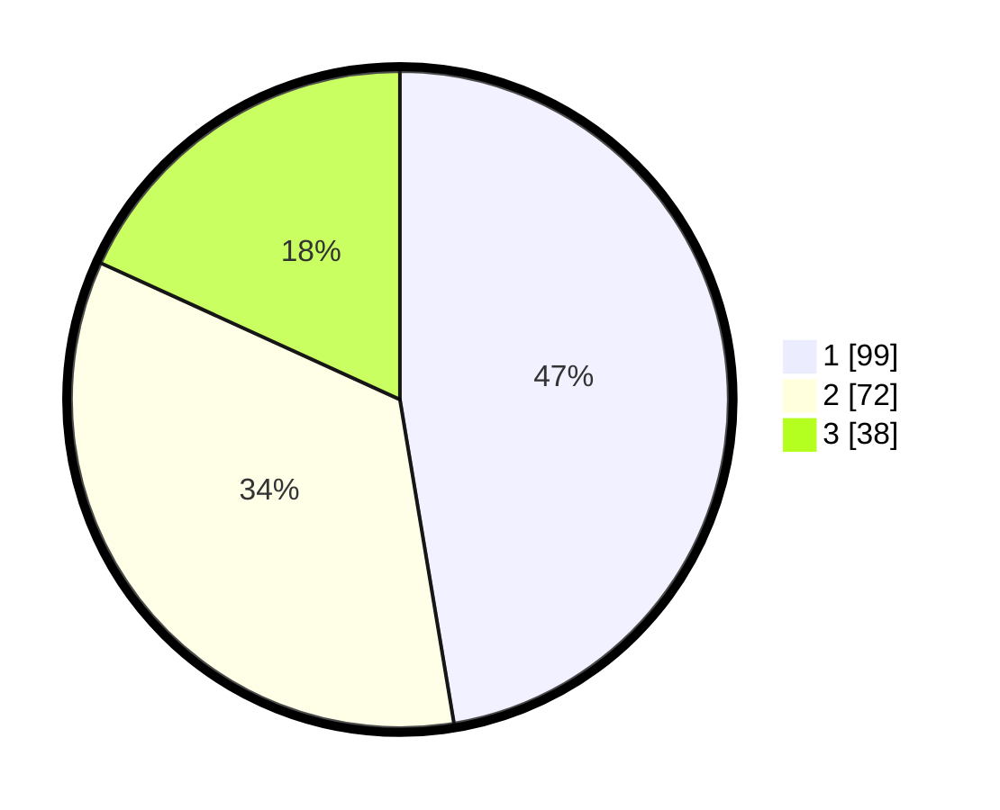

# Hasil

## Grafik

## Tabel

| No.    | Nama Paslon    | Suara | Suara (raw) | Persentase |
|:------ |:-------------- | -----:| -----------:| ----------:|
| 100025 | ANIES MUHAIMIN | 99    | [99][p-1]   | 47,37      |
| 100026 | PRABOWO GIBRAN | 72    | [72][p-2]   | 34,45      |
| 100027 | GANJAR MAHFUD  | 38    | [38][p-3]   | 18,18      |

[p-1]: https://github.com/gigit-pemilu/pemilu-2024/blob/main/pilpres/hitung-suara/sub/31-dki-jakarta/sub/74-jakarta-selatan/sub/03-mampang-prapatan/sub/1003-pela-mampang/sub/137-tps/sub/paslon-1.txt
[p-2]: https://github.com/gigit-pemilu/pemilu-2024/blob/main/pilpres/hitung-suara/sub/31-dki-jakarta/sub/74-jakarta-selatan/sub/03-mampang-prapatan/sub/1003-pela-mampang/sub/137-tps/sub/paslon-2.txt
[p-3]: https://github.com/gigit-pemilu/pemilu-2024/blob/main/pilpres/hitung-suara/sub/31-dki-jakarta/sub/74-jakarta-selatan/sub/03-mampang-prapatan/sub/1003-pela-mampang/sub/137-tps/sub/paslon-3.txt

## Foto C Plano

https://sirekap-obj-formc.kpu.go.id/ebdb/pemilu/ppwp/31/74/03/10/03/3174031003137-20240214-193218--18d2ee84-c192-4944-b8a1-4ef8736aa6e8.jpg

https://sirekap-obj-formc.kpu.go.id/ebdb/pemilu/ppwp/31/74/03/10/03/3174031003137-20240215-003153--4db61ea9-3181-4a45-94f1-26755cdb5007.jpg

https://sirekap-obj-formc.kpu.go.id/ebdb/pemilu/ppwp/31/74/03/10/03/3174031003137-20240214-212010--a294de82-b6a2-4762-b6a0-a386708f758b.jpg

## Metadata

| Key        | Value               |
| ---------- | ------------------- |
| Time Stamp | 2024-02-24 22:31:28 |

