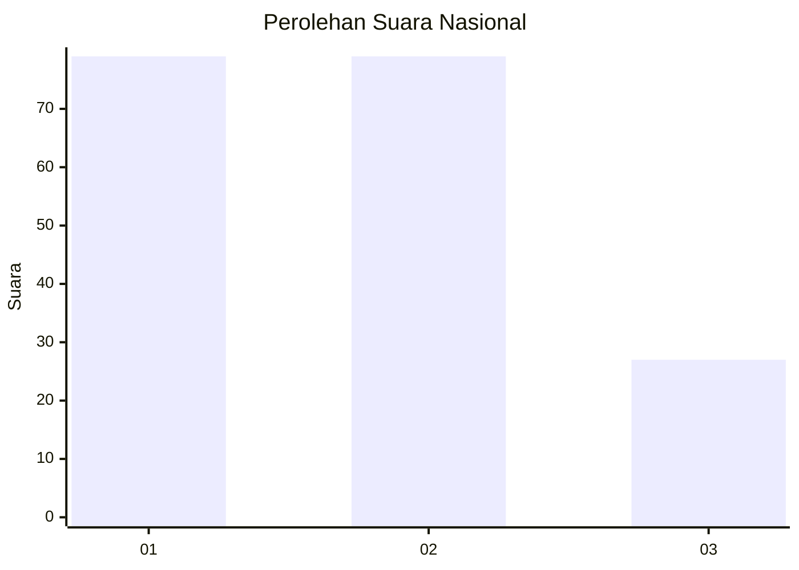
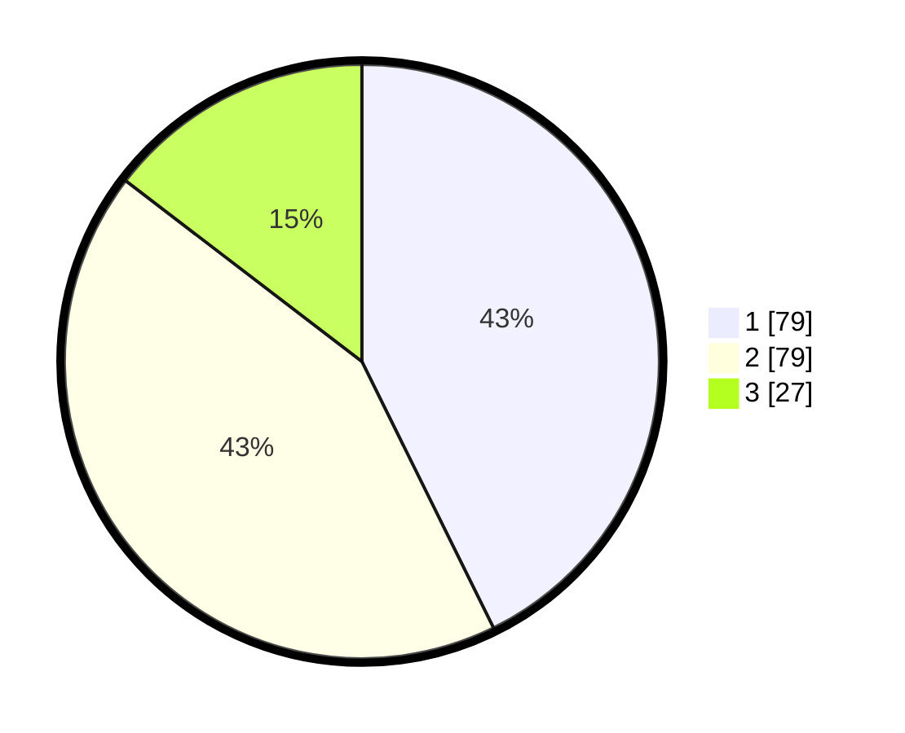

# Hasil

## Grafik

## Tabel

| No.    | Nama Paslon    | Suara | Suara (raw) | Persentase |
|:------ |:-------------- | -----:| -----------:| ----------:|
| 100025 | ANIES MUHAIMIN | 79    | [79][p-1]   | 42,70      |
| 100026 | PRABOWO GIBRAN | 79    | [79][p-2]   | 42,70      |
| 100027 | GANJAR MAHFUD  | 27    | [27][p-3]   | 14,59      |

[p-1]: https://github.com/gigit-pemilu/pemilu-2024/blob/main/pilpres/hitung-suara/sub/31-dki-jakarta/sub/74-jakarta-selatan/sub/03-mampang-prapatan/sub/1003-pela-mampang/sub/151-tps/sub/paslon-1.txt
[p-2]: https://github.com/gigit-pemilu/pemilu-2024/blob/main/pilpres/hitung-suara/sub/31-dki-jakarta/sub/74-jakarta-selatan/sub/03-mampang-prapatan/sub/1003-pela-mampang/sub/151-tps/sub/paslon-2.txt
[p-3]: https://github.com/gigit-pemilu/pemilu-2024/blob/main/pilpres/hitung-suara/sub/31-dki-jakarta/sub/74-jakarta-selatan/sub/03-mampang-prapatan/sub/1003-pela-mampang/sub/151-tps/sub/paslon-3.txt

## Foto C Plano

https://sirekap-obj-formc.kpu.go.id/6f64/pemilu/ppwp/31/74/03/10/03/3174031003151-20240214-200224--0ee81332-25ca-4c7e-b308-cc3d3abb9371.jpg

https://sirekap-obj-formc.kpu.go.id/6f64/pemilu/ppwp/31/74/03/10/03/3174031003151-20240214-200234--ab1d8498-b18b-4b26-9f4d-ef29a348c2b2.jpg

https://sirekap-obj-formc.kpu.go.id/6f64/pemilu/ppwp/31/74/03/10/03/3174031003151-20240214-200237--e1af0fd2-61ea-422e-9033-a3154d3d4d80.jpg

## Metadata

| Key        | Value               |
| ---------- | ------------------- |
| Time Stamp | 2024-02-24 22:31:28 |

