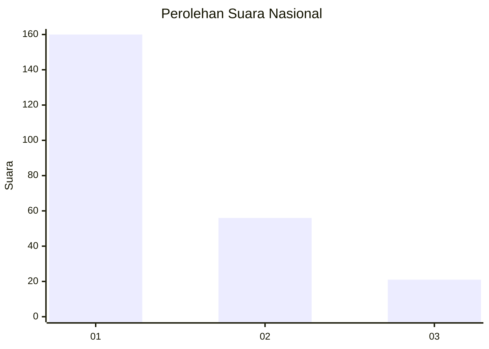
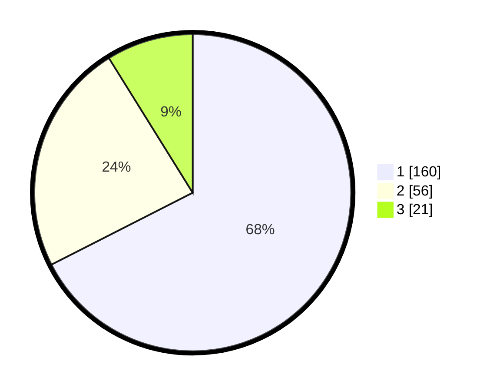

# Hasil

## Grafik

## Tabel

| No. | Nama Paslon    | Suara | Suara (raw) | Persentase |
|:--- |:-------------- | -----:| -----------:| ----------:|
| 1   | ANIES MUHAIMIN | 160   | [160][p-1]  | 67,51      |
| 2   | PRABOWO GIBRAN | 56    | [56][p-2]   | 23,63      |
| 3   | GANJAR MAHFUD  | 21    | [21][p-3]   | 8,86       |

[p-1]: https://github.com/gigit-pemilu/pemilu-2024/blob/main/pilpres/hitung-suara/sub/31-dki-jakarta/sub/74-jakarta-selatan/sub/03-mampang-prapatan/sub/1004-tegal-parang/sub/015-tps/sub/paslon-1.txt
[p-2]: https://github.com/gigit-pemilu/pemilu-2024/blob/main/pilpres/hitung-suara/sub/31-dki-jakarta/sub/74-jakarta-selatan/sub/03-mampang-prapatan/sub/1004-tegal-parang/sub/015-tps/sub/paslon-2.txt
[p-3]: https://github.com/gigit-pemilu/pemilu-2024/blob/main/pilpres/hitung-suara/sub/31-dki-jakarta/sub/74-jakarta-selatan/sub/03-mampang-prapatan/sub/1004-tegal-parang/sub/015-tps/sub/paslon-3.txt

## Foto C Plano

https://sirekap-obj-formc.kpu.go.id/94d1/pemilu/ppwp/31/74/03/10/04/3174031004015-20240215-013650--36d0541b-c662-4aef-bc2b-e3028e4e7e61.jpg

https://sirekap-obj-formc.kpu.go.id/94d1/pemilu/ppwp/31/74/03/10/04/3174031004015-20240215-013800--8031d882-7e67-496a-9f2b-6e50f16ffa22.jpg

https://sirekap-obj-formc.kpu.go.id/94d1/pemilu/ppwp/31/74/03/10/04/3174031004015-20240215-013847--cf3beb19-1ca7-4b88-847b-2bfd48d0080b.jpg

## Metadata

| Key        | Value               |
| ---------- | ------------------- |
| Time Stamp | 2024-02-25 17:00:00 |

