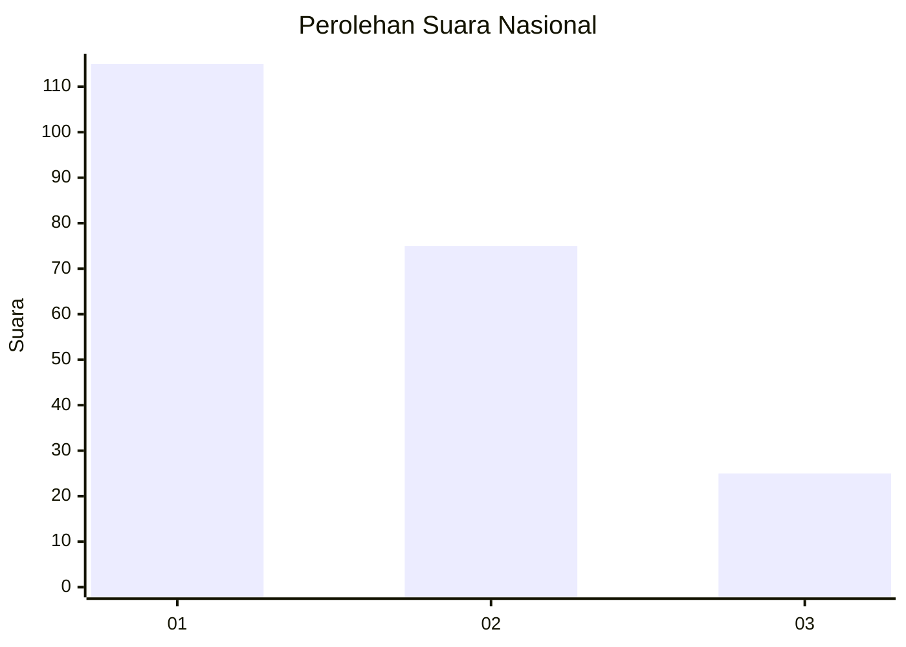
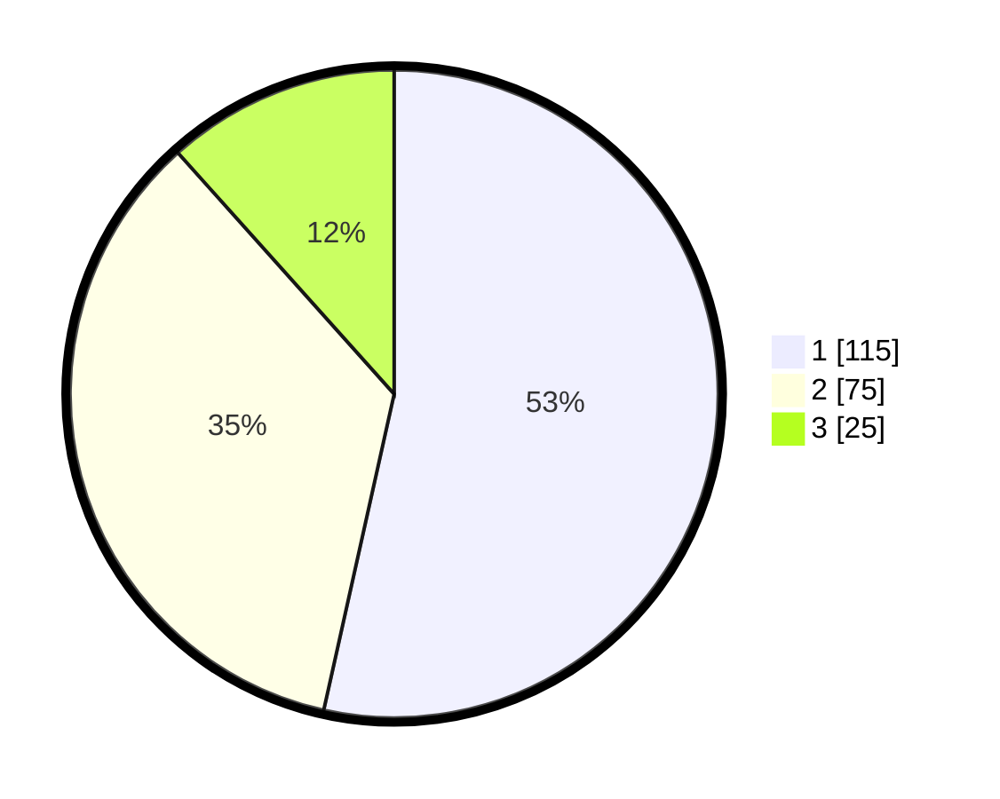

# Hasil

## Grafik

## Tabel

| No.    | Nama Paslon    | Suara | Suara (raw) | Persentase |
|:------ |:-------------- | -----:| -----------:| ----------:|
| 100025 | ANIES MUHAIMIN | 115   | [115][p-1]  | 53,49      |
| 100026 | PRABOWO GIBRAN | 75    | [75][p-2]   | 34,88      |
| 100027 | GANJAR MAHFUD  | 25    | [25][p-3]   | 11,63      |

[p-1]: https://github.com/gigit-pemilu/pemilu-2024/blob/main/pilpres/hitung-suara/sub/31-dki-jakarta/sub/74-jakarta-selatan/sub/03-mampang-prapatan/sub/1004-tegal-parang/sub/048-tps/sub/paslon-1.txt
[p-2]: https://github.com/gigit-pemilu/pemilu-2024/blob/main/pilpres/hitung-suara/sub/31-dki-jakarta/sub/74-jakarta-selatan/sub/03-mampang-prapatan/sub/1004-tegal-parang/sub/048-tps/sub/paslon-2.txt
[p-3]: https://github.com/gigit-pemilu/pemilu-2024/blob/main/pilpres/hitung-suara/sub/31-dki-jakarta/sub/74-jakarta-selatan/sub/03-mampang-prapatan/sub/1004-tegal-parang/sub/048-tps/sub/paslon-3.txt

## Foto C Plano

https://sirekap-obj-formc.kpu.go.id/e2fb/pemilu/ppwp/31/74/03/10/04/3174031004048-20240215-041927--7c9a4a2f-371b-4be8-8149-a2714bc46132.jpg

https://sirekap-obj-formc.kpu.go.id/e2fb/pemilu/ppwp/31/74/03/10/04/3174031004048-20240215-042028--fe30617b-9e1e-47b1-a33b-3a445af98440.jpg

https://sirekap-obj-formc.kpu.go.id/e2fb/pemilu/ppwp/31/74/03/10/04/3174031004048-20240215-042121--36955711-d24f-4c8d-b17a-077ccc7ae8b0.jpg

## Metadata

| Key        | Value               |
| ---------- | ------------------- |
| Time Stamp | 2024-02-24 22:31:28 |

