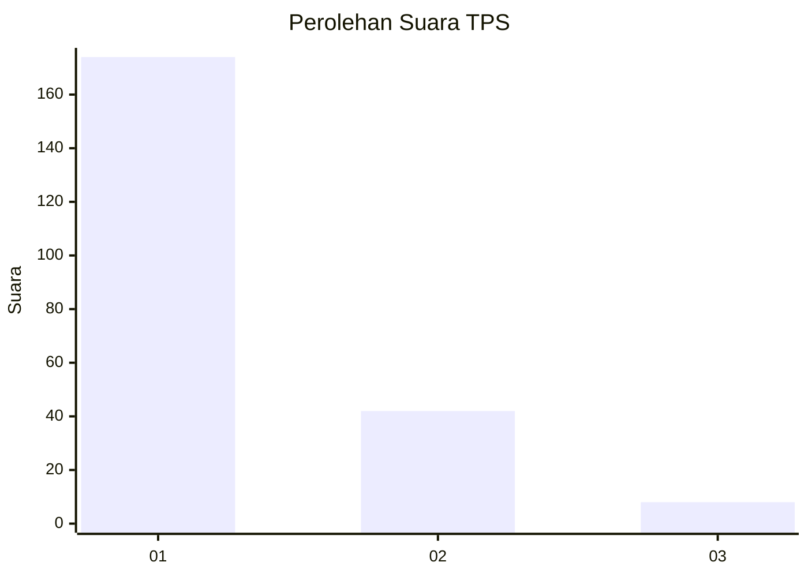
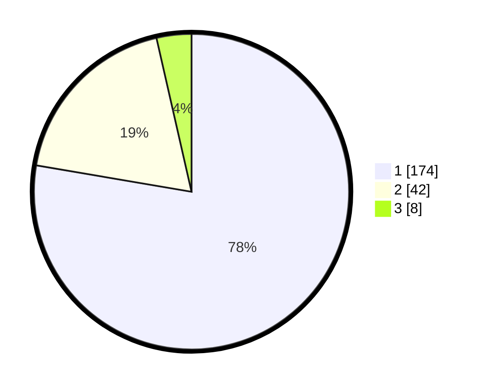

# Hasil

## Grafik

## Tabel

| No. | Nama Paslon    | Suara | Suara (raw) | Persentase |
|:--- |:-------------- | -----:| -----------:| ----------:|
| 1   | ANIES MUHAIMIN | 174   | [174][p-1]  | 77,68      |
| 2   | PRABOWO GIBRAN | 42    | [42][p-2]   | 18,75      |
| 3   | GANJAR MAHFUD  | 8     | [8][p-3]    | 3,57       |

[p-1]: https://github.com/gigit-pemilu/pemilu-2024-31-dki-jakarta/blob/main/pilpres/hitung-suara/sub/31-dki-jakarta/sub/74-jakarta-selatan/sub/03-mampang-prapatan/sub/1004-tegal-parang/sub/067-tps/sub/paslon-1.txt
[p-2]: https://github.com/gigit-pemilu/pemilu-2024-31-dki-jakarta/blob/main/pilpres/hitung-suara/sub/31-dki-jakarta/sub/74-jakarta-selatan/sub/03-mampang-prapatan/sub/1004-tegal-parang/sub/067-tps/sub/paslon-2.txt
[p-3]: https://github.com/gigit-pemilu/pemilu-2024-31-dki-jakarta/blob/main/pilpres/hitung-suara/sub/31-dki-jakarta/sub/74-jakarta-selatan/sub/03-mampang-prapatan/sub/1004-tegal-parang/sub/067-tps/sub/paslon-3.txt

## Foto C Plano

https://sirekap-obj-formc.kpu.go.id/8cd3/pemilu/ppwp/31/74/03/10/04/3174031004067-20240214-230815--164f87b0-c9e0-4312-9f33-2f3e7772dd3c.jpg

https://sirekap-obj-formc.kpu.go.id/8cd3/pemilu/ppwp/31/74/03/10/04/3174031004067-20240214-231008--0570ace6-9f9d-4109-89ef-f182c7f62294.jpg

https://sirekap-obj-formc.kpu.go.id/8cd3/pemilu/ppwp/31/74/03/10/04/3174031004067-20240214-231144--5b5de103-aaaf-497c-929f-abcaa243f3e3.jpg

## Metadata

| Key        | Value               |
| ---------- | ------------------- |
| Time Stamp | 2024-02-25 11:00:00 |

