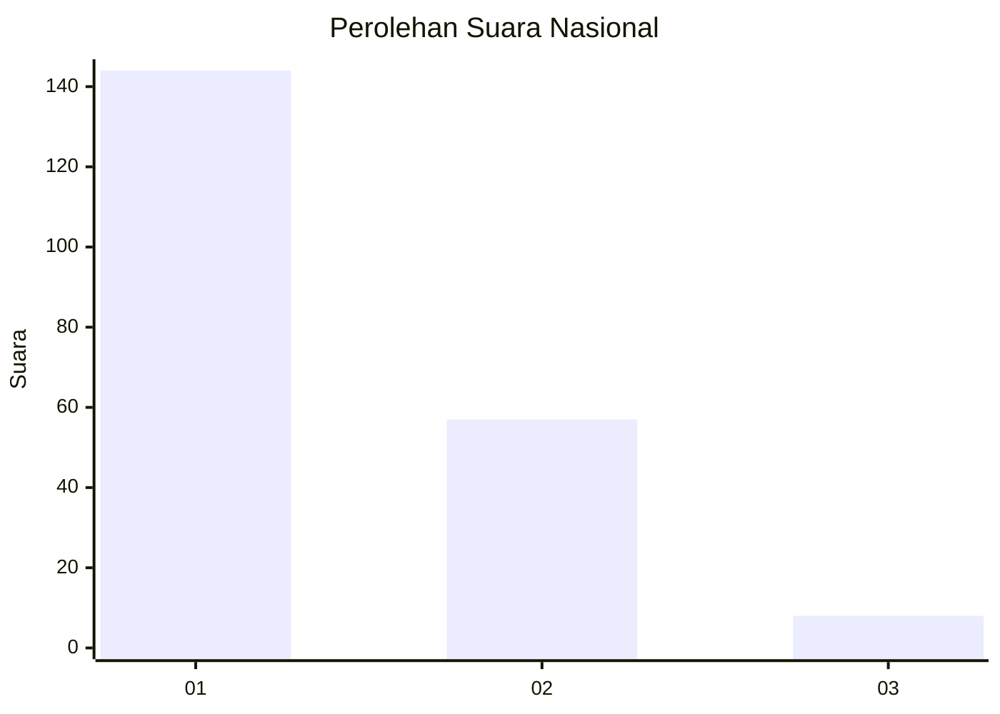
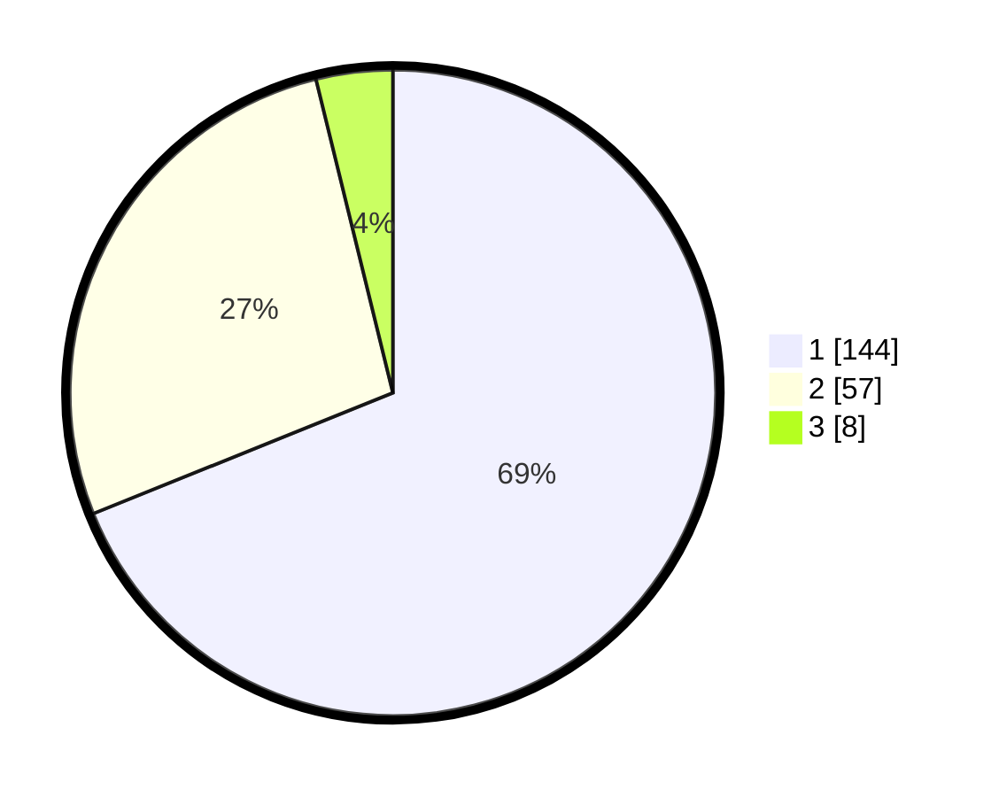

# Hasil

## Grafik

## Tabel

| No.    | Nama Paslon    | Suara | Suara (raw) | Persentase |
|:------ |:-------------- | -----:| -----------:| ----------:|
| 100025 | ANIES MUHAIMIN | 144   | [144][p-1]  | 68,90      |
| 100026 | PRABOWO GIBRAN | 57    | [57][p-2]   | 27,27      |
| 100027 | GANJAR MAHFUD  | 8     | [8][p-3]    | 3,83       |

[p-1]: https://github.com/gigit-pemilu/pemilu-2024/blob/main/pilpres/hitung-suara/sub/31-dki-jakarta/sub/74-jakarta-selatan/sub/03-mampang-prapatan/sub/1004-tegal-parang/sub/076-tps/sub/paslon-1.txt
[p-2]: https://github.com/gigit-pemilu/pemilu-2024/blob/main/pilpres/hitung-suara/sub/31-dki-jakarta/sub/74-jakarta-selatan/sub/03-mampang-prapatan/sub/1004-tegal-parang/sub/076-tps/sub/paslon-2.txt
[p-3]: https://github.com/gigit-pemilu/pemilu-2024/blob/main/pilpres/hitung-suara/sub/31-dki-jakarta/sub/74-jakarta-selatan/sub/03-mampang-prapatan/sub/1004-tegal-parang/sub/076-tps/sub/paslon-3.txt

## Foto C Plano

https://sirekap-obj-formc.kpu.go.id/0c0e/pemilu/ppwp/31/74/03/10/04/3174031004076-20240214-225442--fa294b46-b4f4-49c8-a1b9-721942f1a526.jpg

https://sirekap-obj-formc.kpu.go.id/0c0e/pemilu/ppwp/31/74/03/10/04/3174031004076-20240214-225556--5d9bac7e-1a8c-41b0-b824-e12cde266df3.jpg

https://sirekap-obj-formc.kpu.go.id/0c0e/pemilu/ppwp/31/74/03/10/04/3174031004076-20240214-225731--55f6c680-d967-4390-89cd-d4eb3b63cba7.jpg

## Metadata

| Key        | Value               |
| ---------- | ------------------- |
| Time Stamp | 2024-02-25 00:00:00 |

