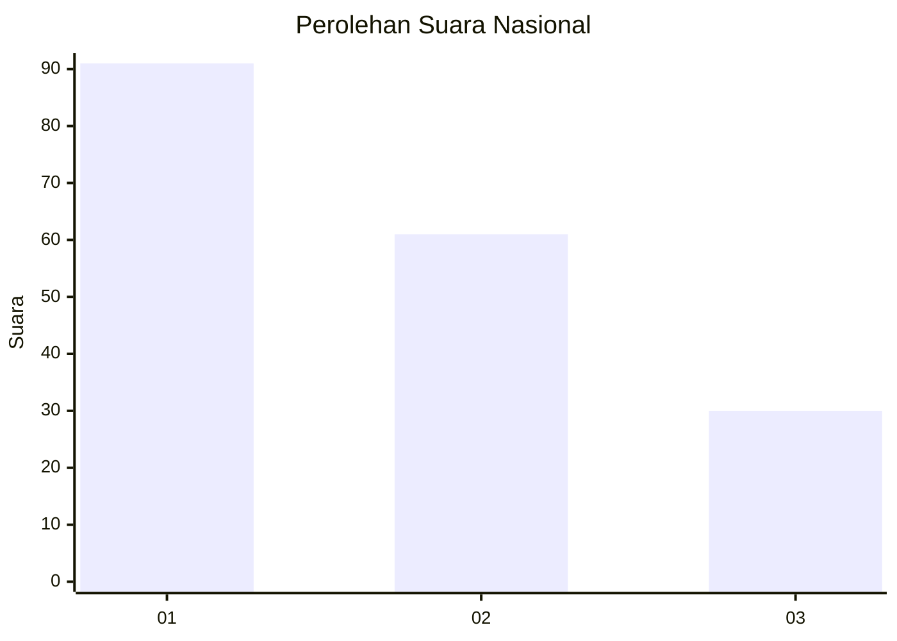
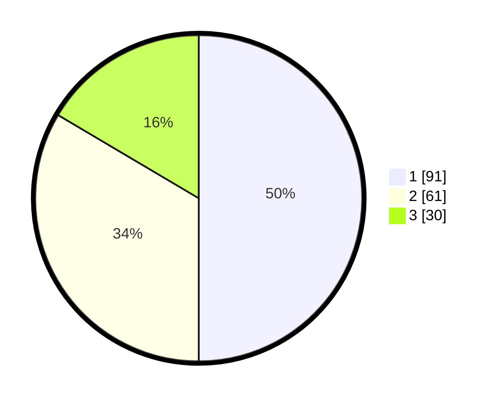

# Hasil

## Grafik

## Tabel

| No.    | Nama Paslon    | Suara | Suara (raw) | Persentase |
|:------ |:-------------- | -----:| -----------:| ----------:|
| 100025 | ANIES MUHAIMIN | 91    | [91][p-1]   | 50,00      |
| 100026 | PRABOWO GIBRAN | 61    | [61][p-2]   | 33,52      |
| 100027 | GANJAR MAHFUD  | 30    | [30][p-3]   | 16,48      |

[p-1]: https://github.com/gigit-pemilu/pemilu-2024/blob/main/pilpres/hitung-suara/sub/31-dki-jakarta/sub/74-jakarta-selatan/sub/03-mampang-prapatan/sub/1004-tegal-parang/sub/091-tps/sub/paslon-1.txt
[p-2]: https://github.com/gigit-pemilu/pemilu-2024/blob/main/pilpres/hitung-suara/sub/31-dki-jakarta/sub/74-jakarta-selatan/sub/03-mampang-prapatan/sub/1004-tegal-parang/sub/091-tps/sub/paslon-2.txt
[p-3]: https://github.com/gigit-pemilu/pemilu-2024/blob/main/pilpres/hitung-suara/sub/31-dki-jakarta/sub/74-jakarta-selatan/sub/03-mampang-prapatan/sub/1004-tegal-parang/sub/091-tps/sub/paslon-3.txt

## Foto C Plano

https://sirekap-obj-formc.kpu.go.id/cdca/pemilu/ppwp/31/74/03/10/04/3174031004091-20240215-000652--fb81c8d4-55ef-47e7-a44b-e8cbae51da1e.jpg

https://sirekap-obj-formc.kpu.go.id/cdca/pemilu/ppwp/31/74/03/10/04/3174031004091-20240215-000755--e4a59d62-7c98-47c4-956f-6caadb389988.jpg

https://sirekap-obj-formc.kpu.go.id/cdca/pemilu/ppwp/31/74/03/10/04/3174031004091-20240215-001231--f8367ead-021a-4ee0-be79-a5c3e4761407.jpg

## Metadata

| Key        | Value               |
| ---------- | ------------------- |
| Time Stamp | 2024-02-25 17:00:00 |

