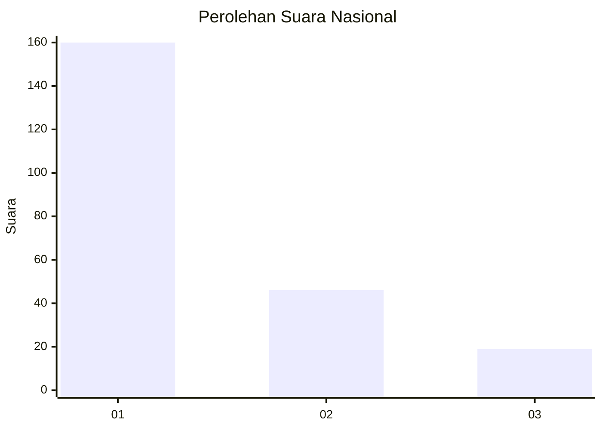
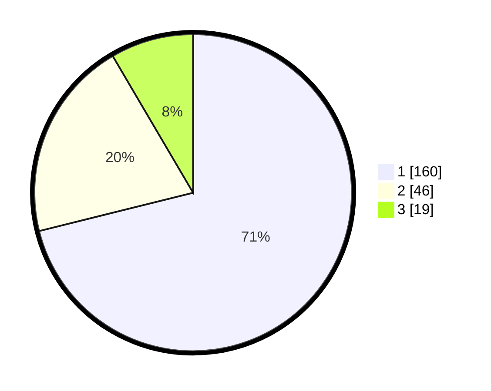

# Hasil

## Grafik

## Tabel

| No. | Nama Paslon    | Suara | Suara (raw) | Persentase |
|:--- |:-------------- | -----:| -----------:| ----------:|
| 1   | ANIES MUHAIMIN | 160   | [160][p-1]  | 71,11      |
| 2   | PRABOWO GIBRAN | 46    | [46][p-2]   | 20,44      |
| 3   | GANJAR MAHFUD  | 19    | [19][p-3]   | 8,44       |

[p-1]: https://github.com/gigit-pemilu/pemilu-2024/blob/main/pilpres/hitung-suara/sub/31-dki-jakarta/sub/74-jakarta-selatan/sub/03-mampang-prapatan/sub/1004-tegal-parang/sub/107-tps/sub/paslon-1.txt
[p-2]: https://github.com/gigit-pemilu/pemilu-2024/blob/main/pilpres/hitung-suara/sub/31-dki-jakarta/sub/74-jakarta-selatan/sub/03-mampang-prapatan/sub/1004-tegal-parang/sub/107-tps/sub/paslon-2.txt
[p-3]: https://github.com/gigit-pemilu/pemilu-2024/blob/main/pilpres/hitung-suara/sub/31-dki-jakarta/sub/74-jakarta-selatan/sub/03-mampang-prapatan/sub/1004-tegal-parang/sub/107-tps/sub/paslon-3.txt

## Foto C Plano

https://sirekap-obj-formc.kpu.go.id/d446/pemilu/ppwp/31/74/03/10/04/3174031004107-20240215-002735--47ddd8a5-dad2-43f4-a813-7fe92f9d9905.jpg

https://sirekap-obj-formc.kpu.go.id/d446/pemilu/ppwp/31/74/03/10/04/3174031004107-20240215-003024--96fbbf4c-1698-402a-9e09-c63c1bb544d4.jpg

https://sirekap-obj-formc.kpu.go.id/d446/pemilu/ppwp/31/74/03/10/04/3174031004107-20240215-024738--c20e88b7-77d3-4553-b0fc-617bd8aa56e7.jpg

## Metadata

| Key        | Value               |
| ---------- | ------------------- |
| Time Stamp | 2024-02-24 22:31:28 |

