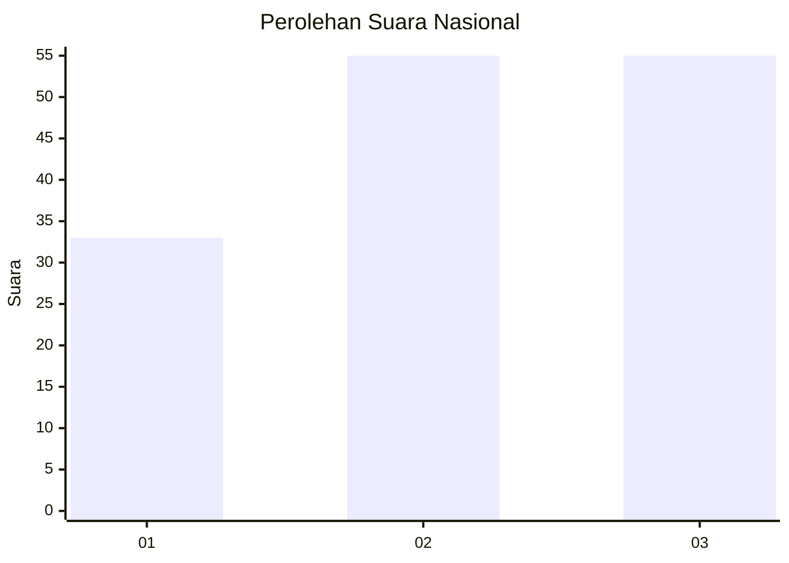
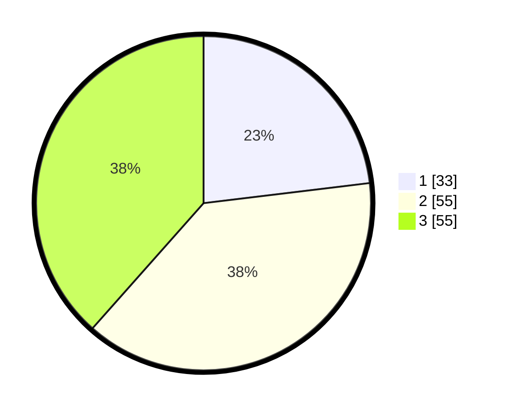

# Hasil

## Grafik

## Tabel

| No.    | Nama Paslon    | Suara | Suara (raw) | Persentase |
|:------ |:-------------- | -----:| -----------:| ----------:|
| 100025 | ANIES MUHAIMIN | 33    | [33][p-1]   | 23,08      |
| 100026 | PRABOWO GIBRAN | 55    | [55][p-2]   | 38,46      |
| 100027 | GANJAR MAHFUD  | 55    | [55][p-3]   | 38,46      |

[p-1]: https://github.com/gigit-pemilu/pemilu-2024/blob/main/pilpres/hitung-suara/sub/31-dki-jakarta/sub/74-jakarta-selatan/sub/03-mampang-prapatan/sub/1005-kuningan-barat/sub/014-tps/sub/paslon-1.txt
[p-2]: https://github.com/gigit-pemilu/pemilu-2024/blob/main/pilpres/hitung-suara/sub/31-dki-jakarta/sub/74-jakarta-selatan/sub/03-mampang-prapatan/sub/1005-kuningan-barat/sub/014-tps/sub/paslon-2.txt
[p-3]: https://github.com/gigit-pemilu/pemilu-2024/blob/main/pilpres/hitung-suara/sub/31-dki-jakarta/sub/74-jakarta-selatan/sub/03-mampang-prapatan/sub/1005-kuningan-barat/sub/014-tps/sub/paslon-3.txt

## Foto C Plano

https://sirekap-obj-formc.kpu.go.id/0267/pemilu/ppwp/31/74/03/10/05/3174031005014-20240214-232613--9e6aa606-d3c9-4a11-b226-242d262630e3.jpg

https://sirekap-obj-formc.kpu.go.id/0267/pemilu/ppwp/31/74/03/10/05/3174031005014-20240214-220225--2d9cc830-700e-4bc8-a24b-a22b39c0fea2.jpg

https://sirekap-obj-formc.kpu.go.id/0267/pemilu/ppwp/31/74/03/10/05/3174031005014-20240214-220235--d32dc1af-c11f-48da-b0fc-b0fc465ee057.jpg

## Metadata

| Key        | Value               |
| ---------- | ------------------- |
| Time Stamp | 2024-02-24 22:31:28 |

