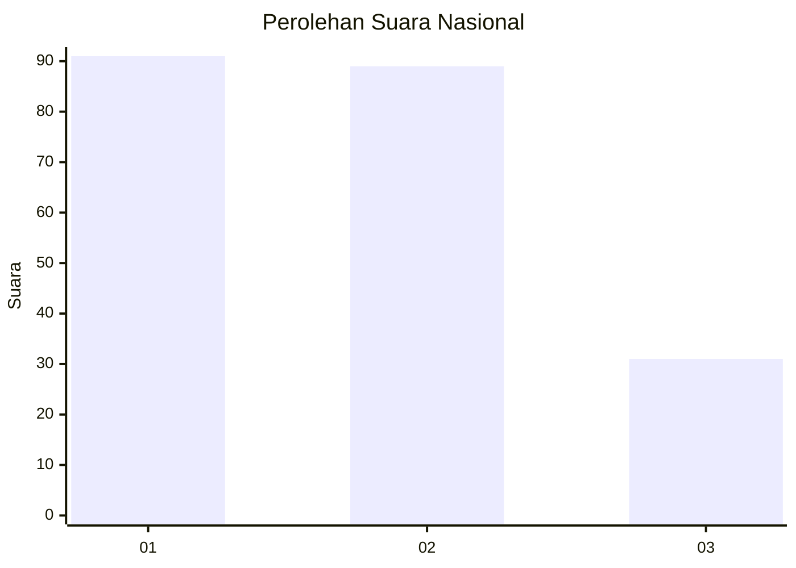
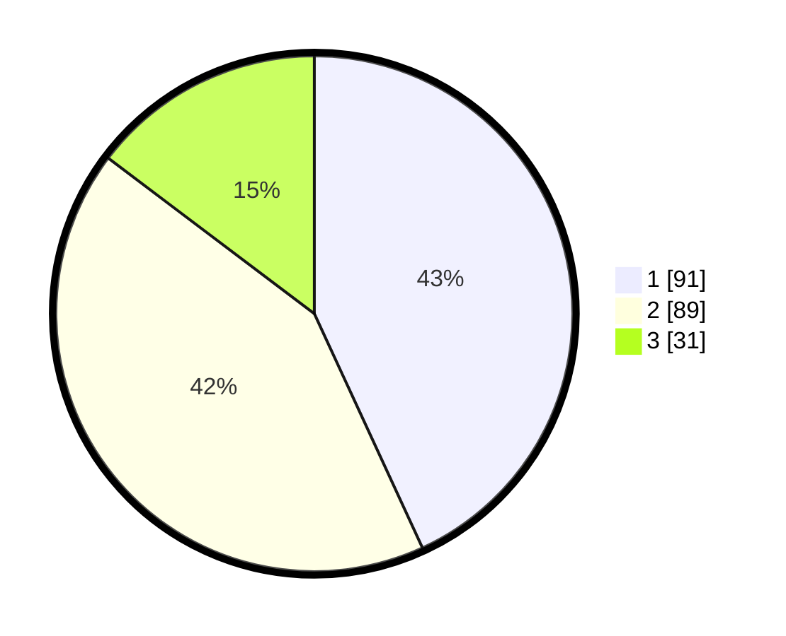

# Hasil

## Grafik

## Tabel

| No.    | Nama Paslon    | Suara | Suara (raw) | Persentase |
|:------ |:-------------- | -----:| -----------:| ----------:|
| 100025 | ANIES MUHAIMIN | 91    | [91][p-1]   | 43,13      |
| 100026 | PRABOWO GIBRAN | 89    | [89][p-2]   | 42,18      |
| 100027 | GANJAR MAHFUD  | 31    | [31][p-3]   | 14,69      |

[p-1]: https://github.com/gigit-pemilu/pemilu-2024/blob/main/pilpres/hitung-suara/sub/31-dki-jakarta/sub/74-jakarta-selatan/sub/03-mampang-prapatan/sub/1005-kuningan-barat/sub/015-tps/sub/paslon-1.txt
[p-2]: https://github.com/gigit-pemilu/pemilu-2024/blob/main/pilpres/hitung-suara/sub/31-dki-jakarta/sub/74-jakarta-selatan/sub/03-mampang-prapatan/sub/1005-kuningan-barat/sub/015-tps/sub/paslon-2.txt
[p-3]: https://github.com/gigit-pemilu/pemilu-2024/blob/main/pilpres/hitung-suara/sub/31-dki-jakarta/sub/74-jakarta-selatan/sub/03-mampang-prapatan/sub/1005-kuningan-barat/sub/015-tps/sub/paslon-3.txt

## Foto C Plano

https://sirekap-obj-formc.kpu.go.id/bc87/pemilu/ppwp/31/74/03/10/05/3174031005015-20240214-184932--83fb7abd-3193-4314-a424-6558c4885ffe.jpg

https://sirekap-obj-formc.kpu.go.id/bc87/pemilu/ppwp/31/74/03/10/05/3174031005015-20240214-185037--569b0286-1d86-4b65-b9a3-b8dae26077e0.jpg

https://sirekap-obj-formc.kpu.go.id/bc87/pemilu/ppwp/31/74/03/10/05/3174031005015-20240214-185237--7a76c99f-93a8-443d-8b41-4b5a41fa727a.jpg

## Metadata

| Key        | Value               |
| ---------- | ------------------- |
| Time Stamp | 2024-02-25 12:00:00 |

