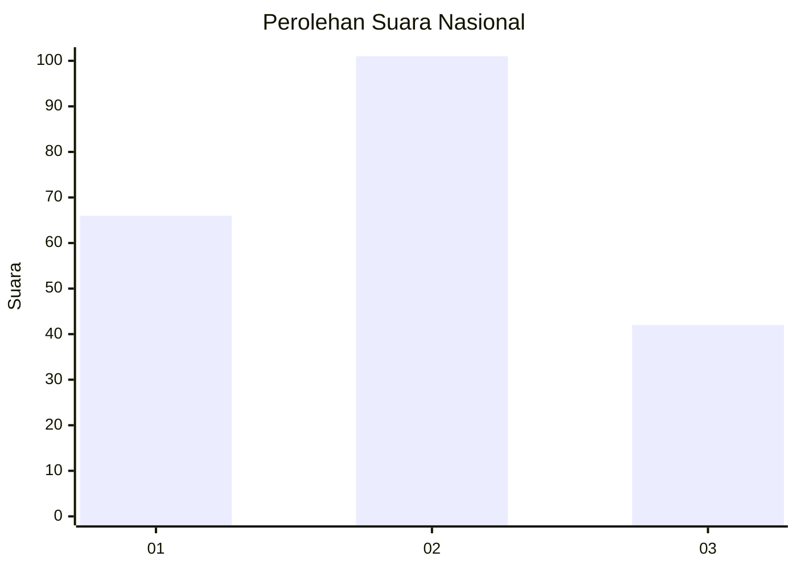
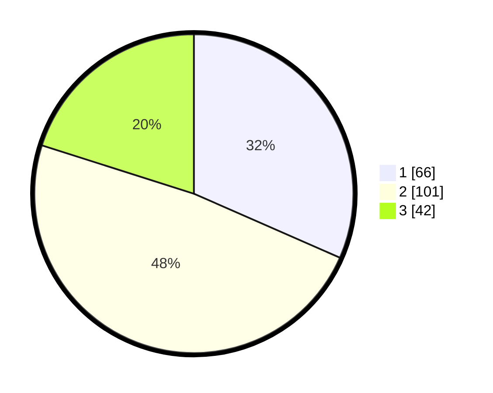

# Hasil

## Grafik

## Tabel

| No.    | Nama Paslon    | Suara | Suara (raw) | Persentase |
|:------ |:-------------- | -----:| -----------:| ----------:|
| 100025 | ANIES MUHAIMIN | 66    | [66][p-1]   | 31,58      |
| 100026 | PRABOWO GIBRAN | 101   | [101][p-2]  | 48,33      |
| 100027 | GANJAR MAHFUD  | 42    | [42][p-3]   | 20,10      |

[p-1]: https://github.com/gigit-pemilu/pemilu-2024/blob/main/pilpres/hitung-suara/sub/31-dki-jakarta/sub/74-jakarta-selatan/sub/03-mampang-prapatan/sub/1005-kuningan-barat/sub/016-tps/sub/paslon-1.txt
[p-2]: https://github.com/gigit-pemilu/pemilu-2024/blob/main/pilpres/hitung-suara/sub/31-dki-jakarta/sub/74-jakarta-selatan/sub/03-mampang-prapatan/sub/1005-kuningan-barat/sub/016-tps/sub/paslon-2.txt
[p-3]: https://github.com/gigit-pemilu/pemilu-2024/blob/main/pilpres/hitung-suara/sub/31-dki-jakarta/sub/74-jakarta-selatan/sub/03-mampang-prapatan/sub/1005-kuningan-barat/sub/016-tps/sub/paslon-3.txt

## Foto C Plano

https://sirekap-obj-formc.kpu.go.id/2382/pemilu/ppwp/31/74/03/10/05/3174031005016-20240217-191216--a923d333-98ea-4bcd-bd38-dcb053cac891.jpg

https://sirekap-obj-formc.kpu.go.id/2382/pemilu/ppwp/31/74/03/10/05/3174031005016-20240217-191317--15e77546-ad90-49ce-975a-19005371d74e.jpg

https://sirekap-obj-formc.kpu.go.id/2382/pemilu/ppwp/31/74/03/10/05/3174031005016-20240217-191355--823c0841-8da6-4c4c-98bc-2112a0f6111b.jpg

## Metadata

| Key        | Value               |
| ---------- | ------------------- |
| Time Stamp | 2024-02-24 22:31:28 |

