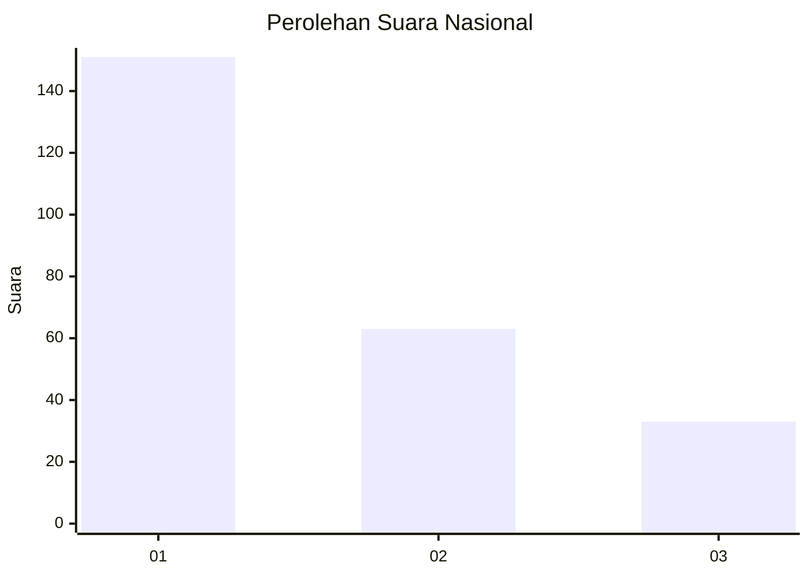
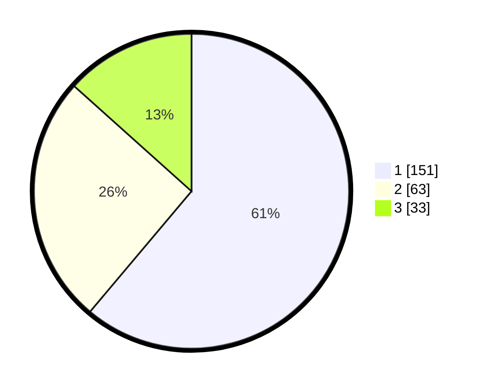

# Hasil

## Grafik

## Tabel

| No.    | Nama Paslon    | Suara | Suara (raw) | Persentase |
|:------ |:-------------- | -----:| -----------:| ----------:|
| 100025 | ANIES MUHAIMIN | 151   | [151][p-1]  | 61,13      |
| 100026 | PRABOWO GIBRAN | 63    | [63][p-2]   | 25,51      |
| 100027 | GANJAR MAHFUD  | 33    | [33][p-3]   | 13,36      |

[p-1]: https://github.com/gigit-pemilu/pemilu-2024/blob/main/pilpres/hitung-suara/sub/31-dki-jakarta/sub/74-jakarta-selatan/sub/03-mampang-prapatan/sub/1005-kuningan-barat/sub/028-tps/sub/paslon-1.txt
[p-2]: https://github.com/gigit-pemilu/pemilu-2024/blob/main/pilpres/hitung-suara/sub/31-dki-jakarta/sub/74-jakarta-selatan/sub/03-mampang-prapatan/sub/1005-kuningan-barat/sub/028-tps/sub/paslon-2.txt
[p-3]: https://github.com/gigit-pemilu/pemilu-2024/blob/main/pilpres/hitung-suara/sub/31-dki-jakarta/sub/74-jakarta-selatan/sub/03-mampang-prapatan/sub/1005-kuningan-barat/sub/028-tps/sub/paslon-3.txt

## Foto C Plano

https://sirekap-obj-formc.kpu.go.id/8ee9/pemilu/ppwp/31/74/03/10/05/3174031005028-20240214-210159--4116e151-6607-48ea-bc34-cce76504a865.jpg

https://sirekap-obj-formc.kpu.go.id/8ee9/pemilu/ppwp/31/74/03/10/05/3174031005028-20240214-210325--20fc05d5-4e7f-4693-8a45-81fe51f85b33.jpg

https://sirekap-obj-formc.kpu.go.id/8ee9/pemilu/ppwp/31/74/03/10/05/3174031005028-20240214-210509--476624d4-09b8-49ba-95c8-80e82b7b71b0.jpg

## Metadata

| Key        | Value               |
| ---------- | ------------------- |
| Time Stamp | 2024-02-24 22:31:28 |

