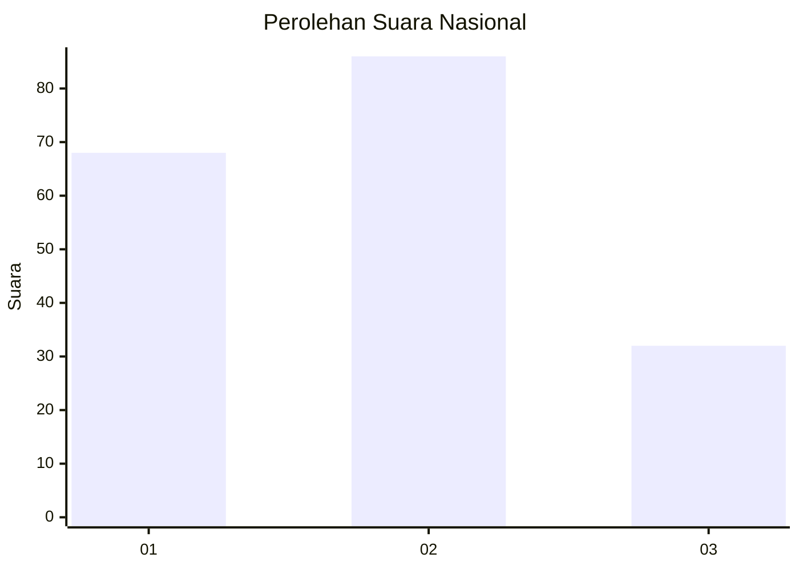
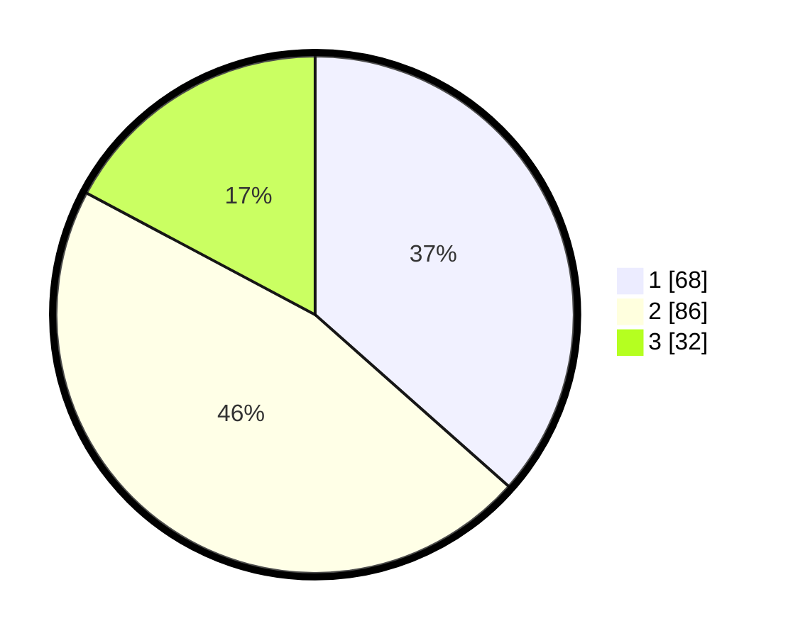

# Hasil

## Grafik

## Tabel

| No.    | Nama Paslon    | Suara | Suara (raw) | Persentase |
|:------ |:-------------- | -----:| -----------:| ----------:|
| 100025 | ANIES MUHAIMIN | 68    | [68][p-1]   | 36,56      |
| 100026 | PRABOWO GIBRAN | 86    | [86][p-2]   | 46,24      |
| 100027 | GANJAR MAHFUD  | 32    | [32][p-3]   | 17,20      |

[p-1]: https://github.com/gigit-pemilu/pemilu-2024/blob/main/pilpres/hitung-suara/sub/31-dki-jakarta/sub/74-jakarta-selatan/sub/03-mampang-prapatan/sub/1005-kuningan-barat/sub/033-tps/sub/paslon-1.txt
[p-2]: https://github.com/gigit-pemilu/pemilu-2024/blob/main/pilpres/hitung-suara/sub/31-dki-jakarta/sub/74-jakarta-selatan/sub/03-mampang-prapatan/sub/1005-kuningan-barat/sub/033-tps/sub/paslon-2.txt
[p-3]: https://github.com/gigit-pemilu/pemilu-2024/blob/main/pilpres/hitung-suara/sub/31-dki-jakarta/sub/74-jakarta-selatan/sub/03-mampang-prapatan/sub/1005-kuningan-barat/sub/033-tps/sub/paslon-3.txt

## Foto C Plano

https://sirekap-obj-formc.kpu.go.id/c11e/pemilu/ppwp/31/74/03/10/05/3174031005033-20240214-191857--5d7c4b6c-dd6d-4a2a-b6a5-d30075c78fc6.jpg

https://sirekap-obj-formc.kpu.go.id/c11e/pemilu/ppwp/31/74/03/10/05/3174031005033-20240214-192006--4562dc74-ae52-4819-949f-bb24357c60f8.jpg

https://sirekap-obj-formc.kpu.go.id/c11e/pemilu/ppwp/31/74/03/10/05/3174031005033-20240214-192131--e96c68d7-902f-4c4d-93ff-373a7d916de8.jpg

## Metadata

| Key        | Value               |
| ---------- | ------------------- |
| Time Stamp | 2024-02-17 19:30:00 |

