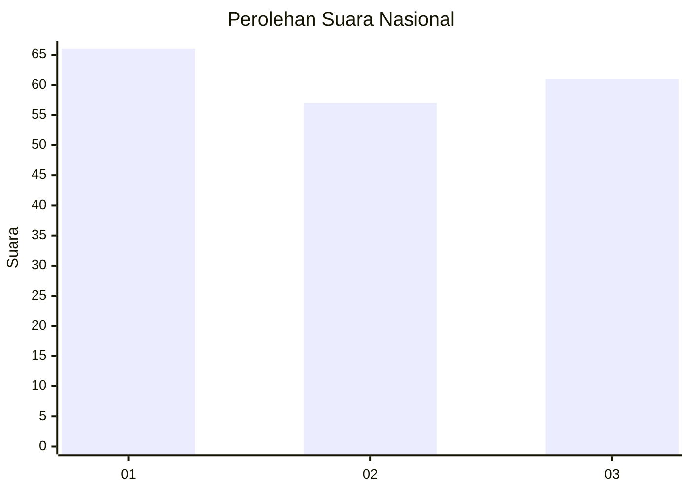
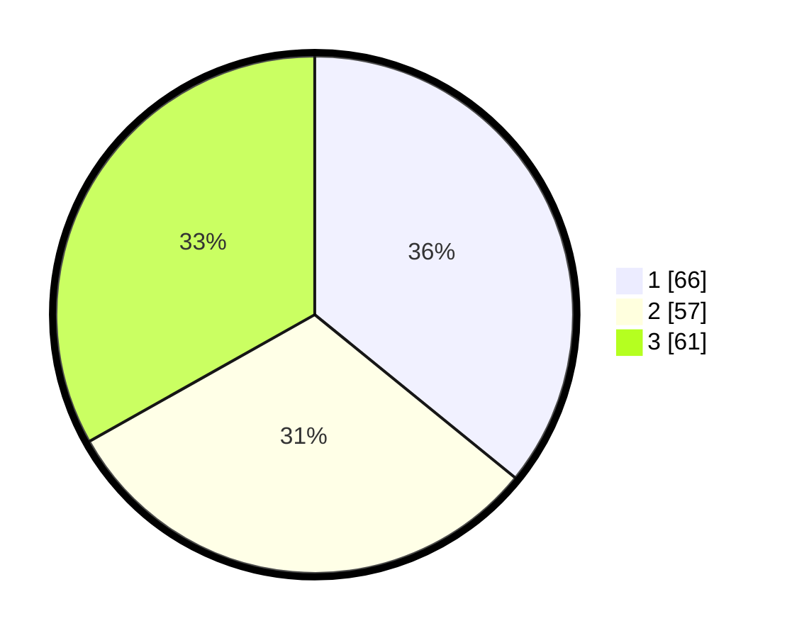

# Hasil

## Grafik

## Tabel

| No.    | Nama Paslon    | Suara | Suara (raw) | Persentase |
|:------ |:-------------- | -----:| -----------:| ----------:|
| 100025 | ANIES MUHAIMIN | 66    | [66][p-1]   | 35,87      |
| 100026 | PRABOWO GIBRAN | 57    | [57][p-2]   | 30,98      |
| 100027 | GANJAR MAHFUD  | 61    | [61][p-3]   | 33,15      |

[p-1]: https://github.com/gigit-pemilu/pemilu-2024/blob/main/pilpres/hitung-suara/sub/31-dki-jakarta/sub/74-jakarta-selatan/sub/04-pasar-minggu/sub/1001-pasar-minggu/sub/021-tps/sub/paslon-1.txt
[p-2]: https://github.com/gigit-pemilu/pemilu-2024/blob/main/pilpres/hitung-suara/sub/31-dki-jakarta/sub/74-jakarta-selatan/sub/04-pasar-minggu/sub/1001-pasar-minggu/sub/021-tps/sub/paslon-2.txt
[p-3]: https://github.com/gigit-pemilu/pemilu-2024/blob/main/pilpres/hitung-suara/sub/31-dki-jakarta/sub/74-jakarta-selatan/sub/04-pasar-minggu/sub/1001-pasar-minggu/sub/021-tps/sub/paslon-3.txt

## Foto C Plano

https://sirekap-obj-formc.kpu.go.id/7419/pemilu/ppwp/31/74/04/10/01/3174041001021-20240214-210800--507e0f9b-6fbb-4040-bfd8-9bb82613fe14.jpg

https://sirekap-obj-formc.kpu.go.id/7419/pemilu/ppwp/31/74/04/10/01/3174041001021-20240214-211957--f45fe57c-a0ba-4aa9-b43c-098e35971331.jpg

https://sirekap-obj-formc.kpu.go.id/7419/pemilu/ppwp/31/74/04/10/01/3174041001021-20240214-214247--e678faf1-2e80-4209-80c9-b506bbdcce8b.jpg

## Metadata

| Key        | Value               |
| ---------- | ------------------- |
| Time Stamp | 2024-02-25 14:00:00 |

