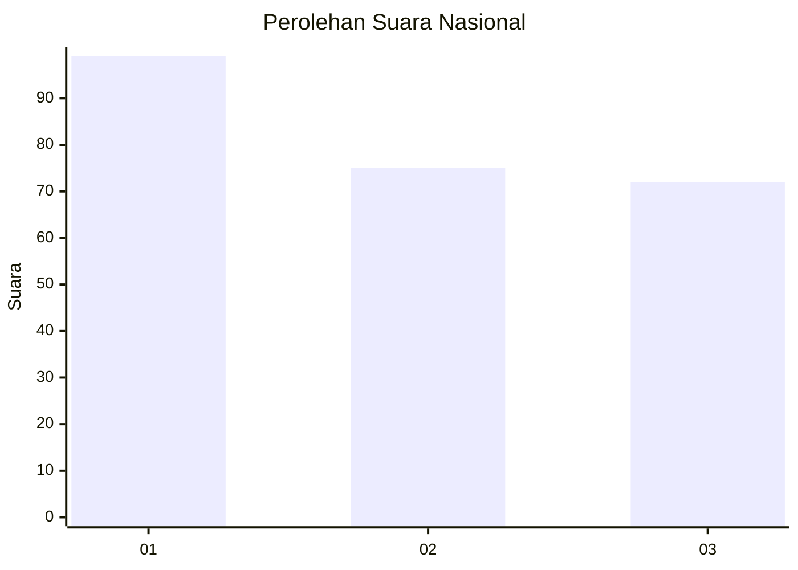
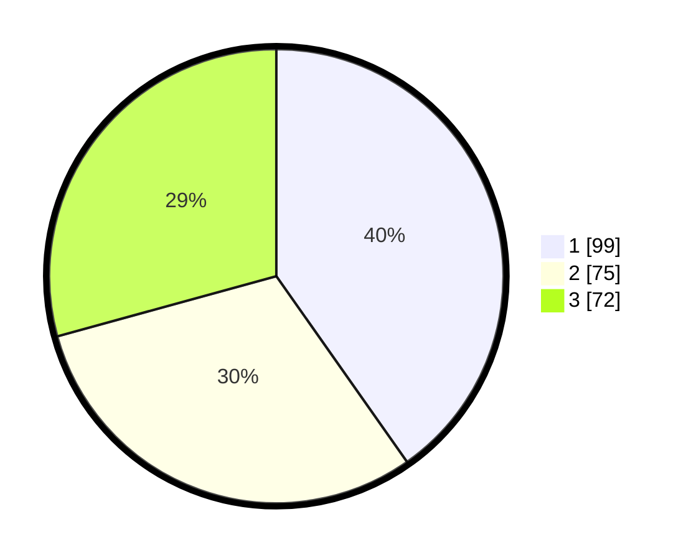

# Hasil

## Grafik

## Tabel

| No.    | Nama Paslon    | Suara | Suara (raw) | Persentase |
|:------ |:-------------- | -----:| -----------:| ----------:|
| 100025 | ANIES MUHAIMIN | 99    | [99][p-1]   | 40,24      |
| 100026 | PRABOWO GIBRAN | 75    | [75][p-2]   | 30,49      |
| 100027 | GANJAR MAHFUD  | 72    | [72][p-3]   | 29,27      |

[p-1]: https://github.com/gigit-pemilu/pemilu-2024/blob/main/pilpres/hitung-suara/sub/31-dki-jakarta/sub/74-jakarta-selatan/sub/04-pasar-minggu/sub/1001-pasar-minggu/sub/040-tps/sub/paslon-1.txt
[p-2]: https://github.com/gigit-pemilu/pemilu-2024/blob/main/pilpres/hitung-suara/sub/31-dki-jakarta/sub/74-jakarta-selatan/sub/04-pasar-minggu/sub/1001-pasar-minggu/sub/040-tps/sub/paslon-2.txt
[p-3]: https://github.com/gigit-pemilu/pemilu-2024/blob/main/pilpres/hitung-suara/sub/31-dki-jakarta/sub/74-jakarta-selatan/sub/04-pasar-minggu/sub/1001-pasar-minggu/sub/040-tps/sub/paslon-3.txt

## Foto C Plano

https://sirekap-obj-formc.kpu.go.id/e0a6/pemilu/ppwp/31/74/04/10/01/3174041001040-20240215-014827--0696663f-018a-4048-b10a-5a4d2d501cbd.jpg

https://sirekap-obj-formc.kpu.go.id/e0a6/pemilu/ppwp/31/74/04/10/01/3174041001040-20240215-015018--a143a325-a037-408e-a0f2-213d408347ac.jpg

https://sirekap-obj-formc.kpu.go.id/e0a6/pemilu/ppwp/31/74/04/10/01/3174041001040-20240215-015319--b33f3e14-0480-435b-ac37-f4b97de77d9b.jpg

## Metadata

| Key        | Value               |
| ---------- | ------------------- |
| Time Stamp | 2024-02-25 14:00:00 |

