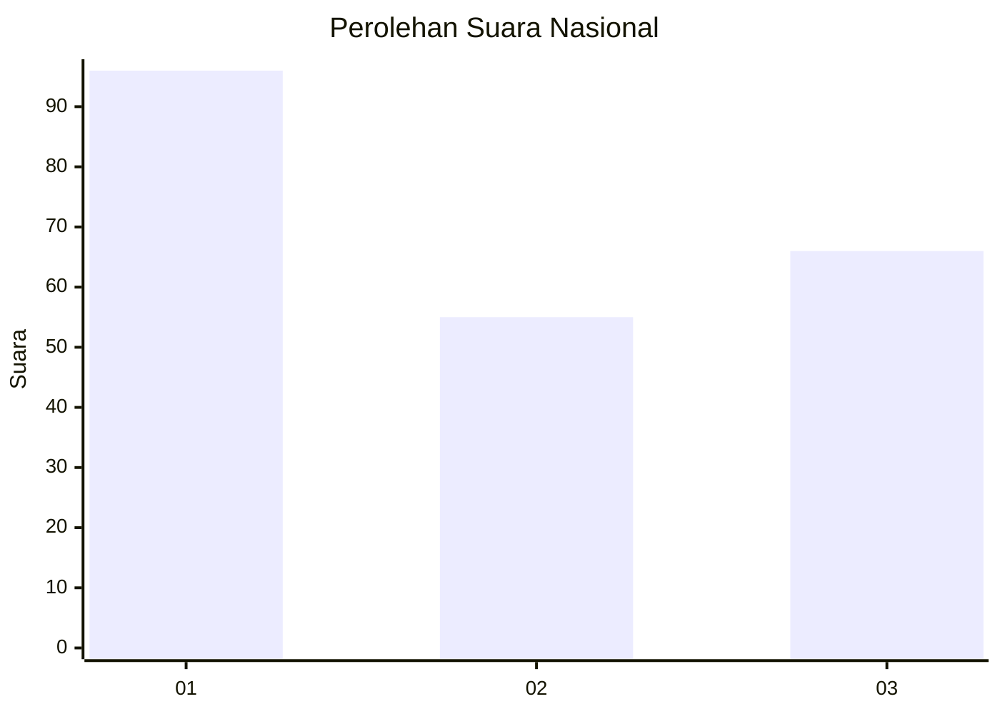
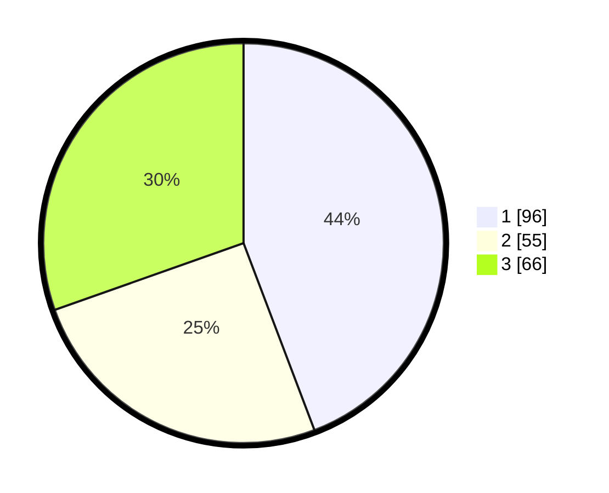

# Hasil

## Grafik

## Tabel

| No.    | Nama Paslon    | Suara | Suara (raw) | Persentase |
|:------ |:-------------- | -----:| -----------:| ----------:|
| 100025 | ANIES MUHAIMIN | 96    | [96][p-1]   | 44,24      |
| 100026 | PRABOWO GIBRAN | 55    | [55][p-2]   | 25,35      |
| 100027 | GANJAR MAHFUD  | 66    | [66][p-3]   | 30,41      |

[p-1]: https://github.com/gigit-pemilu/pemilu-2024/blob/main/pilpres/hitung-suara/sub/31-dki-jakarta/sub/74-jakarta-selatan/sub/04-pasar-minggu/sub/1001-pasar-minggu/sub/043-tps/sub/paslon-1.txt
[p-2]: https://github.com/gigit-pemilu/pemilu-2024/blob/main/pilpres/hitung-suara/sub/31-dki-jakarta/sub/74-jakarta-selatan/sub/04-pasar-minggu/sub/1001-pasar-minggu/sub/043-tps/sub/paslon-2.txt
[p-3]: https://github.com/gigit-pemilu/pemilu-2024/blob/main/pilpres/hitung-suara/sub/31-dki-jakarta/sub/74-jakarta-selatan/sub/04-pasar-minggu/sub/1001-pasar-minggu/sub/043-tps/sub/paslon-3.txt

## Foto C Plano

https://sirekap-obj-formc.kpu.go.id/01c9/pemilu/ppwp/31/74/04/10/01/3174041001043-20240215-032516--6fc944f0-c7f3-4eaf-85cf-02a48e151d22.jpg

https://sirekap-obj-formc.kpu.go.id/01c9/pemilu/ppwp/31/74/04/10/01/3174041001043-20240214-211500--b6488aca-4102-4043-8984-edde07c8beae.jpg

https://sirekap-obj-formc.kpu.go.id/01c9/pemilu/ppwp/31/74/04/10/01/3174041001043-20240214-211549--944e3a08-4512-4a25-be53-7d237548f346.jpg

## Metadata

| Key        | Value               |
| ---------- | ------------------- |
| Time Stamp | 2024-02-15 04:00:24 |

