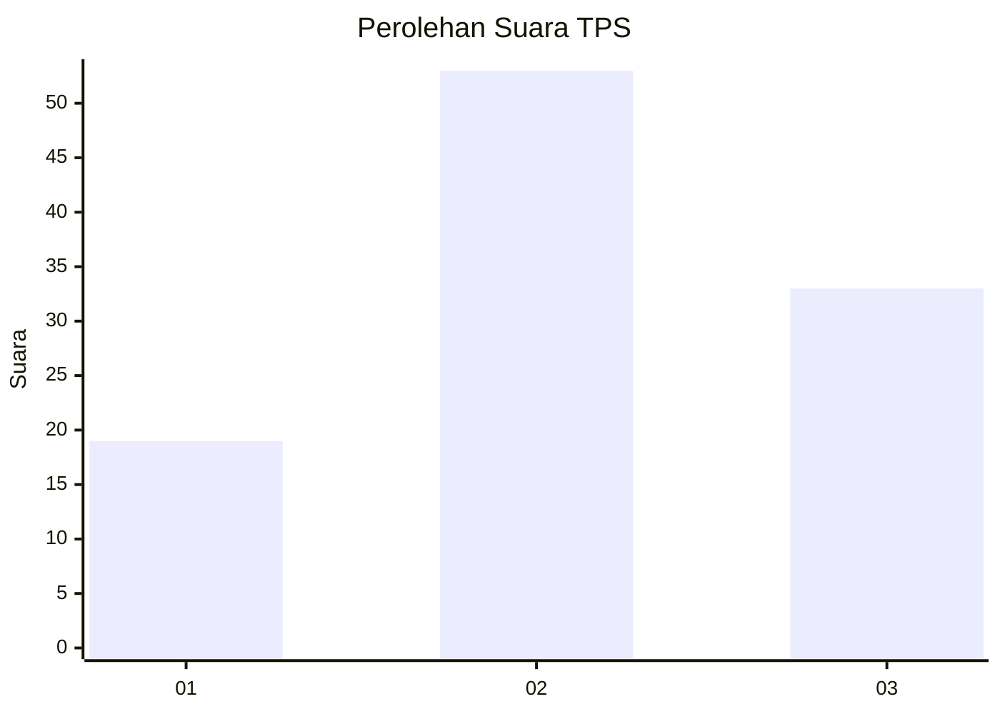
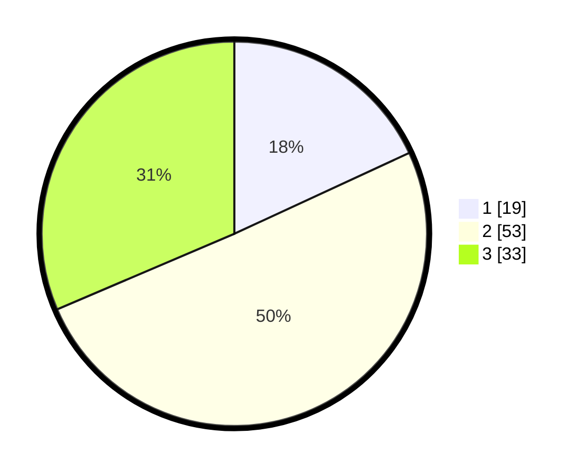

# Hasil

## Grafik

## Tabel

| No. | Nama Paslon    | Suara | Suara (raw) | Persentase |
|:--- |:-------------- | -----:| -----------:| ----------:|
| 1   | ANIES MUHAIMIN | 19    | [19][p-1]   | 18,10      |
| 2   | PRABOWO GIBRAN | 53    | [53][p-2]   | 50,48      |
| 3   | GANJAR MAHFUD  | 33    | [33][p-3]   | 31,43      |

[p-1]: https://github.com/gigit-pemilu/pemilu-2024-31-dki-jakarta/blob/main/pilpres/hitung-suara/sub/31-dki-jakarta/sub/74-jakarta-selatan/sub/04-pasar-minggu/sub/1001-pasar-minggu/sub/062-tps/sub/paslon-1.txt
[p-2]: https://github.com/gigit-pemilu/pemilu-2024-31-dki-jakarta/blob/main/pilpres/hitung-suara/sub/31-dki-jakarta/sub/74-jakarta-selatan/sub/04-pasar-minggu/sub/1001-pasar-minggu/sub/062-tps/sub/paslon-2.txt
[p-3]: https://github.com/gigit-pemilu/pemilu-2024-31-dki-jakarta/blob/main/pilpres/hitung-suara/sub/31-dki-jakarta/sub/74-jakarta-selatan/sub/04-pasar-minggu/sub/1001-pasar-minggu/sub/062-tps/sub/paslon-3.txt

## Foto C Plano

https://sirekap-obj-formc.kpu.go.id/4359/pemilu/ppwp/31/74/04/10/01/3174041001062-20240214-202634--b6843c9d-664e-4718-9b52-e13a12ea858b.jpg

https://sirekap-obj-formc.kpu.go.id/4359/pemilu/ppwp/31/74/04/10/01/3174041001062-20240214-202654--099c9906-6efb-48ad-9a9a-eb4941fc38cd.jpg

https://sirekap-obj-formc.kpu.go.id/4359/pemilu/ppwp/31/74/04/10/01/3174041001062-20240214-202713--4bfe5b9d-7137-44aa-9f22-d8d97f8525dc.jpg

## Metadata

| Key        | Value               |
| ---------- | ------------------- |
| Time Stamp | 2024-02-24 22:31:28 |

