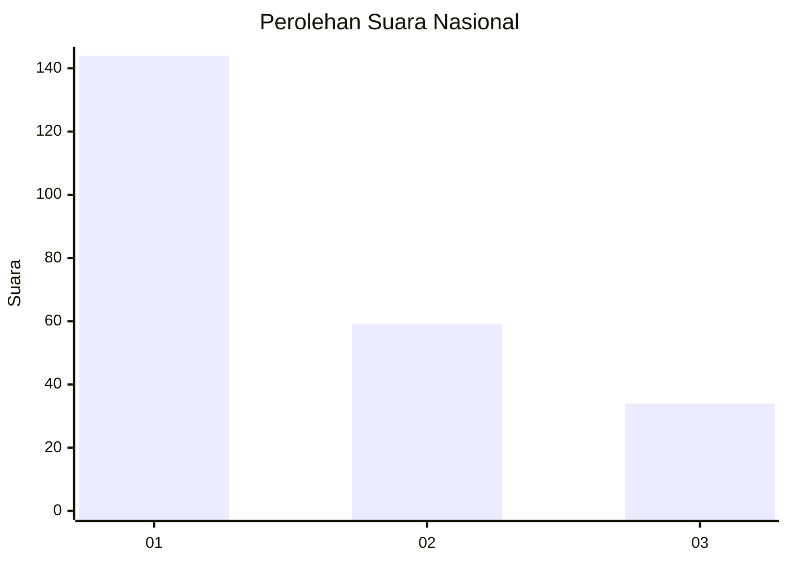
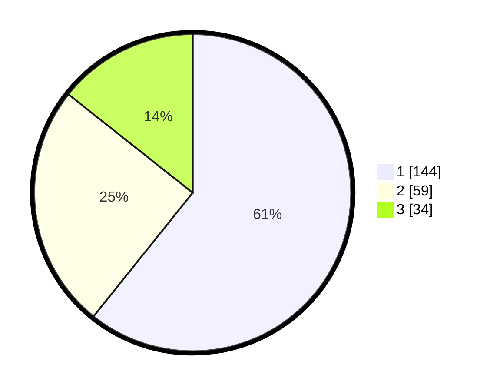

# Hasil

## Grafik

## Tabel

| No.    | Nama Paslon    | Suara | Suara (raw) | Persentase |
|:------ |:-------------- | -----:| -----------:| ----------:|
| 100025 | ANIES MUHAIMIN | 144   | [144][p-1]  | 60,76      |
| 100026 | PRABOWO GIBRAN | 59    | [59][p-2]   | 24,89      |
| 100027 | GANJAR MAHFUD  | 34    | [34][p-3]   | 14,35      |

[p-1]: https://github.com/gigit-pemilu/pemilu-2024/blob/main/pilpres/hitung-suara/sub/31-dki-jakarta/sub/74-jakarta-selatan/sub/04-pasar-minggu/sub/1001-pasar-minggu/sub/077-tps/sub/paslon-1.txt
[p-2]: https://github.com/gigit-pemilu/pemilu-2024/blob/main/pilpres/hitung-suara/sub/31-dki-jakarta/sub/74-jakarta-selatan/sub/04-pasar-minggu/sub/1001-pasar-minggu/sub/077-tps/sub/paslon-2.txt
[p-3]: https://github.com/gigit-pemilu/pemilu-2024/blob/main/pilpres/hitung-suara/sub/31-dki-jakarta/sub/74-jakarta-selatan/sub/04-pasar-minggu/sub/1001-pasar-minggu/sub/077-tps/sub/paslon-3.txt

## Foto C Plano

https://sirekap-obj-formc.kpu.go.id/e2f3/pemilu/ppwp/31/74/04/10/01/3174041001077-20240214-232623--fb73a99f-c5b1-4a67-953a-f17ac7b362f3.jpg

https://sirekap-obj-formc.kpu.go.id/e2f3/pemilu/ppwp/31/74/04/10/01/3174041001077-20240214-203731--36afcf61-ab68-4d88-800d-dab762c485f9.jpg

https://sirekap-obj-formc.kpu.go.id/e2f3/pemilu/ppwp/31/74/04/10/01/3174041001077-20240214-203826--76a48abb-2ef1-4620-b773-e2c2ba9682fc.jpg

## Metadata

| Key        | Value               |
| ---------- | ------------------- |
| Time Stamp | 2024-02-24 22:31:28 |

