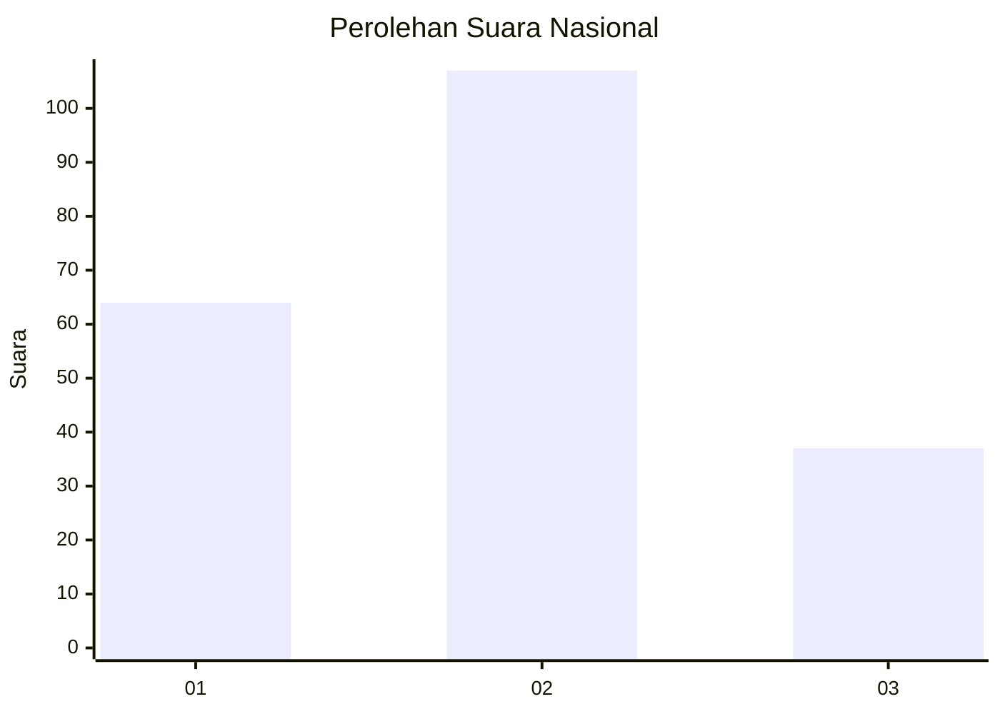
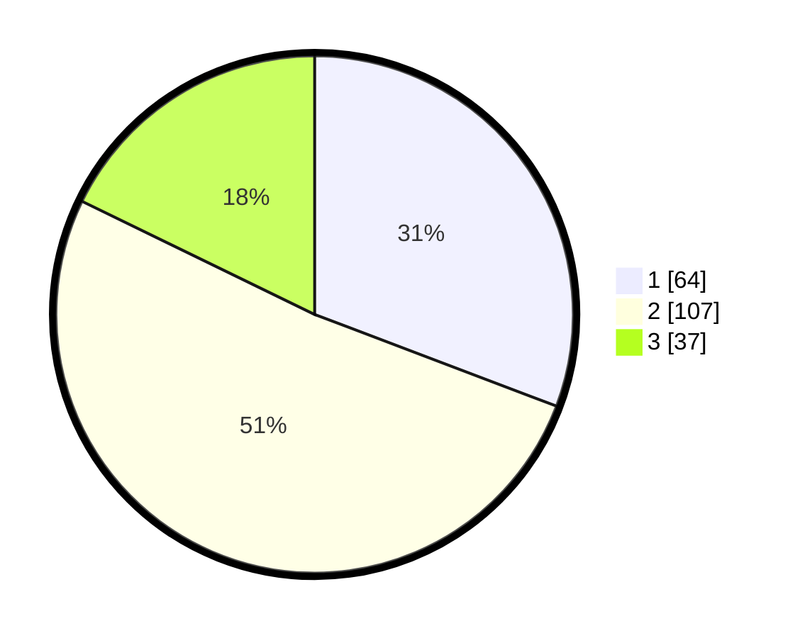

# Hasil

## Grafik

## Tabel

| No.    | Nama Paslon    | Suara | Suara (raw) | Persentase |
|:------ |:-------------- | -----:| -----------:| ----------:|
| 100025 | ANIES MUHAIMIN | 64    | [64][p-1]   | 30,77      |
| 100026 | PRABOWO GIBRAN | 107   | [107][p-2]  | 51,44      |
| 100027 | GANJAR MAHFUD  | 37    | [37][p-3]   | 17,79      |

[p-1]: https://github.com/gigit-pemilu/pemilu-2024/blob/main/pilpres/hitung-suara/sub/31-dki-jakarta/sub/74-jakarta-selatan/sub/04-pasar-minggu/sub/1001-pasar-minggu/sub/081-tps/sub/paslon-1.txt
[p-2]: https://github.com/gigit-pemilu/pemilu-2024/blob/main/pilpres/hitung-suara/sub/31-dki-jakarta/sub/74-jakarta-selatan/sub/04-pasar-minggu/sub/1001-pasar-minggu/sub/081-tps/sub/paslon-2.txt
[p-3]: https://github.com/gigit-pemilu/pemilu-2024/blob/main/pilpres/hitung-suara/sub/31-dki-jakarta/sub/74-jakarta-selatan/sub/04-pasar-minggu/sub/1001-pasar-minggu/sub/081-tps/sub/paslon-3.txt

## Foto C Plano

https://sirekap-obj-formc.kpu.go.id/538b/pemilu/ppwp/31/74/04/10/01/3174041001081-20240214-211018--c2fa8267-98da-477d-94fa-87bc88921f67.jpg

https://sirekap-obj-formc.kpu.go.id/538b/pemilu/ppwp/31/74/04/10/01/3174041001081-20240214-211318--9a59227c-ce77-4657-ac3b-ea098f1b888c.jpg

https://sirekap-obj-formc.kpu.go.id/538b/pemilu/ppwp/31/74/04/10/01/3174041001081-20240214-211749--c31d3441-40f6-4362-9f87-6cf647871d8b.jpg

## Metadata

| Key        | Value               |
| ---------- | ------------------- |
| Time Stamp | 2024-02-25 11:00:00 |

