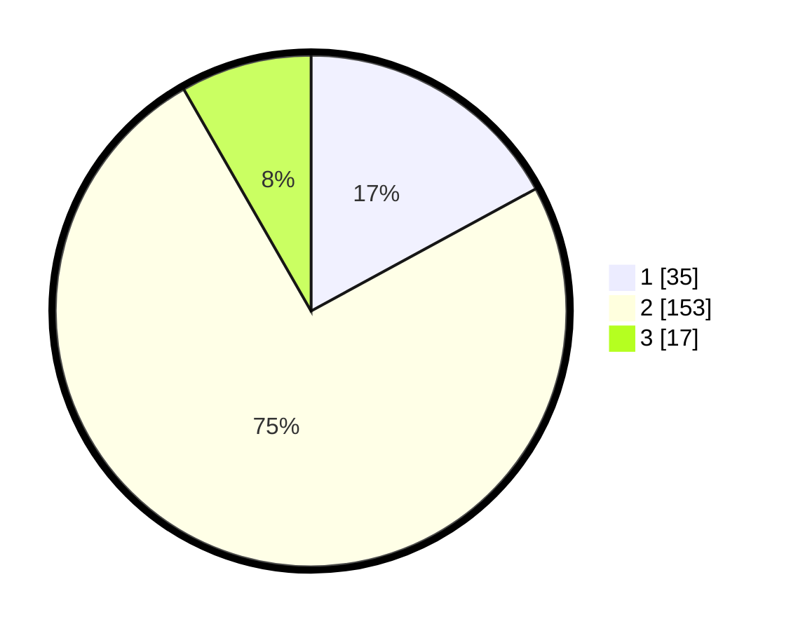

# Hasil

## Grafik

## Tabel

| No.    | Nama Paslon    | Suara | Suara (raw) | Persentase |
|:------ |:-------------- | -----:| -----------:| ----------:|
| 100025 | ANIES MUHAIMIN | 35    | [35][p-1]   | 17,07      |
| 100026 | PRABOWO GIBRAN | 153   | [153][p-2]  | 74,63      |
| 100027 | GANJAR MAHFUD  | 17    | [17][p-3]   | 8,29       |

[p-1]: https://github.com/gigit-pemilu/pemilu-2024/blob/main/pilpres/hitung-suara/sub/31-dki-jakarta/sub/74-jakarta-selatan/sub/04-pasar-minggu/sub/1001-pasar-minggu/sub/903-tps/sub/paslon-1.txt
[p-2]: https://github.com/gigit-pemilu/pemilu-2024/blob/main/pilpres/hitung-suara/sub/31-dki-jakarta/sub/74-jakarta-selatan/sub/04-pasar-minggu/sub/1001-pasar-minggu/sub/903-tps/sub/paslon-2.txt
[p-3]: https://github.com/gigit-pemilu/pemilu-2024/blob/main/pilpres/hitung-suara/sub/31-dki-jakarta/sub/74-jakarta-selatan/sub/04-pasar-minggu/sub/1001-pasar-minggu/sub/903-tps/sub/paslon-3.txt

## Foto C Plano

https://sirekap-obj-formc.kpu.go.id/94f5/pemilu/ppwp/31/74/04/10/01/3174041001903-20240214-202112--a14ef442-8c3e-441c-807f-33c327d88a22.jpg

https://sirekap-obj-formc.kpu.go.id/94f5/pemilu/ppwp/31/74/04/10/01/3174041001903-20240214-210545--f13fbc63-abc0-497a-b330-92fe53ad42e2.jpg

https://sirekap-obj-formc.kpu.go.id/94f5/pemilu/ppwp/31/74/04/10/01/3174041001903-20240214-202650--9a94aef8-6d7b-4da8-ba7b-e55b7c809c78.jpg

## Metadata

| Key        | Value               |
| ---------- | ------------------- |
| Time Stamp | 2024-02-24 22:31:28 |

