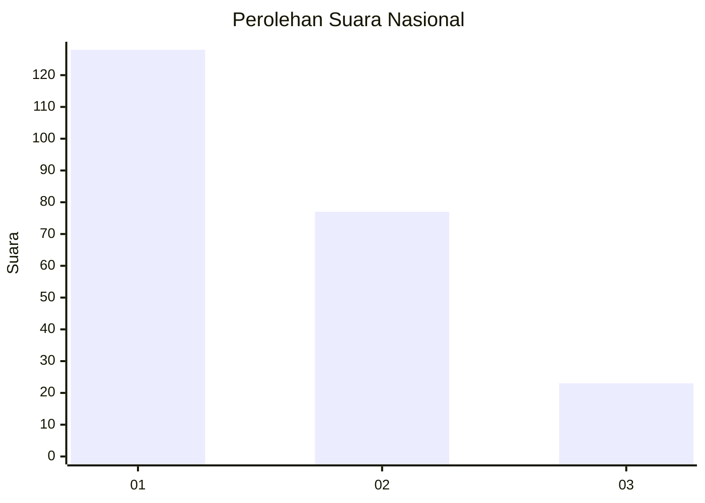
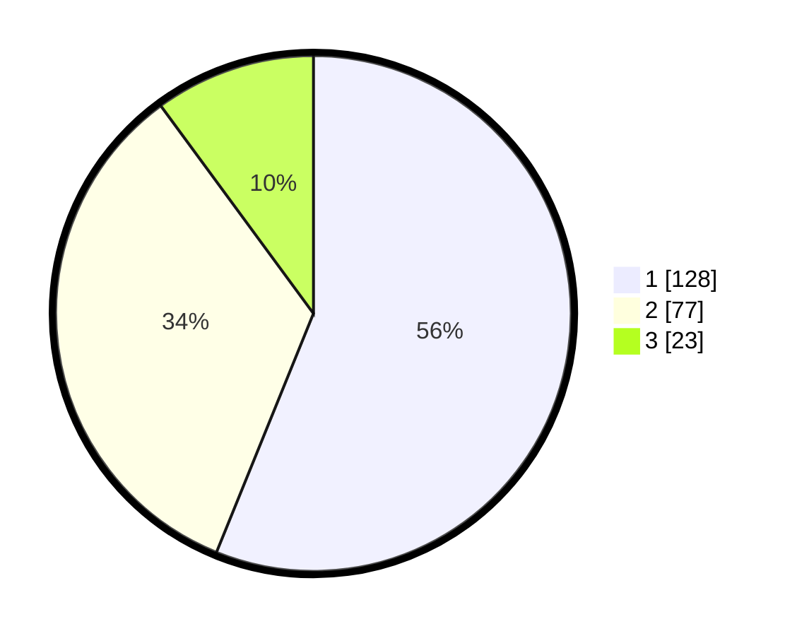

# Hasil

## Grafik

## Tabel

| No.    | Nama Paslon    | Suara | Suara (raw) | Persentase |
|:------ |:-------------- | -----:| -----------:| ----------:|
| 100025 | ANIES MUHAIMIN | 128   | [128][p-1]  | 56,14      |
| 100026 | PRABOWO GIBRAN | 77    | [77][p-2]   | 33,77      |
| 100027 | GANJAR MAHFUD  | 23    | [23][p-3]   | 10,09      |

[p-1]: https://github.com/gigit-pemilu/pemilu-2024/blob/main/pilpres/hitung-suara/sub/31-dki-jakarta/sub/74-jakarta-selatan/sub/04-pasar-minggu/sub/1002-jati-padang/sub/002-tps/sub/paslon-1.txt
[p-2]: https://github.com/gigit-pemilu/pemilu-2024/blob/main/pilpres/hitung-suara/sub/31-dki-jakarta/sub/74-jakarta-selatan/sub/04-pasar-minggu/sub/1002-jati-padang/sub/002-tps/sub/paslon-2.txt
[p-3]: https://github.com/gigit-pemilu/pemilu-2024/blob/main/pilpres/hitung-suara/sub/31-dki-jakarta/sub/74-jakarta-selatan/sub/04-pasar-minggu/sub/1002-jati-padang/sub/002-tps/sub/paslon-3.txt

## Foto C Plano

https://sirekap-obj-formc.kpu.go.id/3d6d/pemilu/ppwp/31/74/04/10/02/3174041002002-20240214-233630--c3cf70be-adc6-4a8e-8c42-cf706eece5b1.jpg

https://sirekap-obj-formc.kpu.go.id/3d6d/pemilu/ppwp/31/74/04/10/02/3174041002002-20240214-233732--34894d26-66f2-456a-97c5-1109e9f01341.jpg

https://sirekap-obj-formc.kpu.go.id/3d6d/pemilu/ppwp/31/74/04/10/02/3174041002002-20240214-233845--509cbb3b-d78e-4aa3-be2f-014c5477f6f6.jpg

## Metadata

| Key        | Value               |
| ---------- | ------------------- |
| Time Stamp | 2024-02-24 22:31:28 |

