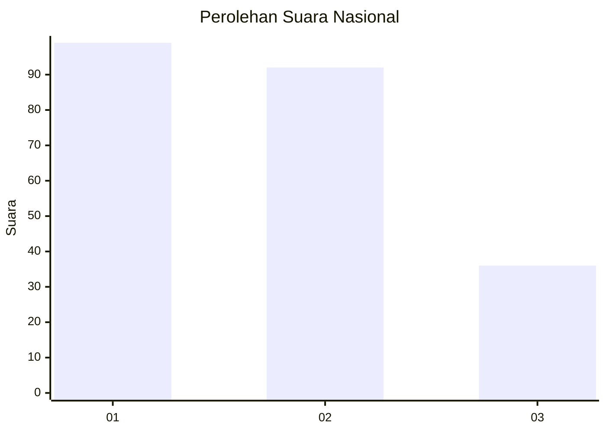
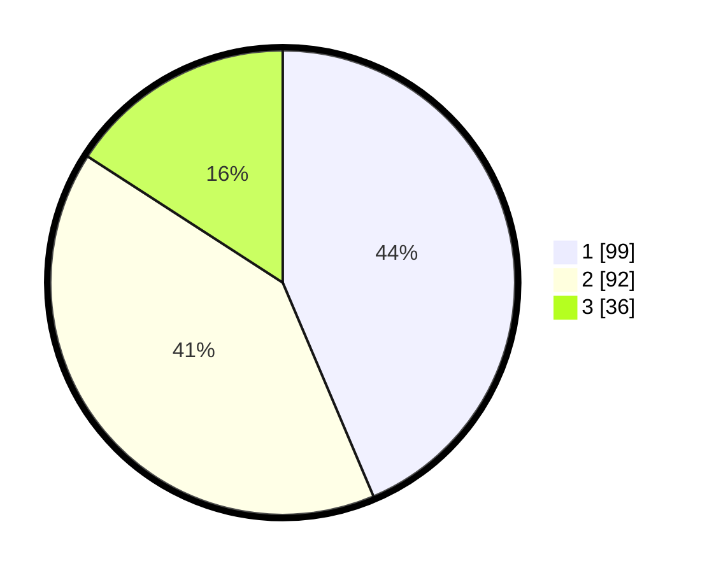

# Hasil

## Grafik

## Tabel

| No.    | Nama Paslon    | Suara | Suara (raw) | Persentase |
|:------ |:-------------- | -----:| -----------:| ----------:|
| 100025 | ANIES MUHAIMIN | 99    | [99][p-1]   | 43,61      |
| 100026 | PRABOWO GIBRAN | 92    | [92][p-2]   | 40,53      |
| 100027 | GANJAR MAHFUD  | 36    | [36][p-3]   | 15,86      |

[p-1]: https://github.com/gigit-pemilu/pemilu-2024/blob/main/pilpres/hitung-suara/sub/31-dki-jakarta/sub/74-jakarta-selatan/sub/04-pasar-minggu/sub/1002-jati-padang/sub/010-tps/sub/paslon-1.txt
[p-2]: https://github.com/gigit-pemilu/pemilu-2024/blob/main/pilpres/hitung-suara/sub/31-dki-jakarta/sub/74-jakarta-selatan/sub/04-pasar-minggu/sub/1002-jati-padang/sub/010-tps/sub/paslon-2.txt
[p-3]: https://github.com/gigit-pemilu/pemilu-2024/blob/main/pilpres/hitung-suara/sub/31-dki-jakarta/sub/74-jakarta-selatan/sub/04-pasar-minggu/sub/1002-jati-padang/sub/010-tps/sub/paslon-3.txt

## Foto C Plano

https://sirekap-obj-formc.kpu.go.id/1d00/pemilu/ppwp/31/74/04/10/02/3174041002010-20240214-185537--bc256328-22ea-48da-afc3-8c281d33f39a.jpg

https://sirekap-obj-formc.kpu.go.id/1d00/pemilu/ppwp/31/74/04/10/02/3174041002010-20240214-195857--b31f51cf-1abc-4c5a-a9a3-16d8dcae70a5.jpg

https://sirekap-obj-formc.kpu.go.id/1d00/pemilu/ppwp/31/74/04/10/02/3174041002010-20240214-200725--cabf5415-164d-4251-99d5-f8cc2768abf3.jpg

## Metadata

| Key        | Value               |
| ---------- | ------------------- |
| Time Stamp | 2024-02-24 22:31:28 |

