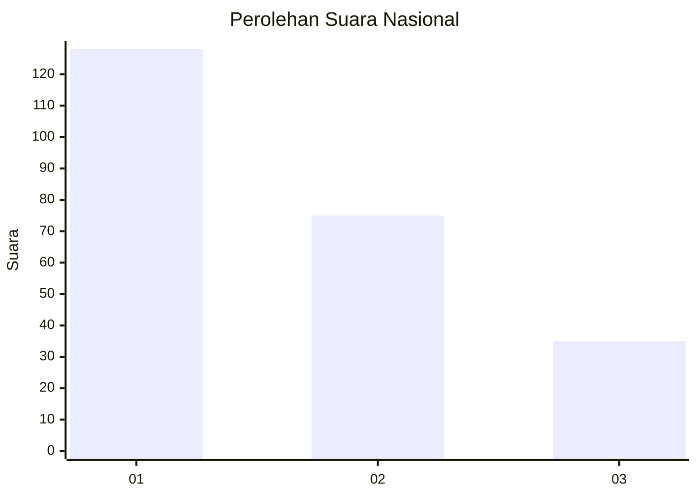
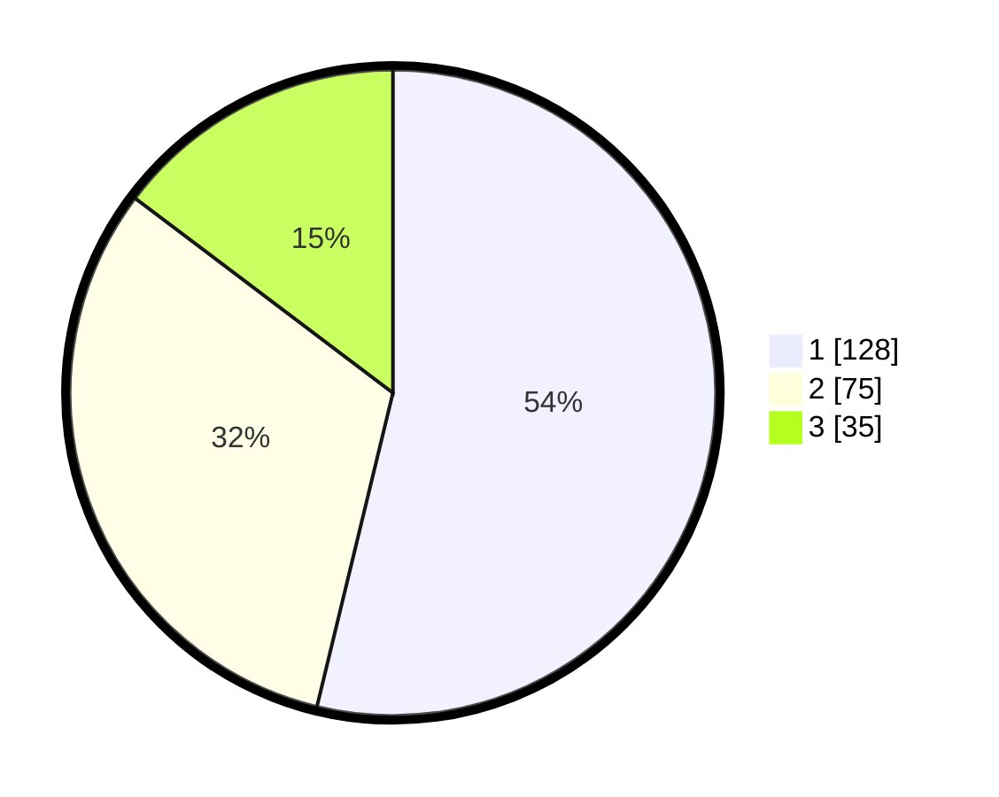

# Hasil

## Grafik

## Tabel

| No.    | Nama Paslon    | Suara | Suara (raw) | Persentase |
|:------ |:-------------- | -----:| -----------:| ----------:|
| 100025 | ANIES MUHAIMIN | 128   | [128][p-1]  | 53,78      |
| 100026 | PRABOWO GIBRAN | 75    | [75][p-2]   | 31,51      |
| 100027 | GANJAR MAHFUD  | 35    | [35][p-3]   | 14,71      |

[p-1]: https://github.com/gigit-pemilu/pemilu-2024/blob/main/pilpres/hitung-suara/sub/31-dki-jakarta/sub/74-jakarta-selatan/sub/04-pasar-minggu/sub/1002-jati-padang/sub/019-tps/sub/paslon-1.txt
[p-2]: https://github.com/gigit-pemilu/pemilu-2024/blob/main/pilpres/hitung-suara/sub/31-dki-jakarta/sub/74-jakarta-selatan/sub/04-pasar-minggu/sub/1002-jati-padang/sub/019-tps/sub/paslon-2.txt
[p-3]: https://github.com/gigit-pemilu/pemilu-2024/blob/main/pilpres/hitung-suara/sub/31-dki-jakarta/sub/74-jakarta-selatan/sub/04-pasar-minggu/sub/1002-jati-padang/sub/019-tps/sub/paslon-3.txt

## Foto C Plano

https://sirekap-obj-formc.kpu.go.id/e02e/pemilu/ppwp/31/74/04/10/02/3174041002019-20240215-021210--15de1d29-ad16-46f6-b5a6-6cea51b19550.jpg

https://sirekap-obj-formc.kpu.go.id/e02e/pemilu/ppwp/31/74/04/10/02/3174041002019-20240215-021238--f5df34f3-96a9-4293-8b9d-b7edb1845b3e.jpg

https://sirekap-obj-formc.kpu.go.id/e02e/pemilu/ppwp/31/74/04/10/02/3174041002019-20240215-021304--9099e6fa-4ca0-4577-b79e-27c6e8b7a2ef.jpg

## Metadata

| Key        | Value               |
| ---------- | ------------------- |
| Time Stamp | 2024-02-24 22:31:28 |

