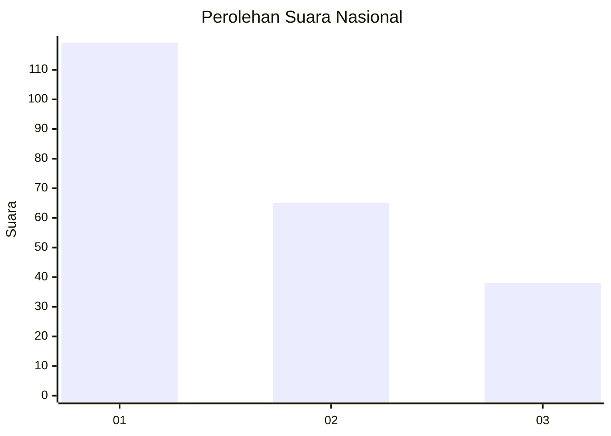
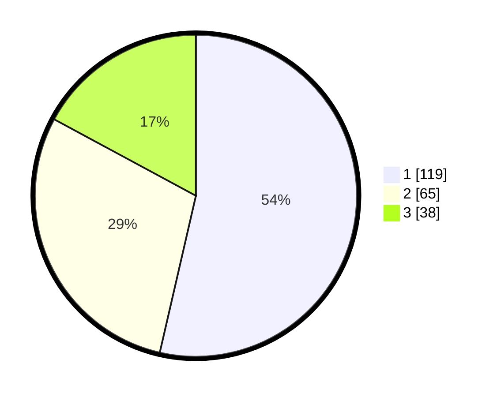

# Hasil

## Grafik

## Tabel

| No.    | Nama Paslon    | Suara | Suara (raw) | Persentase |
|:------ |:-------------- | -----:| -----------:| ----------:|
| 100025 | ANIES MUHAIMIN | 119   | [119][p-1]  | 53,60      |
| 100026 | PRABOWO GIBRAN | 65    | [65][p-2]   | 29,28      |
| 100027 | GANJAR MAHFUD  | 38    | [38][p-3]   | 17,12      |

[p-1]: https://github.com/gigit-pemilu/pemilu-2024/blob/main/pilpres/hitung-suara/sub/31-dki-jakarta/sub/74-jakarta-selatan/sub/04-pasar-minggu/sub/1002-jati-padang/sub/034-tps/sub/paslon-1.txt
[p-2]: https://github.com/gigit-pemilu/pemilu-2024/blob/main/pilpres/hitung-suara/sub/31-dki-jakarta/sub/74-jakarta-selatan/sub/04-pasar-minggu/sub/1002-jati-padang/sub/034-tps/sub/paslon-2.txt
[p-3]: https://github.com/gigit-pemilu/pemilu-2024/blob/main/pilpres/hitung-suara/sub/31-dki-jakarta/sub/74-jakarta-selatan/sub/04-pasar-minggu/sub/1002-jati-padang/sub/034-tps/sub/paslon-3.txt

## Foto C Plano

https://sirekap-obj-formc.kpu.go.id/e5ba/pemilu/ppwp/31/74/04/10/02/3174041002034-20240215-002222--cfaf6466-0848-43f8-b0bf-5d2573cbad37.jpg

https://sirekap-obj-formc.kpu.go.id/e5ba/pemilu/ppwp/31/74/04/10/02/3174041002034-20240215-002251--cef8a573-8450-463a-ac39-7bdc21c33dba.jpg

https://sirekap-obj-formc.kpu.go.id/e5ba/pemilu/ppwp/31/74/04/10/02/3174041002034-20240215-002341--f2308d81-d569-48c5-a1f9-dd89930c8ab4.jpg

## Metadata

| Key        | Value               |
| ---------- | ------------------- |
| Time Stamp | 2024-02-24 22:31:28 |

