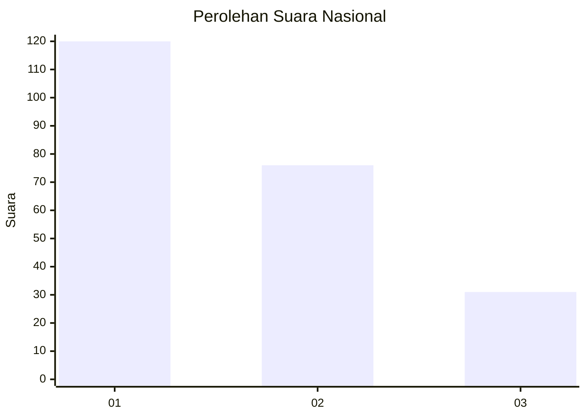
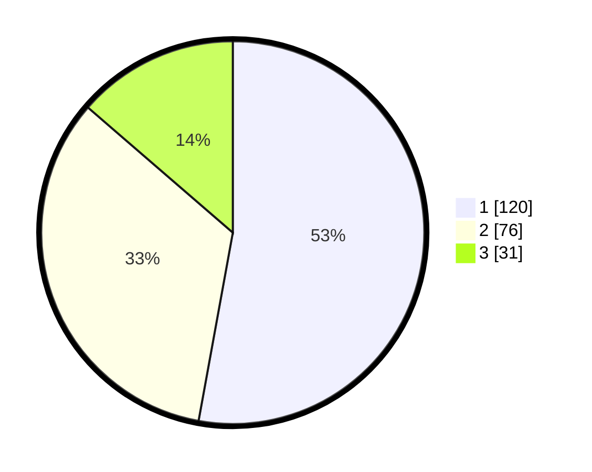

# Hasil

## Grafik

## Tabel

| No.    | Nama Paslon    | Suara | Suara (raw) | Persentase |
|:------ |:-------------- | -----:| -----------:| ----------:|
| 100025 | ANIES MUHAIMIN | 120   | [120][p-1]  | 52,86      |
| 100026 | PRABOWO GIBRAN | 76    | [76][p-2]   | 33,48      |
| 100027 | GANJAR MAHFUD  | 31    | [31][p-3]   | 13,66      |

[p-1]: https://github.com/gigit-pemilu/pemilu-2024/blob/main/pilpres/hitung-suara/sub/31-dki-jakarta/sub/74-jakarta-selatan/sub/04-pasar-minggu/sub/1002-jati-padang/sub/054-tps/sub/paslon-1.txt
[p-2]: https://github.com/gigit-pemilu/pemilu-2024/blob/main/pilpres/hitung-suara/sub/31-dki-jakarta/sub/74-jakarta-selatan/sub/04-pasar-minggu/sub/1002-jati-padang/sub/054-tps/sub/paslon-2.txt
[p-3]: https://github.com/gigit-pemilu/pemilu-2024/blob/main/pilpres/hitung-suara/sub/31-dki-jakarta/sub/74-jakarta-selatan/sub/04-pasar-minggu/sub/1002-jati-padang/sub/054-tps/sub/paslon-3.txt

## Foto C Plano

https://sirekap-obj-formc.kpu.go.id/1a33/pemilu/ppwp/31/74/04/10/02/3174041002054-20240214-205837--87e24637-dd1c-4b28-bdc5-fc80ae32262c.jpg

https://sirekap-obj-formc.kpu.go.id/1a33/pemilu/ppwp/31/74/04/10/02/3174041002054-20240214-205945--3769cd55-ede4-4726-a046-6f49dcf7323d.jpg

https://sirekap-obj-formc.kpu.go.id/1a33/pemilu/ppwp/31/74/04/10/02/3174041002054-20240214-210049--cdccf09b-0e0e-4fd6-9b29-c7cbd5734a96.jpg

## Metadata

| Key        | Value               |
| ---------- | ------------------- |
| Time Stamp | 2024-02-26 11:00:00 |

