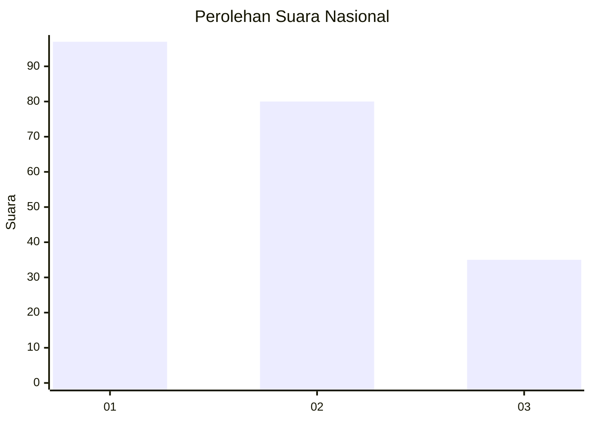
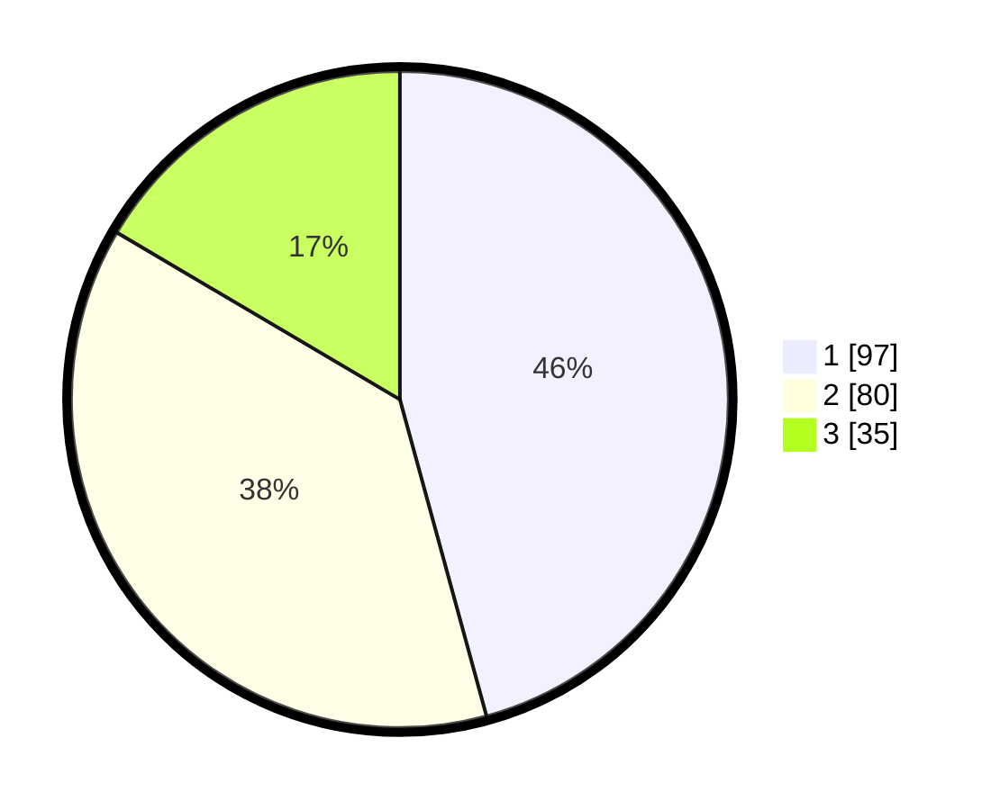

# Hasil

## Grafik

## Tabel

| No.    | Nama Paslon    | Suara | Suara (raw) | Persentase |
|:------ |:-------------- | -----:| -----------:| ----------:|
| 100025 | ANIES MUHAIMIN | 97    | [97][p-1]   | 45,75      |
| 100026 | PRABOWO GIBRAN | 80    | [80][p-2]   | 37,74      |
| 100027 | GANJAR MAHFUD  | 35    | [35][p-3]   | 16,51      |

[p-1]: https://github.com/gigit-pemilu/pemilu-2024/blob/main/pilpres/hitung-suara/sub/31-dki-jakarta/sub/74-jakarta-selatan/sub/04-pasar-minggu/sub/1002-jati-padang/sub/060-tps/sub/paslon-1.txt
[p-2]: https://github.com/gigit-pemilu/pemilu-2024/blob/main/pilpres/hitung-suara/sub/31-dki-jakarta/sub/74-jakarta-selatan/sub/04-pasar-minggu/sub/1002-jati-padang/sub/060-tps/sub/paslon-2.txt
[p-3]: https://github.com/gigit-pemilu/pemilu-2024/blob/main/pilpres/hitung-suara/sub/31-dki-jakarta/sub/74-jakarta-selatan/sub/04-pasar-minggu/sub/1002-jati-padang/sub/060-tps/sub/paslon-3.txt

## Foto C Plano

https://sirekap-obj-formc.kpu.go.id/1c98/pemilu/ppwp/31/74/04/10/02/3174041002060-20240214-202155--18a7ac37-922d-4df9-953a-55811b32f645.jpg

https://sirekap-obj-formc.kpu.go.id/1c98/pemilu/ppwp/31/74/04/10/02/3174041002060-20240214-195025--55b404c9-46c1-468d-beb2-5ca69211f5a7.jpg

https://sirekap-obj-formc.kpu.go.id/1c98/pemilu/ppwp/31/74/04/10/02/3174041002060-20240214-201602--22a632c4-b93a-46df-8a5e-694d8c2e6f6a.jpg

## Metadata

| Key        | Value               |
| ---------- | ------------------- |
| Time Stamp | 2024-02-27 16:00:00 |

