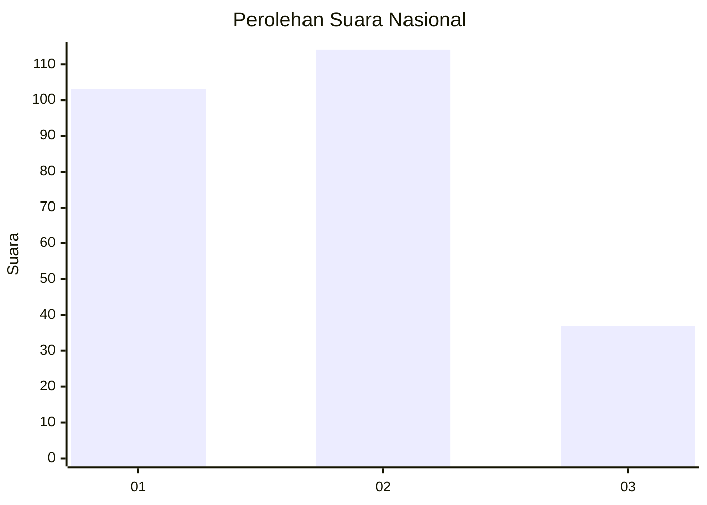
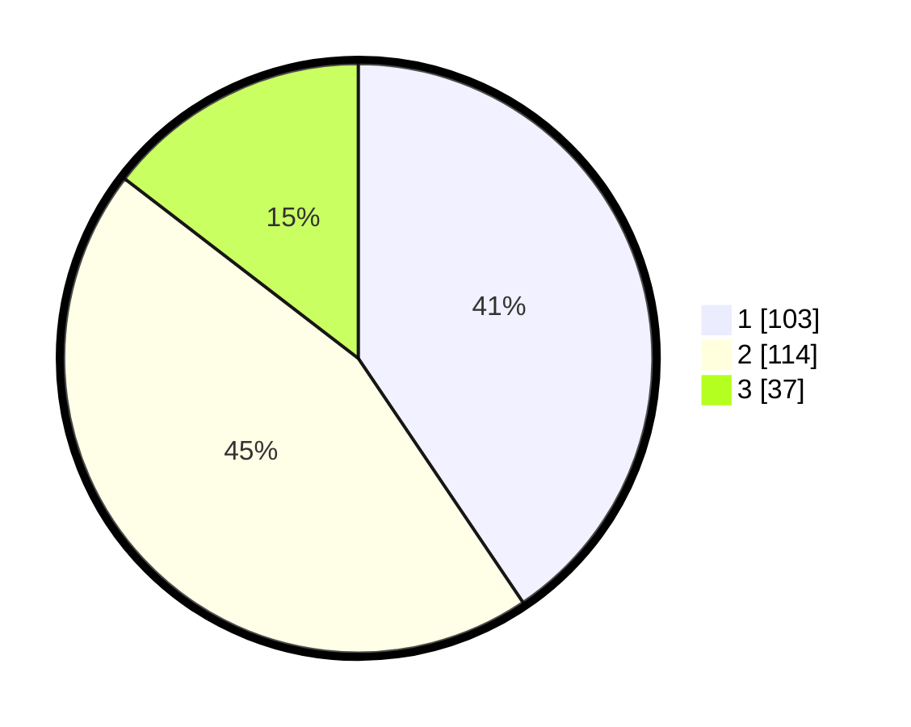

# Hasil

## Grafik

## Tabel

| No.    | Nama Paslon    | Suara | Suara (raw) | Persentase |
|:------ |:-------------- | -----:| -----------:| ----------:|
| 100025 | ANIES MUHAIMIN | 103   | [103][p-1]  | 40,55      |
| 100026 | PRABOWO GIBRAN | 114   | [114][p-2]  | 44,88      |
| 100027 | GANJAR MAHFUD  | 37    | [37][p-3]   | 14,57      |

[p-1]: https://github.com/gigit-pemilu/pemilu-2024/blob/main/pilpres/hitung-suara/sub/31-dki-jakarta/sub/74-jakarta-selatan/sub/04-pasar-minggu/sub/1002-jati-padang/sub/064-tps/sub/paslon-1.txt
[p-2]: https://github.com/gigit-pemilu/pemilu-2024/blob/main/pilpres/hitung-suara/sub/31-dki-jakarta/sub/74-jakarta-selatan/sub/04-pasar-minggu/sub/1002-jati-padang/sub/064-tps/sub/paslon-2.txt
[p-3]: https://github.com/gigit-pemilu/pemilu-2024/blob/main/pilpres/hitung-suara/sub/31-dki-jakarta/sub/74-jakarta-selatan/sub/04-pasar-minggu/sub/1002-jati-padang/sub/064-tps/sub/paslon-3.txt

## Foto C Plano

https://sirekap-obj-formc.kpu.go.id/71ca/pemilu/ppwp/31/74/04/10/02/3174041002064-20240214-210124--4646bd87-7831-4bba-b441-4a9917d85b44.jpg

https://sirekap-obj-formc.kpu.go.id/71ca/pemilu/ppwp/31/74/04/10/02/3174041002064-20240215-025706--8de0b18f-937d-4682-9047-07093350cf1a.jpg

https://sirekap-obj-formc.kpu.go.id/71ca/pemilu/ppwp/31/74/04/10/02/3174041002064-20240214-203814--76eb5972-ca7a-447e-803a-0bc891abefcd.jpg

## Metadata

| Key        | Value               |
| ---------- | ------------------- |
| Time Stamp | 2024-02-24 22:31:28 |

