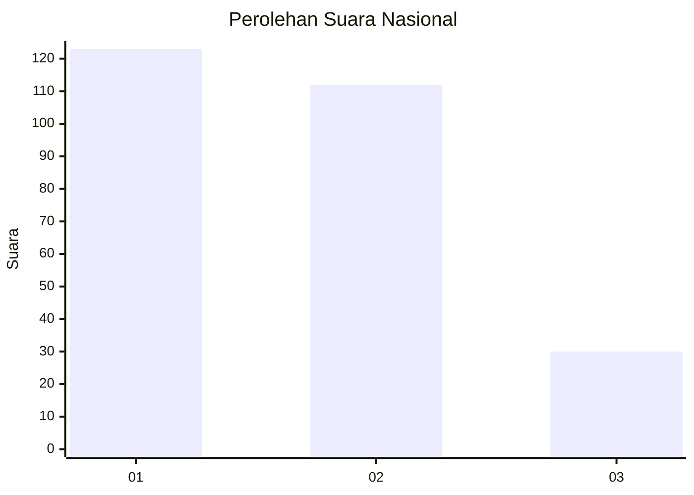
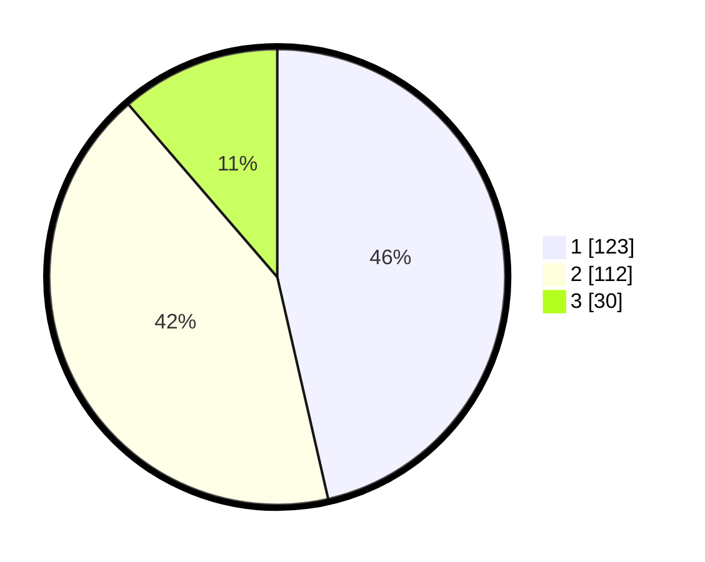

# Hasil

## Grafik

## Tabel

| No. | Nama Paslon    | Suara | Suara (raw) | Persentase |
|:--- |:-------------- | -----:| -----------:| ----------:|
| 1   | ANIES MUHAIMIN | 123   | [123][p-1]  | 46,42      |
| 2   | PRABOWO GIBRAN | 112   | [112][p-2]  | 42,26      |
| 3   | GANJAR MAHFUD  | 30    | [30][p-3]   | 11,32      |

[p-1]: https://github.com/gigit-pemilu/pemilu-2024/blob/main/pilpres/hitung-suara/sub/31-dki-jakarta/sub/74-jakarta-selatan/sub/04-pasar-minggu/sub/1002-jati-padang/sub/065-tps/sub/paslon-1.txt
[p-2]: https://github.com/gigit-pemilu/pemilu-2024/blob/main/pilpres/hitung-suara/sub/31-dki-jakarta/sub/74-jakarta-selatan/sub/04-pasar-minggu/sub/1002-jati-padang/sub/065-tps/sub/paslon-2.txt
[p-3]: https://github.com/gigit-pemilu/pemilu-2024/blob/main/pilpres/hitung-suara/sub/31-dki-jakarta/sub/74-jakarta-selatan/sub/04-pasar-minggu/sub/1002-jati-padang/sub/065-tps/sub/paslon-3.txt

## Foto C Plano

https://sirekap-obj-formc.kpu.go.id/0500/pemilu/ppwp/31/74/04/10/02/3174041002065-20240214-185601--dd28c3ed-780b-4128-9fa9-e9659760b5ce.jpg

https://sirekap-obj-formc.kpu.go.id/0500/pemilu/ppwp/31/74/04/10/02/3174041002065-20240214-185552--dd16e883-486d-49d3-a19f-d6314b92e38d.jpg

https://sirekap-obj-formc.kpu.go.id/0500/pemilu/ppwp/31/74/04/10/02/3174041002065-20240214-185547--91f2e293-01e4-4cce-90bc-dbcc1a46f1cb.jpg

## Metadata

| Key        | Value               |
| ---------- | ------------------- |
| Time Stamp | 2024-02-24 22:31:28 |

