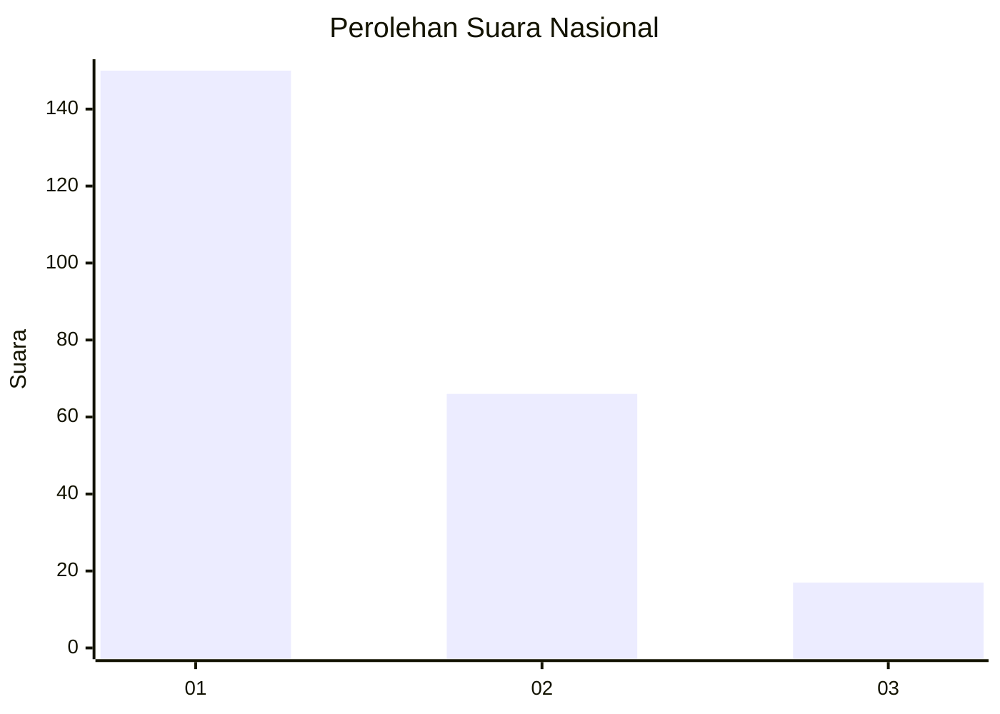
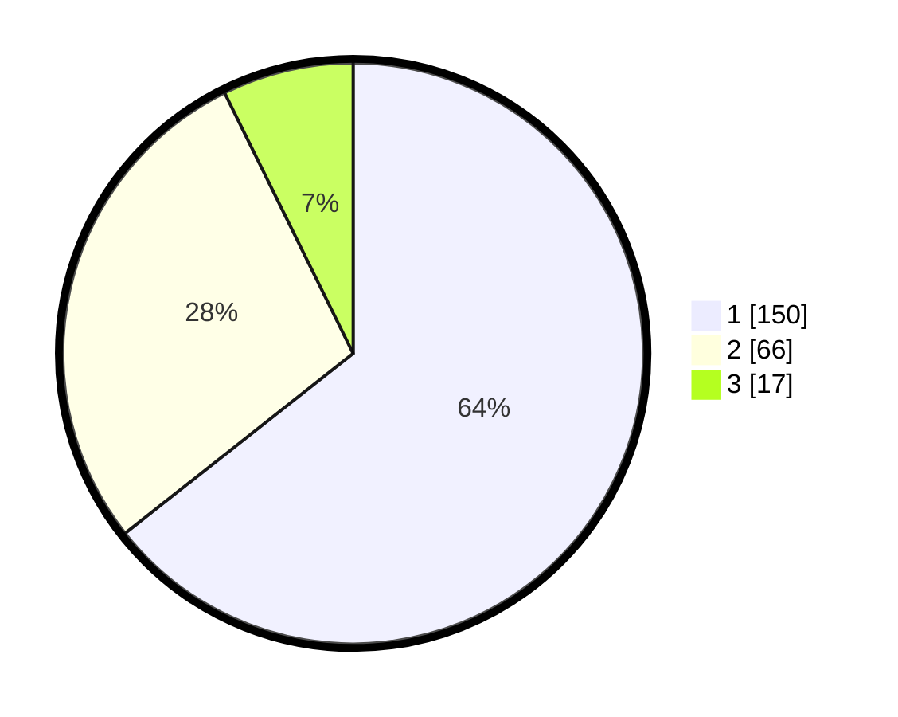

# Hasil

## Grafik

## Tabel

| No.    | Nama Paslon    | Suara | Suara (raw) | Persentase |
|:------ |:-------------- | -----:| -----------:| ----------:|
| 100025 | ANIES MUHAIMIN | 150   | [150][p-1]  | 64,38      |
| 100026 | PRABOWO GIBRAN | 66    | [66][p-2]   | 28,33      |
| 100027 | GANJAR MAHFUD  | 17    | [17][p-3]   | 7,30       |

[p-1]: https://github.com/gigit-pemilu/pemilu-2024/blob/main/pilpres/hitung-suara/sub/31-dki-jakarta/sub/74-jakarta-selatan/sub/04-pasar-minggu/sub/1002-jati-padang/sub/073-tps/sub/paslon-1.txt
[p-2]: https://github.com/gigit-pemilu/pemilu-2024/blob/main/pilpres/hitung-suara/sub/31-dki-jakarta/sub/74-jakarta-selatan/sub/04-pasar-minggu/sub/1002-jati-padang/sub/073-tps/sub/paslon-2.txt
[p-3]: https://github.com/gigit-pemilu/pemilu-2024/blob/main/pilpres/hitung-suara/sub/31-dki-jakarta/sub/74-jakarta-selatan/sub/04-pasar-minggu/sub/1002-jati-padang/sub/073-tps/sub/paslon-3.txt

## Foto C Plano

https://sirekap-obj-formc.kpu.go.id/c9b5/pemilu/ppwp/31/74/04/10/02/3174041002073-20240215-011403--f2a57bea-5cfc-4e05-a2d2-4c81bbad3bad.jpg

https://sirekap-obj-formc.kpu.go.id/c9b5/pemilu/ppwp/31/74/04/10/02/3174041002073-20240215-011416--a427f673-8807-4622-8d0c-e149e518bfe8.jpg

https://sirekap-obj-formc.kpu.go.id/c9b5/pemilu/ppwp/31/74/04/10/02/3174041002073-20240215-011423--e1d65e72-49d2-4bda-ad15-c52dc6f4b794.jpg

## Metadata

| Key        | Value               |
| ---------- | ------------------- |
| Time Stamp | 2024-02-19 06:16:00 |

