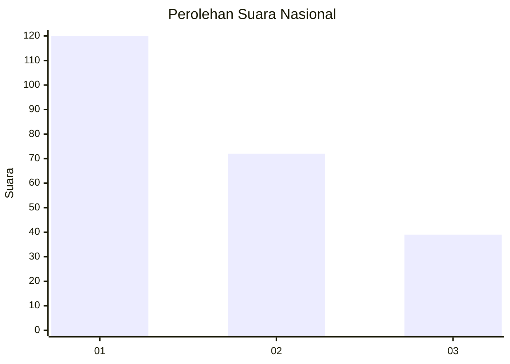
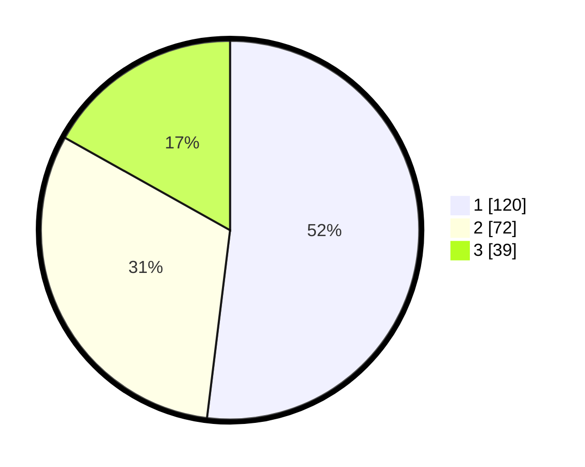

# Hasil

## Grafik

## Tabel

| No.    | Nama Paslon    | Suara | Suara (raw) | Persentase |
|:------ |:-------------- | -----:| -----------:| ----------:|
| 100025 | ANIES MUHAIMIN | 120   | [120][p-1]  | 51,95      |
| 100026 | PRABOWO GIBRAN | 72    | [72][p-2]   | 31,17      |
| 100027 | GANJAR MAHFUD  | 39    | [39][p-3]   | 16,88      |

[p-1]: https://github.com/gigit-pemilu/pemilu-2024/blob/main/pilpres/hitung-suara/sub/31-dki-jakarta/sub/74-jakarta-selatan/sub/04-pasar-minggu/sub/1002-jati-padang/sub/099-tps/sub/paslon-1.txt
[p-2]: https://github.com/gigit-pemilu/pemilu-2024/blob/main/pilpres/hitung-suara/sub/31-dki-jakarta/sub/74-jakarta-selatan/sub/04-pasar-minggu/sub/1002-jati-padang/sub/099-tps/sub/paslon-2.txt
[p-3]: https://github.com/gigit-pemilu/pemilu-2024/blob/main/pilpres/hitung-suara/sub/31-dki-jakarta/sub/74-jakarta-selatan/sub/04-pasar-minggu/sub/1002-jati-padang/sub/099-tps/sub/paslon-3.txt

## Foto C Plano

https://sirekap-obj-formc.kpu.go.id/7fce/pemilu/ppwp/31/74/04/10/02/3174041002099-20240215-001428--b21b192a-6f34-43a6-bca3-585059a60df2.jpg

https://sirekap-obj-formc.kpu.go.id/7fce/pemilu/ppwp/31/74/04/10/02/3174041002099-20240215-001545--7e614903-71e9-413a-9fb1-0359f7fe9e27.jpg

https://sirekap-obj-formc.kpu.go.id/7fce/pemilu/ppwp/31/74/04/10/02/3174041002099-20240215-001709--19f03b67-0e2a-427f-9038-1c6a0be34c31.jpg

## Metadata

| Key        | Value               |
| ---------- | ------------------- |
| Time Stamp | 2024-02-24 22:31:28 |

