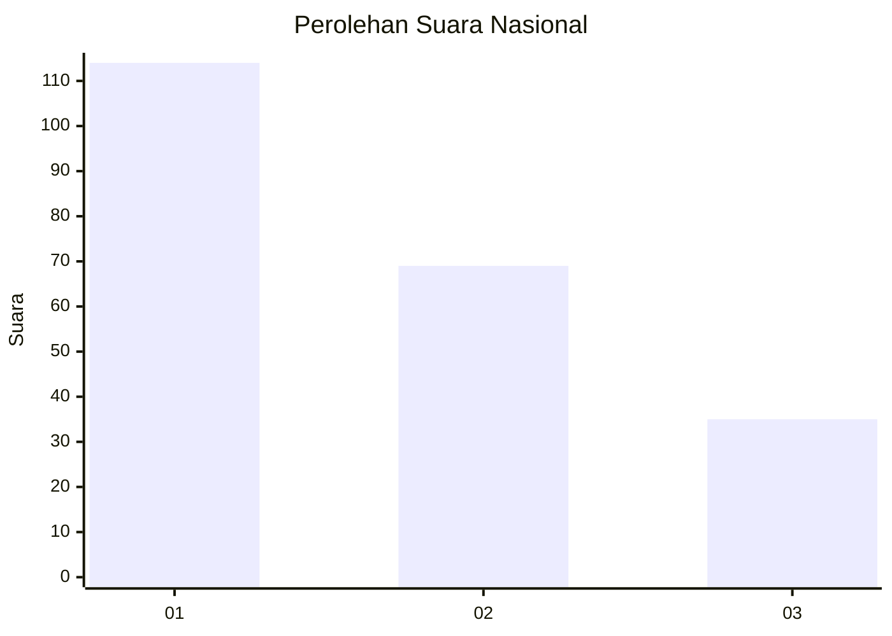
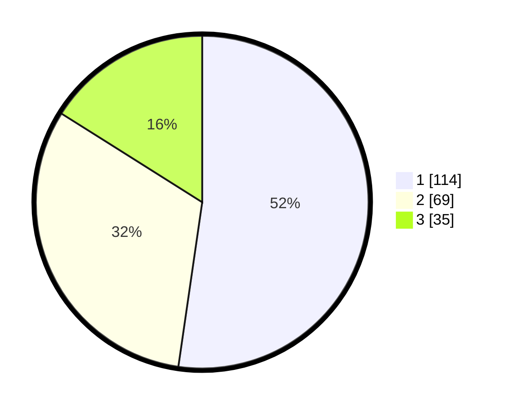

# Hasil

## Grafik

## Tabel

| No.    | Nama Paslon    | Suara | Suara (raw) | Persentase |
|:------ |:-------------- | -----:| -----------:| ----------:|
| 100025 | ANIES MUHAIMIN | 114   | [114][p-1]  | 52,29      |
| 100026 | PRABOWO GIBRAN | 69    | [69][p-2]   | 31,65      |
| 100027 | GANJAR MAHFUD  | 35    | [35][p-3]   | 16,06      |

[p-1]: https://github.com/gigit-pemilu/pemilu-2024/blob/main/pilpres/hitung-suara/sub/31-dki-jakarta/sub/74-jakarta-selatan/sub/04-pasar-minggu/sub/1002-jati-padang/sub/100-tps/sub/paslon-1.txt
[p-2]: https://github.com/gigit-pemilu/pemilu-2024/blob/main/pilpres/hitung-suara/sub/31-dki-jakarta/sub/74-jakarta-selatan/sub/04-pasar-minggu/sub/1002-jati-padang/sub/100-tps/sub/paslon-2.txt
[p-3]: https://github.com/gigit-pemilu/pemilu-2024/blob/main/pilpres/hitung-suara/sub/31-dki-jakarta/sub/74-jakarta-selatan/sub/04-pasar-minggu/sub/1002-jati-padang/sub/100-tps/sub/paslon-3.txt

## Foto C Plano

https://sirekap-obj-formc.kpu.go.id/ded7/pemilu/ppwp/31/74/04/10/02/3174041002100-20240214-155804--915d039b-9a8a-46f8-82d2-57cd5b0a6eea.jpg

https://sirekap-obj-formc.kpu.go.id/ded7/pemilu/ppwp/31/74/04/10/02/3174041002100-20240214-162237--4416d029-bc73-4c1e-af3e-dd3802c76419.jpg

https://sirekap-obj-formc.kpu.go.id/ded7/pemilu/ppwp/31/74/04/10/02/3174041002100-20240214-155827--3917fc6b-f9cd-447c-969c-037ba77b6b73.jpg

## Metadata

| Key        | Value               |
| ---------- | ------------------- |
| Time Stamp | 2024-02-24 22:31:28 |

