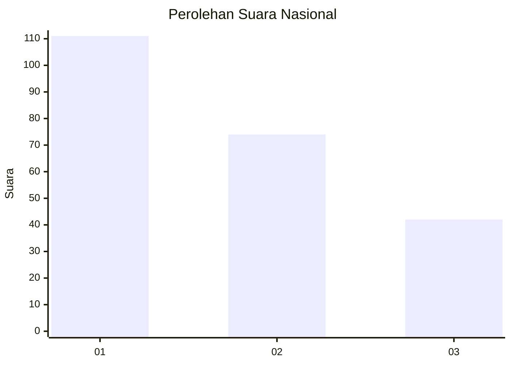
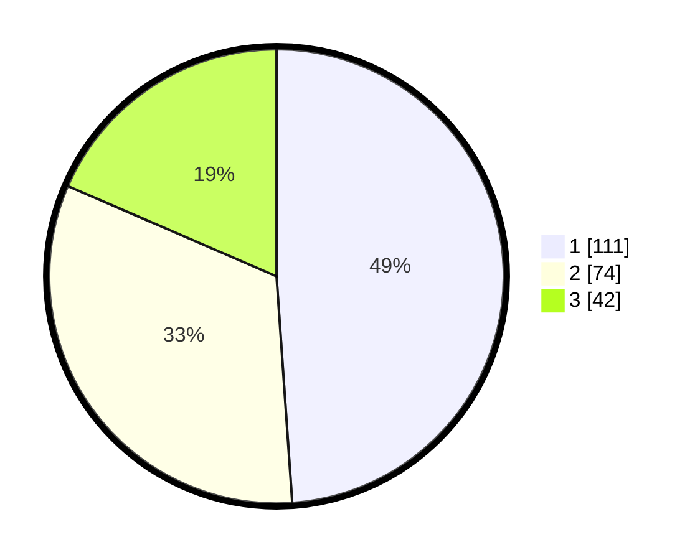

# Hasil

## Grafik

## Tabel

| No.    | Nama Paslon    | Suara | Suara (raw) | Persentase |
|:------ |:-------------- | -----:| -----------:| ----------:|
| 100025 | ANIES MUHAIMIN | 111   | [111][p-1]  | 48,90      |
| 100026 | PRABOWO GIBRAN | 74    | [74][p-2]   | 32,60      |
| 100027 | GANJAR MAHFUD  | 42    | [42][p-3]   | 18,50      |

[p-1]: https://github.com/gigit-pemilu/pemilu-2024/blob/main/pilpres/hitung-suara/sub/31-dki-jakarta/sub/74-jakarta-selatan/sub/04-pasar-minggu/sub/1002-jati-padang/sub/118-tps/sub/paslon-1.txt
[p-2]: https://github.com/gigit-pemilu/pemilu-2024/blob/main/pilpres/hitung-suara/sub/31-dki-jakarta/sub/74-jakarta-selatan/sub/04-pasar-minggu/sub/1002-jati-padang/sub/118-tps/sub/paslon-2.txt
[p-3]: https://github.com/gigit-pemilu/pemilu-2024/blob/main/pilpres/hitung-suara/sub/31-dki-jakarta/sub/74-jakarta-selatan/sub/04-pasar-minggu/sub/1002-jati-padang/sub/118-tps/sub/paslon-3.txt

## Foto C Plano

https://sirekap-obj-formc.kpu.go.id/2f0e/pemilu/ppwp/31/74/04/10/02/3174041002118-20240214-193449--36a4a177-f73d-43fc-bdc2-cee5eb7d6e7d.jpg

https://sirekap-obj-formc.kpu.go.id/2f0e/pemilu/ppwp/31/74/04/10/02/3174041002118-20240214-193620--169e0aea-f970-4058-8420-2eba145a5d33.jpg

https://sirekap-obj-formc.kpu.go.id/2f0e/pemilu/ppwp/31/74/04/10/02/3174041002118-20240214-191709--52abc46e-093e-4fa0-8b25-e3bee1176189.jpg

## Metadata

| Key        | Value               |
| ---------- | ------------------- |
| Time Stamp | 2024-02-24 22:31:28 |

