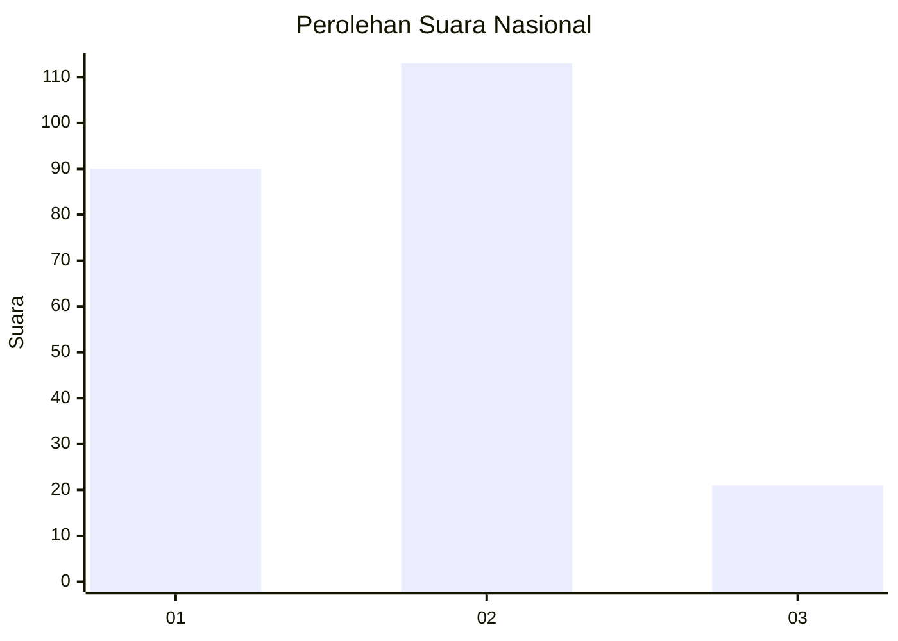
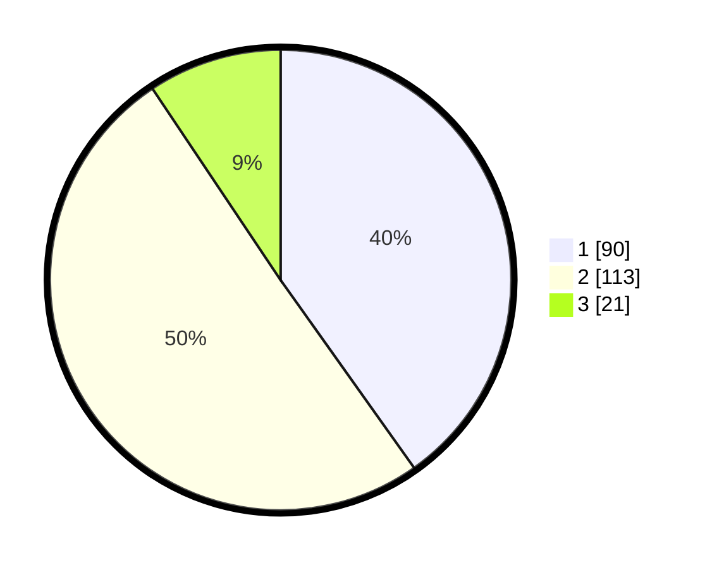

# Hasil

## Grafik

## Tabel

| No.    | Nama Paslon    | Suara | Suara (raw) | Persentase |
|:------ |:-------------- | -----:| -----------:| ----------:|
| 100025 | ANIES MUHAIMIN | 90    | [90][p-1]   | 40,18      |
| 100026 | PRABOWO GIBRAN | 113   | [113][p-2]  | 50,45      |
| 100027 | GANJAR MAHFUD  | 21    | [21][p-3]   | 9,38       |

[p-1]: https://github.com/gigit-pemilu/pemilu-2024/blob/main/pilpres/hitung-suara/sub/31-dki-jakarta/sub/74-jakarta-selatan/sub/04-pasar-minggu/sub/1003-cilandak-timur/sub/009-tps/sub/paslon-1.txt
[p-2]: https://github.com/gigit-pemilu/pemilu-2024/blob/main/pilpres/hitung-suara/sub/31-dki-jakarta/sub/74-jakarta-selatan/sub/04-pasar-minggu/sub/1003-cilandak-timur/sub/009-tps/sub/paslon-2.txt
[p-3]: https://github.com/gigit-pemilu/pemilu-2024/blob/main/pilpres/hitung-suara/sub/31-dki-jakarta/sub/74-jakarta-selatan/sub/04-pasar-minggu/sub/1003-cilandak-timur/sub/009-tps/sub/paslon-3.txt

## Foto C Plano

https://sirekap-obj-formc.kpu.go.id/15e2/pemilu/ppwp/31/74/04/10/03/3174041003009-20240215-034703--64b6341c-390f-4bff-9738-c1cac1d13fd7.jpg

https://sirekap-obj-formc.kpu.go.id/15e2/pemilu/ppwp/31/74/04/10/03/3174041003009-20240215-034856--ba4281bf-0118-4221-9b22-da151dc9d65a.jpg

https://sirekap-obj-formc.kpu.go.id/15e2/pemilu/ppwp/31/74/04/10/03/3174041003009-20240215-033045--589deabd-e5e1-4cce-92cc-a564bb30dd9c.jpg

## Metadata

| Key        | Value               |
| ---------- | ------------------- |
| Time Stamp | 2024-02-16 16:25:10 |

