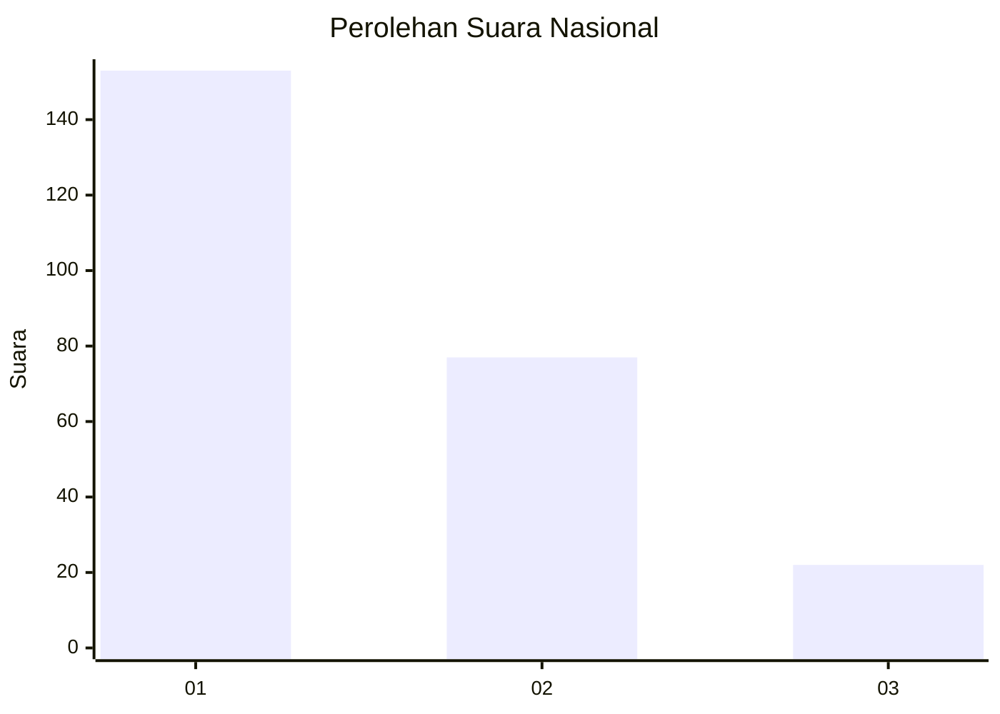
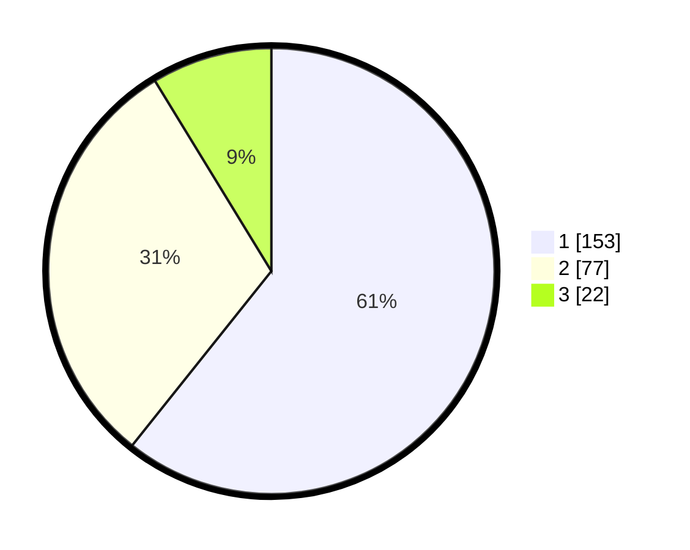

# Hasil

## Grafik

## Tabel

| No.    | Nama Paslon    | Suara | Suara (raw) | Persentase |
|:------ |:-------------- | -----:| -----------:| ----------:|
| 100025 | ANIES MUHAIMIN | 153   | [153][p-1]  | 60,71      |
| 100026 | PRABOWO GIBRAN | 77    | [77][p-2]   | 30,56      |
| 100027 | GANJAR MAHFUD  | 22    | [22][p-3]   | 8,73       |

[p-1]: https://github.com/gigit-pemilu/pemilu-2024/blob/main/pilpres/hitung-suara/sub/31-dki-jakarta/sub/74-jakarta-selatan/sub/04-pasar-minggu/sub/1003-cilandak-timur/sub/025-tps/sub/paslon-1.txt
[p-2]: https://github.com/gigit-pemilu/pemilu-2024/blob/main/pilpres/hitung-suara/sub/31-dki-jakarta/sub/74-jakarta-selatan/sub/04-pasar-minggu/sub/1003-cilandak-timur/sub/025-tps/sub/paslon-2.txt
[p-3]: https://github.com/gigit-pemilu/pemilu-2024/blob/main/pilpres/hitung-suara/sub/31-dki-jakarta/sub/74-jakarta-selatan/sub/04-pasar-minggu/sub/1003-cilandak-timur/sub/025-tps/sub/paslon-3.txt

## Foto C Plano

https://sirekap-obj-formc.kpu.go.id/3c6e/pemilu/ppwp/31/74/04/10/03/3174041003025-20240214-213905--a88579a0-a175-47d7-b3d7-68f1e97250d2.jpg

https://sirekap-obj-formc.kpu.go.id/3c6e/pemilu/ppwp/31/74/04/10/03/3174041003025-20240214-213954--4785334d-dbca-4c6b-8a71-74639e36e69e.jpg

https://sirekap-obj-formc.kpu.go.id/3c6e/pemilu/ppwp/31/74/04/10/03/3174041003025-20240214-214054--f7c1810d-55a6-4b76-ae5a-46f7d433b155.jpg

## Metadata

| Key        | Value               |
| ---------- | ------------------- |
| Time Stamp | 2024-02-24 22:31:28 |

