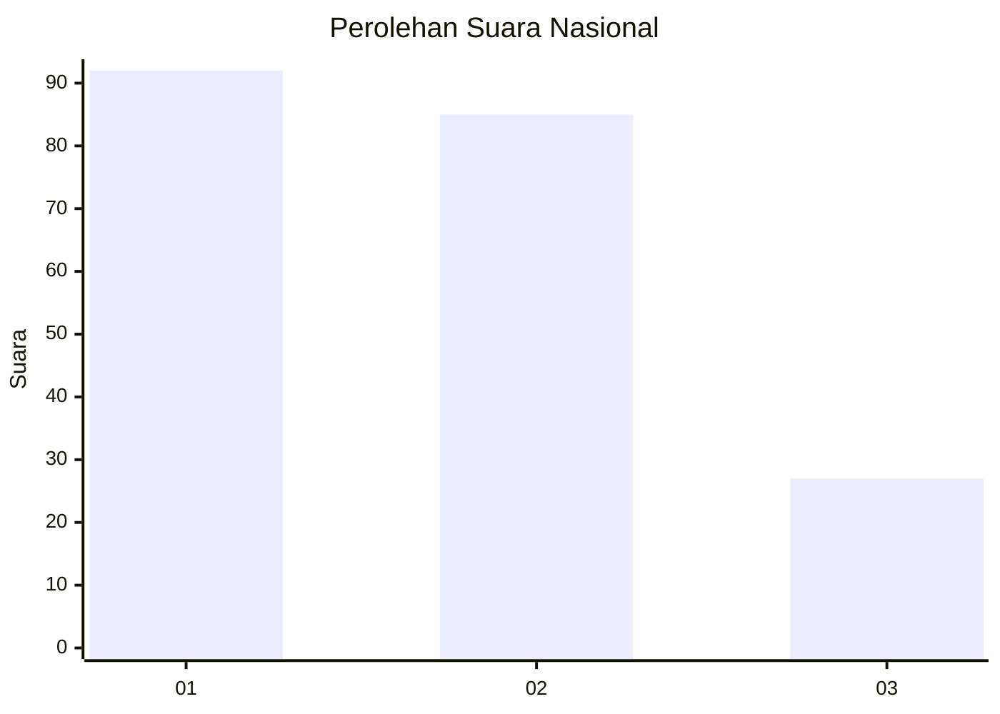
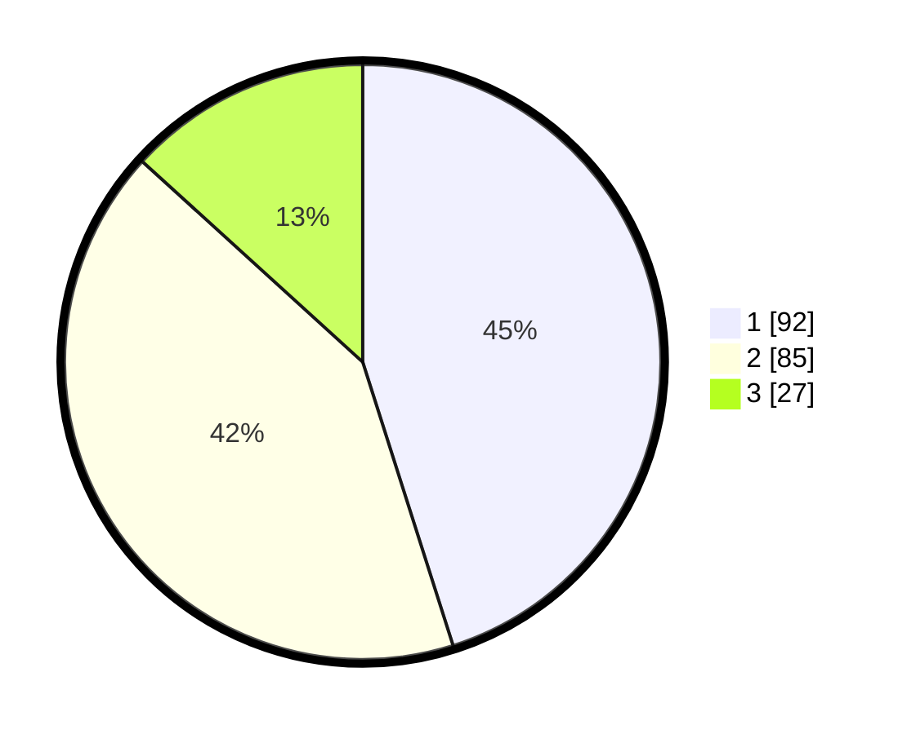

# Hasil

## Grafik

## Tabel

| No.    | Nama Paslon    | Suara | Suara (raw) | Persentase |
|:------ |:-------------- | -----:| -----------:| ----------:|
| 100025 | ANIES MUHAIMIN | 92    | [92][p-1]   | 45,10      |
| 100026 | PRABOWO GIBRAN | 85    | [85][p-2]   | 41,67      |
| 100027 | GANJAR MAHFUD  | 27    | [27][p-3]   | 13,24      |

[p-1]: https://github.com/gigit-pemilu/pemilu-2024/blob/main/pilpres/hitung-suara/sub/31-dki-jakarta/sub/74-jakarta-selatan/sub/04-pasar-minggu/sub/1003-cilandak-timur/sub/027-tps/sub/paslon-1.txt
[p-2]: https://github.com/gigit-pemilu/pemilu-2024/blob/main/pilpres/hitung-suara/sub/31-dki-jakarta/sub/74-jakarta-selatan/sub/04-pasar-minggu/sub/1003-cilandak-timur/sub/027-tps/sub/paslon-2.txt
[p-3]: https://github.com/gigit-pemilu/pemilu-2024/blob/main/pilpres/hitung-suara/sub/31-dki-jakarta/sub/74-jakarta-selatan/sub/04-pasar-minggu/sub/1003-cilandak-timur/sub/027-tps/sub/paslon-3.txt

## Foto C Plano

https://sirekap-obj-formc.kpu.go.id/da00/pemilu/ppwp/31/74/04/10/03/3174041003027-20240214-222318--891d7a10-d4be-4cd9-a275-d421c609481f.jpg

https://sirekap-obj-formc.kpu.go.id/da00/pemilu/ppwp/31/74/04/10/03/3174041003027-20240214-223306--9cda722b-3de6-425f-b311-96f79f36263b.jpg

https://sirekap-obj-formc.kpu.go.id/da00/pemilu/ppwp/31/74/04/10/03/3174041003027-20240214-223309--179ddbe8-84fa-4858-8011-438c3b5da87b.jpg

## Metadata

| Key        | Value               |
| ---------- | ------------------- |
| Time Stamp | 2024-02-24 22:31:28 |

